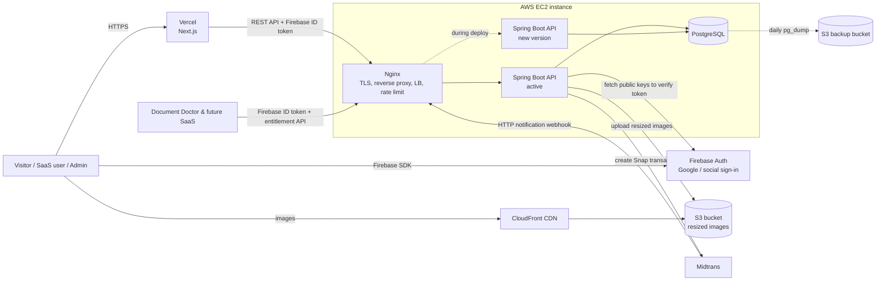

# ADR-001: Initial Technology Stack

| Field      | Value                                  |
| ---------- | -------------------------------------- |
| Author     | Dewa Surya Ariesta                     |
| Date       | 28 September 2026                      |
| Status     | Proposed                               |
| Deciders   | Dewa Surya Ariesta                     |
| Related    | [PRD v0.2](../PRD.md)                  |

---

## 1. Context

Dewa Surya Hub (see [PRD](../PRD.md)) needs a public, SEO-friendly content site, a central user account shared across Dewa's SaaS products, subscription management, and a payment portal. The first connected product is Document Doctor.

The platform is built and run by one person, has no revenue at launch, and targets users in Indonesia. The stack must therefore be:

- **As cheap as possible** to run, especially before the first paying customer.
- Simple enough for one developer to operate.
- Able to grow (more SaaS products, more traffic) without a rewrite.

## 2. Decision Drivers

| #  | Driver                                                                                  | PRD reference            |
| -- | --------------------------------------------------------------------------------------- | ------------------------ |
| D1 | Lowest monthly cost; prefer free tiers and pay-per-use over fixed fees.                 | —                        |
| D2 | Public pages must be server-rendered/static for SEO and fast LCP (< 2.5 s).             | FR-C1, NFR SEO/Perf      |
| D3 | One identity across all SaaS products, with social sign-in.                             | G2, FR-U1, FR-U2         |
| D4 | Local payment methods for Indonesian users (bank transfer/VA, QRIS, e-wallets, cards).  | G3, FR-P1                |
| D5 | Reliable, idempotent handling of payment webhooks.                                      | FR-P2, NFR Reliability   |
| D6 | Relational data (users, products, plans, subscriptions, transactions, articles).        | FR-S1–S3, FR-P3, FR-C3   |
| D7 | Images must be small and fast to serve.                                                 | FR-C4, NFR Performance   |
| D8 | Infrastructure must be reproducible, not hand-clicked in a console.                     | —                        |

## 3. Decision Summary

| Area                  | Choice                                           | Why (short)                                                          |
| --------------------- | ------------------------------------------------ | -------------------------------------------------------------------- |
| Frontend framework    | **Next.js** (App Router)                         | SSR/SSG for SEO; one codebase for public site, user portal, admin.   |
| Frontend hosting      | **Vercel**                                       | Zero-ops deploys, global CDN, free Hobby tier to start.              |
| Backend framework     | **Spring Boot** (Java, REST API)                 | Mature, strongly typed; first-class security, JPA, and migrations.   |
| Backend hosting       | **AWS EC2** (single small instance)              | Cheapest always-on compute; full control; runs API + DB + Nginx.     |
| Reverse proxy / LB    | **Nginx** on the EC2 instance                    | Free; replaces AWS ALB (saves ~US$16+/month).                        |
| Database              | **PostgreSQL** (self-hosted on the EC2 instance) | Free, relational, strong transactions; no RDS fee at launch.         |
| Authentication        | **Firebase Authentication** (social sign-in)     | Free for social/email sign-in; SDKs for web; shared across products. |
| Payment gateway       | **Midtrans** (Snap)                              | No monthly fee; supports VA, QRIS, GoPay, cards in IDR.              |
| Image storage         | **AWS S3** (+ CloudFront for delivery)           | Cheap storage; CloudFront free tier cheaper than direct S3 egress.   |
| Image processing      | **Resize on upload** in Spring Boot (Scrimage)   | Store only optimized WebP sizes; no paid resize service.             |
| Infrastructure as code| **Terraform** (state in S3)                      | Free CLI; reproducible AWS setup; no Terraform Cloud needed.         |

## 4. Architecture Overview

Request flow in short:

1. The user opens the site; Vercel serves server-rendered or statically generated Next.js pages.
2. The user signs in with Google (or another provider) through Firebase Auth in the browser and receives a Firebase ID token.
3. The frontend calls the backend API on EC2 with that token. The Spring Boot backend verifies it (Spring Security, see 5.7) and looks up the user's role, products, and subscriptions in PostgreSQL.
4. For a purchase, the backend creates a Midtrans Snap transaction and returns the Snap token; the user pays in the Midtrans popup.
5. Midtrans sends an HTTP notification to the backend. The backend verifies the signature, updates the transaction, and activates the subscription.

## 5. Decisions in Detail

### 5.1 Frontend: Next.js

**Decision.** Build the public site (blog, about/portfolio, products), the user portal (profile, subscriptions, payments), and the admin dashboard in one Next.js application using the App Router.

**Rationale.**
- Supports static generation and incremental static regeneration (ISR) for articles, and server rendering where needed, which covers the SEO and LCP requirements (D2).
- Built-in metadata API, `sitemap.ts`, and `robots.ts` cover FR-C5 and V-1.1.
- One codebase and one deployment keeps work and cost low for a solo developer.

**Alternatives considered.**
- *Astro:* excellent for content, but the portal and admin need much more interactivity.
- *Plain React SPA (Vite):* cheapest to host, but poor SEO without extra work.

### 5.2 Frontend hosting: Vercel

**Decision.** Host the Next.js app on Vercel. The backend API stays on EC2.

**Rationale.**
- Native Next.js support (ISR, image and edge features) with no servers to manage.
- Global CDN and preview deployments per branch.
- Hobby plan is free.

**Cost rules.**
- Vercel's **Hobby plan is for non-commercial use only**. Phase 1 (blog and portfolio) can run on Hobby. **Before Phase 3 (payments) goes live, either upgrade to Vercel Pro (about US$20/month) or move the Next.js app onto the EC2 instance behind Nginx.** This choice is recorded as a follow-up decision.
- Images are already resized on upload (see 5.9), so use a custom image loader or `unoptimized` images that point at CloudFront. This avoids spending Vercel image optimization quota.
- Prefer static/ISR pages over per-request server rendering to keep function usage inside the free limits.

**Alternatives considered.**
- *Self-host Next.js on EC2:* cheapest (US$0 extra), but more work and no global CDN. Kept as the fallback.
- *Cloudflare Pages / AWS Amplify:* viable, but Next.js support is less complete than on Vercel.

### 5.3 Backend framework: Spring Boot

**Decision.** Build the backend as a single **Spring Boot** REST API (latest stable Spring Boot release, on the latest Java LTS), packaged as a Docker image for `linux/arm64`. It serves the user portal, the admin dashboard, the Midtrans webhook, and the entitlement API for connected SaaS products.

**Main libraries.**

| Concern             | Library / approach                                                                                   |
| ------------------- | ---------------------------------------------------------------------------------------------------- |
| HTTP API            | Spring Web (MVC), Bean Validation for request DTOs.                                                  |
| Auth                | Spring Security **OAuth2 Resource Server** validating Firebase ID tokens as JWTs (see 5.7).          |
| Data access         | Spring Data JPA (Hibernate) with HikariCP; PostgreSQL JDBC driver.                                   |
| Schema migrations   | **Flyway** (`src/main/resources/db/migration`), run on startup.                                      |
| Payments            | Midtrans Java library, or Spring `RestClient` calling the Midtrans Snap and Status APIs directly.    |
| Images              | **Scrimage** (`scrimage-core` + `scrimage-webp`) for resizing and WebP encoding (see 5.9).           |
| AWS                 | AWS SDK for Java v2 (S3), credentials from the EC2 instance role; no access keys in config.          |
| Operations          | Spring Boot Actuator (`/actuator/health` for Nginx and deploy checks; not exposed publicly).         |
| Testing             | JUnit 5, Spring Boot Test, **Testcontainers** (real PostgreSQL in tests).                            |

**Structure.** One deployable application (modular monolith), with a package per domain: `content`, `identity`, `product`, `subscription`, `payment`, `media`, `admin`. This keeps one process to run and pay for, while leaving clean seams if a module ever needs to become its own service.

**Rationale.**
- Strong typing, transactions (`@Transactional`), and database constraints suit billing and webhook logic where mistakes cost money (D5).
- Spring Security validates Firebase tokens with configuration only, no custom crypto code (D3).
- Flyway keeps schema changes versioned in the repository.
- Large ecosystem and long-term support, suitable for a platform that will host several SaaS products.

**Cost rules (JVM memory).** A Spring Boot app uses more memory than a Node.js or Go service, and memory is the main cost limit on a small EC2 instance.
- Cap the JVM: for example `-XX:MaxRAMPercentage=` tuned so heap stays around 384–512 MB, plus container memory limits in Docker Compose.
- Keep the Hikari pool small (for example 5–10 connections).
- Enable lazy initialization only if startup memory is a problem; measure first.
- Add a 2 GB swap file on the instance as a safety net, not as normal working memory.
- If memory stays tight, the options in order of cost are: tune the JVM → build a **GraalVM native image** (much lower memory, longer builds) → move to a 4 GiB instance.

**Alternatives considered.**
- *Node.js (NestJS/Express):* lower memory use and same language as the frontend, but Spring Boot was chosen for its typing, security, and transaction support.
- *Go:* lowest memory and cost to run, but a smaller ecosystem for this kind of business application.
- *Next.js API routes only (no separate backend):* cheapest, but runs as serverless functions on Vercel, which are a poor fit for webhooks, image processing, and a shared entitlement API.

### 5.4 Backend hosting: AWS EC2

**Decision.** Run the backend API on **one small ARM (Graviton) EC2 instance**, for example `t4g.small` (2 vCPU, 2 GiB RAM), in `ap-southeast-3` (Jakarta) or `ap-southeast-1` (Singapore), whichever is cheaper at the time of setup. The Spring Boot API, PostgreSQL, and Nginx run on the same instance using Docker Compose.

**Memory budget on `t4g.small` (2 GiB).** Roughly: Spring Boot ~600–700 MB (heap + metaspace + threads), PostgreSQL ~300–400 MB, Nginx and OS ~300 MB. This fits **one** API instance in normal operation, with a second one running briefly during deploys. If two API instances must run all the time, or monitoring shows memory pressure, move to `t4g.medium` (4 GiB, about twice the price).

**Rationale.**
- One always-on instance is the cheapest way to run an API, database, and webhook receiver together.
- ARM instances cost less than x86 instances of the same size.
- A region close to Indonesia keeps latency low for users and for Midtrans callbacks.
- Can be upgraded later with a 1-year Savings Plan or Reserved Instance (about 30–40% cheaper) once usage is stable.

**Setup rules.**
- Attach an Elastic IP so the webhook URL and DNS record never change.
- Security group: open only 80/443 to the internet; SSH (22) only from Dewa's IP, or use AWS Systems Manager Session Manager and close 22 entirely.
- Enable daily EBS snapshots through AWS Data Lifecycle Manager (keep 7).

**Alternatives considered.**
- *AWS Lightsail:* similar price with bundled traffic; a good fallback, but less flexible with Terraform and other AWS services.
- *ECS Fargate / Lambda:* no servers to manage, but more expensive for an always-on API with a database, and Lambda cold starts affect webhooks.

### 5.5 Load balancing and reverse proxy: Nginx

**Decision.** Use Nginx on the EC2 instance as the only entry point to the backend, instead of an AWS Application Load Balancer.

**Nginx responsibilities.**
- TLS termination with free Let's Encrypt certificates (certbot, auto-renew).
- Reverse proxy to the Spring Boot container(s) through an `upstream` block. At launch this holds one instance; more instances (on the same host or on new EC2 instances) can be added to the same block later.
- Zero-downtime deploys (blue/green): start the new Spring Boot container, wait until `/actuator/health` reports `UP`, switch the upstream to it, reload Nginx, then stop the old container.
- Block public access to `/actuator/*`.
- Rate limiting (`limit_req`) on auth and payment endpoints.
- Request size limits for image uploads, and gzip compression.

**Rationale.** An AWS ALB costs about US$16+/month before traffic; Nginx is free and handles the expected load on one machine easily. When the platform grows to several EC2 instances, the same Nginx config can point at them, or an ALB can be introduced then.

**Trade-off.** Nginx on the same instance is not highly available. If the instance goes down, the API goes down (the public site on Vercel stays up). This is accepted for launch (see Section 7).

### 5.6 Database: PostgreSQL

**Decision.** Use PostgreSQL (latest stable major version) running in a Docker container on the EC2 instance, with data on the EBS volume.

**Rationale.**
- The data is relational: users ↔ products ↔ plans ↔ subscriptions ↔ transactions, and articles ↔ categories ↔ tags (D6).
- Transactions and unique constraints make webhook handling safe to retry. For example, a unique constraint on the Midtrans `order_id` prevents double processing (D5).
- `JSONB` columns can hold per-product plan features and limits, so a new SaaS product needs configuration, not schema changes (NFR Extensibility).
- Self-hosting avoids the RDS cost (about US$15+/month for the smallest instance after the free tier ends).

**Operating rules.**
- Database port is **not** exposed to the internet; only the API containers reach it on the Docker network.
- Daily `pg_dump` to a private S3 bucket, with an S3 lifecycle rule to delete backups after 30 days. Test a restore at least once per quarter.
- Schema changes are made only through **Flyway** migration files in the Spring Boot project; Hibernate `ddl-auto` is set to `validate`, never `update`, in production.

**Alternatives considered.**
- *Amazon RDS:* managed backups and failover, but a fixed monthly cost. Migrate when revenue covers it (see Section 8).
- *Serverless Postgres (Neon, Supabase free tiers):* free to start, but free tiers pause, have storage limits, and add another vendor. A valid option if the EC2 instance becomes too small.
- *MongoDB / Firestore:* poor fit for relational billing data.

### 5.7 Authentication: Firebase Authentication

**Decision.** Use Firebase Authentication for sign-up and sign-in, starting with Google sign-in and optionally email/password. Firebase handles **identity only**. Roles, product membership, subscriptions, and entitlements stay in PostgreSQL.

**How it works.**
1. The browser signs in with the Firebase Web SDK and gets a short-lived Firebase ID token.
2. Every API call sends `Authorization: Bearer <ID token>`.
3. Spring Security (OAuth2 Resource Server) verifies the token as a JWT: signature against Google's public keys (JWK set `https://www.googleapis.com/service_accounts/v1/jwk/securetoken@system.gserviceaccount.com`), issuer `https://securetoken.google.com/<firebase-project-id>`, audience `<firebase-project-id>`, and expiry. The backend then finds or creates the user row by Firebase `uid` (the token's `sub` claim).
4. Admin access is decided by a `role` column in PostgreSQL (FR-U4), not by the client.
5. Connected SaaS products (Document Doctor and later ones) use **the same Firebase project**, so a user has one identity everywhere. Each product calls the hub's entitlement API to check the user's subscription (FR-U2).

**Rationale.**
- Social and email sign-in are free on the standard Firebase Auth plan, which fits D1.
- No password storage on our servers; Firebase handles hashing, account recovery, and provider integration (NFR Security).
- This answers PRD Open Question 2: SSO is a shared Firebase project plus the hub's entitlement API.

**Rules.**
- Do not upgrade to Firebase Identity Platform unless a needed feature requires it, and check pricing before doing so.
- Phone/SMS sign-in is paid per message. Do not enable it without a separate decision.
- Use the Firebase Admin SDK for Java only for server-side user management (for example, disabling a user from the admin dashboard, A-3.1), not for normal request authentication.
- Keep the user's own profile data (name, avatar, products) in PostgreSQL so the hub is not locked into Firebase.

**Alternatives considered.**
- *Build auth in the backend (sessions/JWT + OAuth):* free, but more security-sensitive code to write and maintain.
- *Auth0 / Clerk:* better developer experience, but free tiers are smaller and paid tiers are expensive.
- *AWS Cognito:* cheap, but harder to use and a weaker social sign-in experience.

### 5.8 Payment gateway: Midtrans

**Decision.** Use Midtrans with **Snap** (hosted payment popup/redirect) for all checkouts, charged in **IDR**.

**Rationale.**
- No setup or monthly fee; only a per-transaction fee that depends on the payment method (D1).
- Supports the payment methods Indonesian users expect: bank transfer/virtual account, QRIS, GoPay and other e-wallets, and credit/debit cards (D4).
- Snap means card data never touches our servers, so card data is not stored on the platform (NFR Security).
- This answers PRD Open Question 1: Midtrans, IDR only at launch.

**Integration rules.**
- The Spring Boot backend creates the transaction with a unique `order_id` and stores it as `pending` before returning the Snap token.
- Access is granted **only** from the HTTP notification (webhook), never from the browser redirect (FR-P2).
- Every notification is verified: `signature_key` must equal `SHA512(order_id + status_code + gross_amount + server_key)`. Then fetch the latest status from the Midtrans Status API before changing data.
- Webhook handling is idempotent: process each `order_id` + status change only once, inside one `@Transactional` method that locks the transaction row (`SELECT ... FOR UPDATE`).
- Use the Midtrans sandbox for development and staging; keep the server key only on the backend.
- Renewals (U-2.5) start as manual "renew" purchases. Automatic recurring charges (Midtrans subscription API, cards/GoPay only) are a later decision.
- Refunds are handled from the Midtrans dashboard at launch and recorded in the platform by the admin (PRD Open Question 6).

**Alternatives considered.**
- *Xendit:* similar methods and pricing; a valid alternative if Midtrans onboarding is a problem.
- *Stripe:* strong API and international cards, but limited local Indonesian payment methods and not the best fit for IDR-first customers.

### 5.9 Image storage and processing: S3 with resize on upload

**Decision.** The admin uploads images to the backend, which **resizes and compresses them before storing them in S3**. Images are served through CloudFront.

**Processing on upload.**
1. Check file type (JPEG, PNG, WebP only) and size (for example, max 10 MB) in Nginx and the API.
2. In Spring Boot, using **Scrimage**: apply the EXIF orientation, drop all metadata (EXIF/GPS), and generate WebP versions at fixed widths, for example **480, 960, and 1600 px**. Run resizing on a small bounded thread pool (for example 2 threads) so uploads cannot exhaust CPU or memory.
3. Upload only the resized versions to S3 under a content-hash key, for example `images/<hash>/960.webp`. The original is not kept, which saves storage.
4. Save the image record (keys, width, height, alt text) in PostgreSQL for the media library (A-3.8).

**Delivery.**
- The S3 bucket is private. CloudFront reads it through Origin Access Control.
- Long cache headers (`Cache-Control: public, max-age=31536000, immutable`), since keys change when content changes.
- The frontend uses `srcset` with the three widths, so browsers download the smallest image that fits.

**Rationale.**
- Resizing once on upload is free (it runs on the existing EC2 instance) and keeps storage and transfer small (D7).
- CloudFront's always-free tier includes a large amount of monthly data transfer, which is cheaper than serving directly from S3.
- Pre-sized images mean Vercel image optimization is not needed (see 5.2).

**Note.** `scrimage-webp` uses Google's `cwebp` binary. Check that the bundled binary works on `linux/arm64` (Graviton). If it does not, install the `webp` package in the Docker image and point Scrimage to it.

**Alternatives considered.**
- *S3 upload triggers a Lambda to resize:* scales better, but adds moving parts. Consider it if uploads become heavy.
- *Thumbnailator + ImageIO:* simple Java resizing, but Java has no built-in WebP encoder, so WebP output would still need an extra library.
- *Resize in the browser before upload:* reduces server load, but clients can bypass it, so server-side checks are still needed.
- *Image services (Cloudinary, imgix) or Vercel image optimization:* easy, but paid beyond small free quotas.

### 5.10 Infrastructure as code: Terraform

**Decision.** Define all AWS resources with Terraform (open-source CLI), stored in the repository under `infra/`.

**Scope.** VPC and security groups, EC2 instance and Elastic IP, EBS snapshot policy, S3 buckets (images, backups, Terraform state), CloudFront distribution, IAM roles (for example, an instance role that can write only to the image and backup buckets), and optionally DNS records.

**Rules.**
- Remote state in a private, versioned, encrypted S3 bucket, using S3 native state locking (`use_lockfile = true`). No DynamoDB table or Terraform Cloud needed.
- No secrets in `.tf` files or state where avoidable. Keep secrets (Midtrans server key, Firebase service account, database password) in AWS SSM Parameter Store standard parameters, which are free.
- Separate workspaces or folders for `staging` and `production` if a staging environment is added.
- Vercel and Firebase settings are managed in their consoles at launch; they can be moved to their Terraform providers later.

**Alternatives considered.**
- *AWS CDK / Pulumi:* code-based and powerful, but Terraform is more widely known and provider-neutral.
- *Manual console setup:* fastest the first time, but not reproducible (D8).

## 6. Estimated Monthly Cost

Approximate figures in USD before tax, for low launch traffic. **Check current prices on each provider's pricing page before relying on them**; prices differ by region and change over time.

| Item                                   | Launch (Phase 1–2)         | With payments (Phase 3+)        |
| -------------------------------------- | -------------------------- | ------------------------------- |
| Vercel                                 | $0 (Hobby)                 | $20 (Pro) or $0 if self-hosted on EC2 |
| EC2 `t4g.small`, on-demand             | ~$12–16                    | ~$12–16, or ~$25–32 if `t4g.medium` is needed (less with Savings Plan) |
| Public IPv4 / Elastic IP               | ~$3.6                      | ~$3.6                           |
| EBS gp3 20–30 GB + snapshots           | ~$2–4                      | ~$2–4                           |
| S3 (images + backups + state)          | < $1                       | ~$1                             |
| CloudFront                             | $0 (within free tier)      | $0 (within free tier)           |
| Firebase Auth (social / email)         | $0                         | $0                              |
| Midtrans                               | $0                         | Per-transaction fees only       |
| Terraform, Nginx, PostgreSQL, Let's Encrypt | $0                    | $0                              |
| **Total (approx.)**                    | **~$18–25 / month**        | **~$20–45 / month**             |

Self-hosting Next.js on the same `t4g.small` next to Spring Boot and PostgreSQL will likely not fit in 2 GiB. Choosing that option in ADR-002 probably also means moving to `t4g.medium`, so compare that cost with Vercel Pro.

New AWS accounts may be eligible for free-tier credits that cover part of the first months.

## 7. Consequences

### 7.1 Positive

- Very low fixed cost: the platform runs for roughly the price of one small server until it earns revenue.
- Few moving parts: one frontend deployment, one server, three external services (Firebase, Midtrans, AWS S3/CloudFront).
- Clear separation of concerns: Firebase proves *who* the user is; PostgreSQL decides *what* they can access; Midtrans handles *money*.
- Reproducible infrastructure through Terraform.

### 7.2 Negative and risks

| Risk                                                                  | Mitigation                                                                                          |
| --------------------------------------------------------------------- | --------------------------------------------------------------------------------------------------- |
| Single EC2 instance is a single point of failure for API, DB, and webhooks. | Daily EBS snapshots and `pg_dump` to S3; Terraform to rebuild quickly; Midtrans retries notifications, so short outages do not lose payments. |
| Self-hosted PostgreSQL needs manual backups, upgrades, and tuning.     | Automated backups, quarterly restore test, documented upgrade steps; move to RDS when justified.   |
| Spring Boot (JVM) and PostgreSQL share CPU/RAM on a 2 GiB instance; out-of-memory kills the API. | Cap JVM heap and container memory, add swap, set a CloudWatch memory alarm (CloudWatch agent); GraalVM native image or `t4g.medium` if needed. |
| Slow JVM startup lengthens deploys and restarts.                      | Blue/green deploy through Nginx with health check, so users never hit a starting instance. |
| API and DB share CPU on one instance.                                 | Monitor with CloudWatch basic metrics and alarms; upgrade instance size first (simple change in Terraform). |
| Vercel Hobby does not allow commercial use.                           | Upgrade to Pro or self-host Next.js before payments launch (Phase 3).                               |
| Dependency on Firebase for identity.                                  | Store profile and roles in PostgreSQL keyed by Firebase `uid`; Firebase users can be exported if needed. |
| Frontend (Vercel) and API (EC2) on different hosts.                   | Serve API on a subdomain (for example `api.<domain>`), strict CORS allow-list, tokens in headers rather than cross-site cookies. |
| Manual renewals may lower renewal rates.                              | Send reminder emails before expiry; evaluate Midtrans recurring payments in a later ADR.            |

## 8. When to Revisit This Decision

Create a new ADR that supersedes the relevant part of this one when any of these happens:

- **CPU or memory on EC2 stays above ~70%**, or the database needs more RAM → split PostgreSQL to RDS or a separate instance.
- **Downtime becomes unacceptable** (paying customers depend on the API) → two EC2 instances behind an ALB, RDS Multi-AZ.
- **Monthly revenue comfortably covers managed services** → move to RDS and consider managed containers (ECS).
- **Vercel usage passes Pro plan limits**, or cost grows faster than traffic → self-host Next.js on EC2.
- **Image uploads become frequent or large** → move resizing to an S3-triggered Lambda.
- **Firebase pricing or limits change** in a way that affects social sign-in.

## 9. Follow-up Decisions

- ADR-002: Vercel Pro vs. self-hosted Next.js before Phase 3.
- ADR-003: SSO and entitlement API contract for connected SaaS products.
- ADR-004: Recurring payments and renewal flow with Midtrans.
- ADR-005: Domain, DNS, and email sending provider.
- ADR-006: CI/CD pipeline (build Spring Boot ARM image, deploy to EC2).
