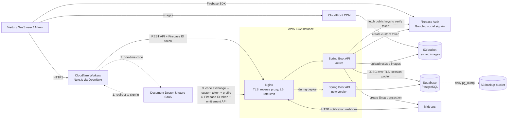
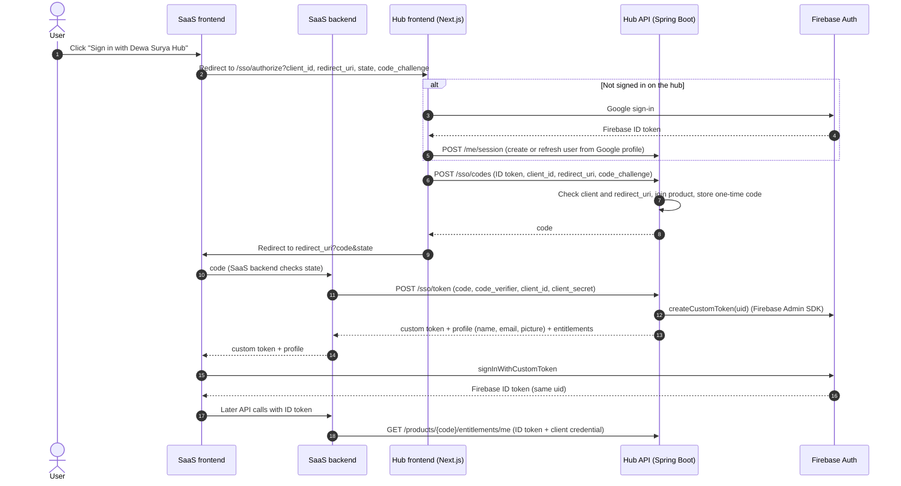

# ADR-001: Initial Technology Stack

| Author   | Dewa Surya Ariesta                                                                                                                    |
| -------- | ------------------------------------------------------------------------------------------------------------------------------------- |
| Date     | 28 September 2026                                                                                                                     |
| Status   | Proposed                                                                                                                              |
| Deciders | Dewa Surya Ariesta                                                                                                                    |
| Related  | [PRD](../PRD.md), [ADR-002](./ADR-002-usecase.md), [ADR-003](./ADR-003-api-contract.md), [ADR-004](./ADR-004-initial_schema_model.md) |

## 1. Overview

Dewa Surya Hub (see [PRD](../PRD.md)) needs a public, SEO-friendly content site, a central user account shared across Dewa's SaaS products, subscription management, and a payment portal with one-time payments and QR code (QRIS) payments. The first connected product is Document Doctor.

The platform is built and run by one person, has no revenue at launch, and targets users in Indonesia, SEA And Europ. The stack must therefore be:

- **As cheap as possible** to run, especially before the first paying customer.
- Simple enough for one developer to operate.
- Able to grow (more SaaS products, more traffic) without a rewrite.

## 2. Decision Drivers

| #   | Driver                                                                                                    | PRD reference                  |
| --- | --------------------------------------------------------------------------------------------------------- | ------------------------------ |
| D1  | Lowest monthly cost; prefer free tiers and pay-per-use over fixed fees.                                   | —                              |
| D2  | Public pages must be server-rendered/static for SEO and fast LCP (< 2.5 s).                               | FR-C1, NFR SEO / Performance   |
| D3  | One identity across all SaaS products: sign in once on the hub with Google, then use it in every product. | G2, FR-U1, FR-U2, NFR Security |
| D4  | One-time payments with local methods for Indonesian users (QRIS, VA, e-wallets, cards).                   | G5, FR-P1, OQ1                 |
| D5  | Reliable, idempotent handling of payment webhooks.                                                        | FR-P2, NFR Reliability         |
| D6  | Relational data (users, products, plans, subscriptions, transactions, articles).                          | FR-U3, FR-P3, FR-C3            |
| D7  | Images asset must be small and fast to serve.                                                             | FR-C4, NFR Performance         |
| D8  | Infrastructure must be reproducible, not hand-clicked in a console.                                       | —                              |
| D9  | Public pages will show ads, so the frontend host must allow commercial use on its cheapest plan.          | —                              |

## 3. Decision Summary

| Area                   | Choice                                                     | Why (short)                                                                                                   |
| ---------------------- | ---------------------------------------------------------- | ------------------------------------------------------------------------------------------------------------- |
| Frontend framework     | **Next.js** (App Router)                                   | SSR/SSG for SEO; one codebase for public site, user portal, admin.                                            |
| Frontend hosting       | **Cloudflare Workers** (OpenNext adapter)                  | Commercial use (ads) allowed on free plan; global CDN; US$5 paid plan.                                        |
| Backend framework      | **Spring Boot** (Java, REST API)                           | Mature, strongly typed; first-class security, JPA, and migrations.                                            |
| Backend hosting        | **AWS EC2** (single small instance)                        | Cheapest always-on compute; full control; runs API + Nginx.                                                   |
| Reverse proxy / LB     | **Nginx** on the EC2 instance                              | Free; replaces AWS ALB (saves ~US$16+/month).                                                                 |
| Database               | **Supabase** (managed PostgreSQL)                          | Free tier to start; managed backups and upgrades; no RDS fee.                                                 |
| Authentication         | **Firebase Authentication** (Google sign-in) + **hub SSO** | Users sign in on the hub; products get the sign-in through a one-time code and a Firebase custom token. Free. |
| Payment gateway        | **Midtrans** (Snap)                                        | No monthly fee; one-time payments with QRIS, VA, GoPay, cards in IDR.                                         |
| Image storage          | **AWS S3** (+ CloudFront for delivery)                     | Cheap storage; CloudFront free tier cheaper than direct S3 egress.                                            |
| Image processing       | **Resize on upload** in Spring Boot (Scrimage)             | Store only optimized WebP sizes; no paid resize service.                                                      |
| Infrastructure as code | **Terraform** (state in S3)                                | Free CLI; reproducible AWS setup; no Terraform Cloud needed.                                                  |

## 4. Architecture Overview

Request flow in short:

1. The user opens the site; Cloudflare serves server-rendered or statically generated Next.js pages.
2. The user signs in with Google through Firebase Auth in the browser and receives a Firebase ID token.
3. The frontend calls the backend API on EC2 with that token. The Spring Boot backend verifies it (Spring Security, see 5.7) and looks up the user's role, products, and subscriptions in the Supabase PostgreSQL database.
4. For a purchase, the backend creates a Midtrans Snap transaction and returns the Snap token; the user pays once in the Midtrans popup (for example by scanning a QRIS code).
5. Midtrans sends an HTTP notification to the backend. The backend verifies the signature, updates the transaction, and activates the subscription.
6. When the user opens a connected product, the product sends them to the hub to sign in. The hub returns a one-time code; the product's backend exchanges it for a Firebase custom token and the user's Google-based profile, and then checks the user's access through the entitlement API (see 5.7).

## 5. Decisions in Detail

### 5.1 Frontend: Next.js

**Decision.** Build the public site (blog, about/portfolio, products), the user portal (profile, subscriptions, payments), and the admin dashboard in one Next.js application using the App Router.

**Rationale.**

- Supports static generation and incremental static regeneration (ISR) for articles, and server rendering where needed, which covers the SEO and LCP requirements (D2).
- Built-in metadata API, `sitemap.ts`, and `robots.ts` cover FR-C5 and V-1.1.
- One codebase and one deployment keeps work and cost low for a solo developer.
- Category and tag pages build their title and description with an async `generateMetadata` that fetches the category or tag from the API (the research note in PRD §4.3; ADR-002 UC-03).

**Alternatives considered.**

- _Astro:_ excellent for content, but the portal and admin need much more interactivity.
- _Plain React SPA (Vite):_ cheapest to host, but poor SEO without extra work.

### 5.2 Frontend hosting: Cloudflare Workers

**Decision.** Host the Next.js app on **Cloudflare Workers** using the **OpenNext Cloudflare adapter** (`@opennextjs/cloudflare`). Start on the Workers Free plan and move to Workers Paid (about US$5/month) when the free limits are reached. The backend API stays on EC2.

**Context.** The public pages will show ads (for example Google AdSense), which makes the site commercial from Phase 1 (D9). Vercel's Hobby plan is for non-commercial use only, so Vercel would cost US$20/month (Pro) from day one. Vercel is therefore not used.

**Rationale.**

- Cloudflare's free and US$5 plans allow commercial use, including ads.
- Static assets (JS, CSS, prerendered pages) are served from Cloudflare's CDN for free and do not count as Worker requests, so most blog traffic costs nothing.
- OpenNext supports the App Router, SSR, ISR, and on-demand revalidation (`revalidatePath` / `revalidateTag`), using R2 for the page cache and Durable Objects / D1 for revalidation.
- Global edge network with a location in Jakarta, close to the target users.
- Deploy with `wrangler` from CI (ADR-007); preview deployments per branch are available.
- The domain's DNS can live on Cloudflare for free, together with the site (ADR-006).

**Plan rules.**

- **Free plan limits to watch:** 100,000 Worker requests per day, 10 ms CPU time per request, and a 3 MiB compressed Worker size. Server-rendered pages and a large bundle can hit the CPU or size limit.
- **Move to Workers Paid (about US$5/month)** when any limit is hit, and in any case before Phase 3 (payments) goes live. Paid includes 10 million requests per month, much higher CPU limits, and a 10 MiB Worker size.
- Check current limits and prices on the Cloudflare pricing page before relying on these figures.

**Build and runtime rules.**

- Use the Node.js runtime through the `nodejs_compat` flag. Do not use `export const runtime = "edge"` in routes; OpenNext does not need it.
- Prefer static and ISR pages over per-request server rendering, to stay inside CPU limits and keep LCP fast (D2).
- Images are already resized on upload (see 5.9), so use a custom image loader or `unoptimized` images that point at CloudFront. Do not use Cloudflare Images (paid).
- Keep server secrets (for example the revalidate secret) as Worker secrets (`wrangler secret put`), not in `wrangler.toml` or the repository.
- Run `opennextjs-cloudflare preview` locally before each release, because the Workers runtime differs slightly from `next start`.

**Ads rules.**

- Serve `ads.txt` from `public/` at the site root.
- Load the ad script with `next/script` (`strategy="afterInteractive"` or `"lazyOnload"`) and reserve fixed space for each ad slot, so ads do not hurt LCP or cause layout shift (CLS).
- Show ads only on public content pages (blog, portfolio, product pages), never in the user portal, admin dashboard, or checkout.
- Allow the ad network's domains in the Content Security Policy.
- Add a cookie consent banner if the ad network requires it for personalised ads.

**Alternatives considered.**

- _Vercel:_ best Next.js support, but Hobby does not allow ads or other commercial use, and Pro costs about US$20/month.
- _Self-host Next.js on EC2 behind Nginx:_ US$0 extra and full Next.js support with `output: "standalone"`, but the Node.js process (about 150–250 MB) shares the 2 GiB instance with the JVM and may force `t4g.medium`, and the public site goes down with the API. Put the Cloudflare free CDN in front for caching. **Kept as the fallback** if OpenNext causes problems.
- _Netlify:_ allows commercial use on its free plan, but its Next.js runtime and free limits are less predictable for this use case.
- _AWS Amplify Hosting:_ pay-per-use and fits the AWS account, but build minutes and SSR requests are billed and Next.js support lags behind.

### 5.3 Backend framework: Spring Boot

**Decision.** Build the backend as a single **Spring Boot** REST API (latest stable Spring Boot release, on the latest Java LTS), packaged as a Docker image for `linux/arm64`. It serves the user portal, the admin dashboard, the Midtrans webhook, and the entitlement API for connected SaaS products.

**Main libraries.**

| Concern           | Library / approach                                                                                                                                                  |
| ----------------- | ------------------------------------------------------------------------------------------------------------------------------------------------------------------- |
| HTTP API          | Spring Web (MVC), Bean Validation for request DTOs.                                                                                                                 |
| Auth              | Spring Security **OAuth2 Resource Server** validating Firebase ID tokens as JWTs; **Firebase Admin SDK** (Java) only to create custom tokens for hub SSO (see 5.7). |
| Data access       | Spring Data JPA (Hibernate) with HikariCP; PostgreSQL JDBC driver, connecting to Supabase (see 5.6).                                                                |
| Schema migrations | **Flyway** (`src/main/resources/db/migration`), run on startup.                                                                                                     |
| Payments          | Midtrans Java library, or Spring `RestClient` calling the Midtrans Snap and Status APIs directly.                                                                   |
| Images            | **Scrimage** (`scrimage-core` + `scrimage-webp`) for resizing and WebP encoding (see 5.9).                                                                          |
| AWS               | AWS SDK for Java v2 (S3), credentials from the EC2 instance role; no access keys in config.                                                                         |
| Operations        | Spring Boot Actuator (`/actuator/health` for Nginx and deploy checks; not exposed publicly).                                                                        |
| Scheduling        | `@Scheduled` + **ShedLock** (PostgreSQL lock), so only one instance runs jobs during a deploy.                                                                      |
| Testing           | JUnit 5, Spring Boot Test, **Testcontainers** (real PostgreSQL in tests).                                                                                           |

**Structure.** One deployable application (modular monolith), with a package per domain: `content`, `identity`, `product`, `subscription`, `payment`, `media`, `admin`. This keeps one process to run and pay for, while leaving clean seams if a module ever needs to become its own service.

**Rationale.**

- Strong typing, transactions (`@Transactional`), and database constraints suit billing and webhook logic where mistakes cost money (D5).
- Spring Security validates Firebase tokens with configuration only, no custom crypto code (D3).
- Flyway keeps schema changes versioned in the repository.
- Large ecosystem and long-term support, suitable for a platform that will host several SaaS products.

**Cost rules (JVM memory).** A Spring Boot app uses more memory than a Node.js or Go service, and memory is the main cost limit on a small EC2 instance.

- Cap the JVM: for example `-XX:MaxRAMPercentage=` tuned so heap stays around 384–512 MB, plus container memory limits in Docker Compose.
- Keep the Hikari pool small (for example 5–10 connections). This also keeps the API inside the Supabase plan's connection limit, including during a blue/green deploy when two instances are connected.
- Enable lazy initialization only if startup memory is a problem; measure first.
- Add a 2 GB swap file on the instance as a safety net, not as normal working memory.
- If memory stays tight, the options in order of cost are: tune the JVM → build a **GraalVM native image** (much lower memory, longer builds) → move to a 4 GiB instance.

**Alternatives considered.**

- _Node.js (NestJS/Express):_ lower memory use and same language as the frontend, but Spring Boot was chosen for its typing, security, and transaction support.
- _Go:_ lowest memory and cost to run, but a smaller ecosystem for this kind of business application.
- _Next.js API routes only (no separate backend):_ cheapest, but runs as serverless functions on the frontend host, which are a poor fit for webhooks, image processing, and a shared entitlement API.

### 5.4 Backend hosting: AWS EC2

**Decision.** Run the backend API on **one small ARM (Graviton) EC2 instance**, for example `t4g.small` (2 vCPU, 2 GiB RAM), in `ap-southeast-1` (Singapore), the same region as the Supabase project (see 5.6), so every database query stays in one region. The Spring Boot API and Nginx run on the instance using Docker Compose. The database is not on this instance.

**Memory budget on `t4g.small` (2 GiB).** Roughly: Spring Boot ~600–700 MB (heap + metaspace + threads), Nginx and OS ~300 MB. With PostgreSQL on Supabase, two API instances fit comfortably during a blue/green deploy. If monitoring shows memory pressure, move to `t4g.medium` (4 GiB, about twice the price).

**Rationale.**

- One always-on instance is the cheapest way to run an API and webhook receiver.
- ARM instances cost less than x86 instances of the same size.
- A region close to Indonesia keeps latency low for users and for Midtrans callbacks.
- Can be upgraded later with a 1-year Savings Plan or Reserved Instance (about 30–40% cheaper) once usage is stable.

**Setup rules.**

- Attach an Elastic IP so the webhook URL and DNS record never change.
- Security group: open only 80/443 to the internet; SSH (22) only from Dewa's IP, or use AWS Systems Manager Session Manager and close 22 entirely.
- Enable daily EBS snapshots through AWS Data Lifecycle Manager (keep 7). The instance holds no database data, so this protects only configuration and can be dropped if the instance is fully rebuilt by Terraform.

**Alternatives considered.**

- _AWS Lightsail:_ similar price with bundled traffic; a good fallback, but less flexible with Terraform and other AWS services.
- _ECS Fargate / Lambda:_ no servers to manage, but more expensive for an always-on API with a database, and Lambda cold starts affect webhooks.

### 5.5 Load balancing and reverse proxy: Nginx

**Decision.** Use Nginx on the EC2 instance as the only entry point to the backend, instead of an AWS Application Load Balancer.

**Nginx responsibilities.**

- TLS termination with free Let's Encrypt certificates (certbot, auto-renew).
- Reverse proxy to the Spring Boot container(s) through an `upstream` block. At launch this holds one instance; more instances (on the same host or on new EC2 instances) can be added to the same block later.
- Zero-downtime deploys (blue/green): start the new Spring Boot container, wait until `/actuator/health` reports `UP`, switch the upstream to it, reload Nginx, then stop the old container.
- Block public access to `/actuator/*`.
- Rate limiting (`limit_req`) on auth, SSO (`/sso/codes`, `/sso/token`), and payment endpoints.
- Request size limits for image uploads, and gzip compression.

**Rationale.** An AWS ALB costs about US$16+/month before traffic; Nginx is free and handles the expected load on one machine easily. When the platform grows to several EC2 instances, the same Nginx config can point at them, or an ALB can be introduced then.

**Trade-off.** Nginx on the same instance is not highly available. If the instance goes down, the API goes down (the public site on Cloudflare stays up). This is accepted for launch (see Section 7).

### 5.6 Database: Supabase (managed PostgreSQL)

**Decision.** Use a **Supabase** project as a managed PostgreSQL database, in `ap-southeast-1` (Singapore), next to the EC2 instance. Supabase is used **only as a Postgres database**. Supabase Auth, Storage, Realtime, and the auto-generated Data API are not used: identity stays in Firebase (5.7), images stay in S3 (5.9), and all data access goes through the Spring Boot API.

**Rationale.**

- The data is relational: users ↔ products ↔ plans ↔ subscriptions ↔ transactions, and articles ↔ categories ↔ tags (D6). Supabase is standard PostgreSQL, so JPA, Flyway, and `SELECT ... FOR UPDATE` work unchanged.
- Transactions and unique constraints make webhook handling safe to retry. For example, a unique constraint on the Midtrans `order_id` prevents double processing (D5).
- `JSONB` columns can hold per-product plan features and limits, so a new SaaS product needs configuration, not schema changes (NFR Extensibility).
- The free plan costs nothing before launch (D1). The Pro plan (about US$25/month) is cheaper than RDS with backups and adds daily backups, no project pausing, and more storage.
- Supabase handles Postgres upgrades, disk, and server tuning, so the one developer does not operate a database server. Moving PostgreSQL off the EC2 instance also frees about 300–400 MB of RAM there (5.4).
- It is plain PostgreSQL, so leaving Supabase later means a `pg_dump` / `pg_restore` to RDS or another host, with no code changes.

**Plan rules.**

- **Free plan for Phase 1–2.** Limits to watch: about 500 MB database size, a paused project after 7 days without activity, and no automatic backups. The scheduled jobs in 5.3 keep the database active; the daily `pg_dump` below covers backups.
- **Upgrade to Pro before Phase 3 (payments) goes live**, at the same time as the move to Cloudflare Workers Paid in 5.2. Payment and subscription data must not depend on a free plan that can pause.
- Check current limits and prices on the Supabase pricing page before relying on these figures.

**Connection rules.**

- Spring Boot connects with JDBC over TLS (`sslmode=require`) using the **session pooler** connection string (Supavisor, port 5432). It works over IPv4 from EC2 and supports prepared statements, which Hibernate uses.
- Do **not** use the transaction pooler (port 6543) for the API, because it does not support prepared statements. The **direct connection** needs IPv6 (or the paid IPv4 add-on), so use it only if the VPC has IPv6 enabled.
- Flyway runs on startup through the same session connection.
- Use a dedicated database role for the API with only the rights it needs, not the `postgres` superuser. Keep the connection string and password in SSM Parameter Store (5.10).
- Restrict database access with Supabase **Network Restrictions** to the EC2 Elastic IP plus Dewa's IP for admin work.

**Security rules (Data API).** Supabase exposes tables in the `public` schema through its REST Data API by default. Because the hub never uses it:

- Disable the Data API in the project settings, **or** put all tables in a separate schema (for example `hub`) that is not exposed.
- Enable Row Level Security on every table with no policies, so the `anon` and `authenticated` keys can read nothing even if the Data API is turned on by mistake. The API role bypasses RLS because it owns the tables.
- Do not put the Supabase `anon` or `service_role` keys in the frontend or backend; they are not needed.

**Operating rules.**

- Daily `pg_dump` (run from the EC2 instance) to a private S3 bucket, with an S3 lifecycle rule to delete backups after 30 days. Keep this on the Pro plan too, so a backup exists outside Supabase. Test a restore at least once per quarter.
- Schema changes are made only through **Flyway** migration files in the Spring Boot project; Hibernate `ddl-auto` is set to `validate`, never `update`, in production. Do not change the schema from the Supabase dashboard.
- Use a separate Supabase project for staging if a staging environment is added.
- Local development and tests use a local PostgreSQL (Docker Compose, Testcontainers) with the same major version as Supabase.

**Alternatives considered.**

- _Self-hosted PostgreSQL on the EC2 instance:_ US$0 extra, but manual backups, upgrades, and tuning, and it shares the 2 GiB RAM with the JVM.
- _Amazon RDS:_ managed backups and failover in the same AWS account, but about US$15+/month for the smallest instance after the free tier, before storage and backups. Consider it if the platform moves fully into AWS (see Section 8).
- _Neon:_ similar serverless Postgres with a free tier, but compute scales to zero and cold starts affect webhooks. Supabase was chosen for its always-on database and simpler pricing.
- _MongoDB / Firestore:_ poor fit for relational billing data.

### 5.7 Authentication: Firebase Authentication

**Decision.** The **hub is the only place where users sign in**. Users sign in on the hub with **Google** through Firebase Authentication (OAuth 2.0, PRD OQ2). Connected SaaS products (Document Doctor and later ones) do not show their own sign-in. They send the user to the hub ("Sign in with Dewa Surya Hub"), and the hub sends the user back signed in, with their access and their Google-based profile (FR-U1, FR-U2, US-2.1).

Firebase handles **identity only**. Roles, product membership, subscriptions, entitlements, and the profile copy stay in PostgreSQL.

**Sign-in on the hub.**

1. The hub frontend signs in with the Firebase Web SDK (Google provider) and gets a short-lived Firebase ID token.
2. Every hub API call sends `Authorization: Bearer <ID token>`.
3. Spring Security (OAuth2 Resource Server) verifies the token as a JWT: signature against Google's public keys (JWK set `https://www.googleapis.com/service_accounts/v1/jwk/securetoken@system.gserviceaccount.com`), issuer `https://securetoken.google.com/<firebase-project-id>`, audience `<firebase-project-id>`, and expiry. The backend then finds or creates the user row by Firebase `uid` (the token's `sub` claim) and copies name, email, and picture from the Google sign-in. The profile follows the Google account and is not edited in the hub or in any product (PRD US-2.1).
4. Admin access is decided by a `role` column in PostgreSQL (FR-U4), not by the client.

**Sign-in on a connected SaaS product (hub SSO).** Firebase keeps its sign-in state per website domain, so signing in on the hub does not by itself sign the user in on `documentdoctor.<domain>`. The hub therefore hands the sign-in over with a short, OAuth 2.0-style **authorization code flow with PKCE**. At the end, the hub gives the product a **Firebase custom token** for the same user, so the product holds a normal Firebase session in the **same Firebase project**.

1. The product redirects the browser to the hub's `/sso/authorize` page with its `client_id`, a registered `redirect_uri`, a random `state`, and a PKCE `code_challenge` (S256).
2. If the user is not signed in on the hub, the hub shows Google sign-in (step 1 above) and creates the account from the Google profile if it is new. If the user is already signed in on the hub, this step is skipped and the user goes straight back to the product without seeing a prompt.
3. The hub frontend asks the hub API for a one-time **authorization code**. The API checks that the client is active and that `redirect_uri` matches a registered URI exactly, records that the user joined the product (FR-U3, UC-06), and stores the code.
4. The hub redirects to `redirect_uri?code=…&state=…`.
5. The product's **backend** checks `state` and exchanges the code at the hub API with `code_verifier` and its client credential (the same credential as ADR-003 §8.1).
6. The hub API returns a Firebase **custom token** for the user's `uid` (made with the Firebase Admin SDK), the user's **profile** (hub user ID, name, email, and avatar URL from Google), and the current entitlements.
7. The product frontend calls `signInWithCustomToken`. Firebase then keeps the user signed in on the product and refreshes the ID token by itself. From here on, the product uses the existing product contract (user's Firebase ID token plus client credential, ADR-003 §8) to check entitlements.
8. The product shows the profile it received from the hub and does not let the user edit it. It gets a fresh copy on each sign-in, or from the hub's membership and entitlement responses.

**SSO security rules.**

- `redirect_uri` must exactly match one of the URIs registered for the product (no wildcards, HTTPS only, except `localhost` in development).
- The authorization code is random, single-use, valid for **60 seconds**, stored only as a hash, and tied to the `client_id`, `redirect_uri`, `code_challenge`, and user. A reused code is rejected, and the product's other codes for that user are cancelled.
- The code exchange happens server to server only. The `client_secret` never reaches a browser.
- The custom token is valid for at most 1 hour and is used once, straight away, by the product frontend. It carries no extra claims; access is always read from the hub API, never from token claims.
- The hub refreshes the stored profile only from Google sign-ins on the hub. A token from a custom-token sign-in (`firebase.sign_in_provider = "custom"`) never overwrites name, email, or picture.
- Rate-limit `/sso/codes` and `/sso/token` in Nginx, like the auth endpoints (5.5).
- Signing out of a product ends only that product's session. Signing out everywhere at once is not planned at launch.

**Rationale.**

- Matches the product requirement: one account, signed in on the hub, reused in every product, with the profile taken from Google (FR-U1, FR-U2, US-2.1).
- Social sign-in and custom tokens are free on the standard Firebase Auth plan, which fits D1.
- No passwords at all: Google handles the account, recovery, and verification (NFR Security: "Integrate with social sign in").
- The authorization code + PKCE pattern is the standard OAuth 2.0 way to pass a sign-in between websites. The hub only adds two endpoints and one table, instead of running a full OpenID Connect provider.
- Because the product ends up with a normal Firebase ID token from the same project, the product contract in ADR-003 §8 does not change, and the product can verify the token itself.
- This implements PRD Open Question 2 ("OAuth 2.0 with Firebase"): Google sign-in through Firebase on the hub, hub SSO handoff to products, and the hub's entitlement API.

**Rules.**

- Do not upgrade to Firebase Identity Platform unless a needed feature requires it, and check pricing before doing so.
- Email/password and phone/SMS sign-in are not enabled. Phone/SMS is paid per message; adding any provider needs a separate decision.
- The **Firebase Admin SDK** (Java) is used by the hub API only to create custom tokens. Its service account key is stored as an SSM `SecureString` parameter (5.10) and never in the repository or the product apps.
- Only the hub's domain is listed in Firebase **Authorized domains** for Google sign-in. Products do not need to be listed, because they sign in with custom tokens.
- Keep a copy of the user's profile data (name, email, avatar URL, products) in PostgreSQL so the hub is not locked into Firebase.

**Alternatives considered.**

- _Each product shows its own Google sign-in on the shared Firebase project:_ simplest, but the user signs in again in every product and the hub is not the place where the account starts. Rejected because it does not meet the "sign in on the hub" requirement.
- _Hub as a full OpenID Connect provider (Spring Authorization Server) issuing its own tokens:_ the most standard option, but more to build and run (keys, consent, discovery, token refresh), and the product contract would move off Firebase tokens. Consider it if outside developers ever build products on the hub.
- _Shared cookie on a parent domain (`.<domain>`):_ only works while every product lives under the same domain, and moves sign-in into cookies with CSRF risks.
- _Build auth in the backend (sessions/JWT + OAuth):_ free, but more security-sensitive code to write and maintain.
- _Auth0 / Clerk:_ better developer experience, but free tiers are smaller and paid tiers are expensive.
- _AWS Cognito:_ cheap, but harder to use and a weaker social sign-in experience.

### 5.8 Payment gateway: Midtrans

**Decision.** Use Midtrans with **Snap** (hosted payment popup/redirect) for all checkouts, charged in **IDR**, as **one-time payments** (PRD G5). Each payment buys one period of a plan; nothing is charged automatically.

**Rationale.**

- No setup or monthly fee; only a per-transaction fee that depends on the payment method (D1).
- Supports the payment methods Indonesian users expect: QRIS, bank transfer/virtual account, GoPay and other e-wallets, and credit/debit cards (D4).
- Snap means card data never touches our servers, so card data is not stored on the platform (NFR Security).
- This implements PRD Open Question 1 ("Midtrans for initial"), with IDR only at launch, and the non-goal of a single payment gateway.

**Integration rules.**

- The Spring Boot backend creates the transaction with a unique `order_id` and stores it as `pending` before returning the Snap token.
- Access is granted **only** from the HTTP notification (webhook), never from the browser redirect (FR-P2).
- Every notification is verified: `signature_key` must equal `SHA512(order_id + status_code + gross_amount + server_key)`. Then fetch the latest status from the Midtrans Status API before changing data.
- Webhook handling is idempotent: process each `order_id` + status change only once, inside one `@Transactional` method that locks the transaction row (`SELECT ... FOR UPDATE`).
- Use the Midtrans sandbox for development and staging; keep the server key only on the backend.
- Renewal is a new one-time purchase of the same plan (ADR-002 UC-12). Automatic recurring charges (Midtrans subscription API) are not planned.
- Refunds are **not** handled in the platform (PRD Open Question 6). Dewa refunds in the Midtrans dashboard; the hub only receives the `refund` status through the webhook and ends access (ADR-002 UC-09).

**Alternatives considered.**

- _Xendit:_ similar methods and pricing; a valid alternative if Midtrans onboarding is a problem.
- _Stripe:_ strong API and international cards, but limited local Indonesian payment methods and not the best fit for IDR-first customers.

### 5.9 Image storage and processing: S3 with resize on upload

**Decision.** The admin uploads images to the backend, which **resizes and compresses them before storing them in S3**. Images are served through CloudFront.

**Processing on upload.**

1. Check file type (JPEG, PNG, WebP only) and size (for example, max 10 MB) in Nginx and the API.
2. In Spring Boot, using **Scrimage**: apply the EXIF orientation, drop all metadata (EXIF/GPS), and generate WebP versions at fixed widths, for example **480, 960, and 1600 px**. Run resizing on a small bounded thread pool (for example 2 threads) so uploads cannot exhaust CPU or memory.
3. Upload only the resized versions to S3 under a content-hash key, for example `images/<hash>/960.webp`. The original is not kept, which saves storage.
4. Save the image record (keys, width, height, alt text) in PostgreSQL for the media library (A-3.7).

**Delivery.**

- The S3 bucket is private. CloudFront reads it through Origin Access Control.
- Long cache headers (`Cache-Control: public, max-age=31536000, immutable`), since keys change when content changes.
- The frontend uses `srcset` with the three widths, so browsers download the smallest image that fits.

**Rationale.**

- Resizing once on upload is free (it runs on the existing EC2 instance) and keeps storage and transfer small (D7).
- CloudFront's always-free tier includes a large amount of monthly data transfer, which is cheaper than serving directly from S3.
- Pre-sized images mean no paid image optimization (Vercel or Cloudflare Images) is needed (see 5.2).

**Note.** `scrimage-webp` uses Google's `cwebp` binary. Check that the bundled binary works on `linux/arm64` (Graviton). If it does not, install the `webp` package in the Docker image and point Scrimage to it.

**Alternatives considered.**

- _S3 upload triggers a Lambda to resize:_ scales better, but adds moving parts. Consider it if uploads become heavy.
- _Thumbnailator + ImageIO:_ simple Java resizing, but Java has no built-in WebP encoder, so WebP output would still need an extra library.
- _Resize in the browser before upload:_ reduces server load, but clients can bypass it, so server-side checks are still needed.
- _Image services (Cloudinary, imgix) or Vercel image optimization:_ easy, but paid beyond small free quotas.

### 5.10 Infrastructure as code: Terraform

**Decision.** Define all AWS resources with Terraform (open-source CLI), stored in the repository under `infra/`.

**Scope.** VPC and security groups, EC2 instance and Elastic IP, EBS snapshot policy, S3 buckets (images, backups, Terraform state), CloudFront distribution, IAM roles (for example, an instance role that can write only to the image and backup buckets), and optionally DNS records.

**Rules.**

- Remote state in a private, versioned, encrypted S3 bucket, using S3 native state locking (`use_lockfile = true`). No DynamoDB table or Terraform Cloud needed.
- No secrets in `.tf` files or state where avoidable. Keep secrets (Midtrans server key, Supabase database connection string and password, Next.js revalidate secret, Firebase Admin service account key) in AWS SSM Parameter Store standard `SecureString` parameters, which are free. Product client secrets are stored only as hashes in PostgreSQL.
- Separate workspaces or folders for `staging` and `production` if a staging environment is added.
- Cloudflare, Firebase, and Supabase settings are managed in their consoles (Cloudflare Workers config in `wrangler.toml`) at launch; they can be moved to their Terraform providers later. The Supabase network restriction must be updated whenever the Elastic IP changes.

**Alternatives considered.**

- _AWS CDK / Pulumi:_ code-based and powerful, but Terraform is more widely known and provider-neutral.
- _Manual console setup:_ fastest the first time, but not reproducible (D8).

## 6. Estimated Monthly Cost

Approximate figures in USD before tax, for low launch traffic. **Check current prices on each provider's pricing page before relying on them**; prices differ by region and change over time.

| Item                            | Launch (Phase 1–2)     | With payments (Phase 3+)                                               |
| ------------------------------- | ---------------------- | ---------------------------------------------------------------------- |
| Cloudflare Workers (Next.js)    | $0 (Free) or $5 (Paid) | $5 (Paid), or $0 if self-hosted on EC2                                 |
| EC2 `t4g.small`, on-demand      | ~$12–16                | ~$12–16, or ~$25–32 if `t4g.medium` is needed (less with Savings Plan) |
| Public IPv4 / Elastic IP        | ~$3.6                  | ~$3.6                                                                  |
| EBS gp3 20–30 GB + snapshots    | ~$2–4                  | ~$2–4                                                                  |
| Supabase (PostgreSQL)           | $0 (Free)              | ~$25 (Pro)                                                             |
| S3 (images + backups + state)   | < $1                   | ~$1                                                                    |
| CloudFront                      | $0 (within free tier)  | $0 (within free tier)                                                  |
| Firebase Auth (social / email)  | $0                     | $0                                                                     |
| Midtrans                        | $0                     | Per-transaction fees only                                              |
| Terraform, Nginx, Let's Encrypt | $0                     | $0                                                                     |
| **Total (approx.)**             | **~$18–30 / month**    | **~$50–65 / month**                                                    |

Self-hosting Next.js on the same `t4g.small` next to Spring Boot may fit now that PostgreSQL is on Supabase, but measure memory first. If it does not fit, the fallback in 5.2 means moving to `t4g.medium` (about US$12–16 more per month), which costs more than Cloudflare Workers Paid.

New AWS accounts may be eligible for free-tier credits that cover part of the first months.

## 7. Consequences

### 7.1 Positive

- Very low fixed cost: the platform runs for roughly the price of one small server until it earns revenue.
- Few moving parts: one frontend deployment, one server, four external services (Firebase, Midtrans, Supabase, AWS S3/CloudFront).
- No database server to operate: Supabase handles PostgreSQL upgrades, disk, and tuning.
- Clear separation of concerns: Firebase proves _who_ the user is; PostgreSQL decides _what_ they can access; Midtrans handles _money_.
- Reproducible infrastructure through Terraform.

### 7.2 Negative and risks

| Risk                                                                                                                                          | Mitigation                                                                                                                                            |
| --------------------------------------------------------------------------------------------------------------------------------------------- | ----------------------------------------------------------------------------------------------------------------------------------------------------- |
| Single EC2 instance is a single point of failure for the API and webhooks.                                                                    | Terraform to rebuild quickly (the instance holds no data); Midtrans retries notifications, so short outages do not lose payments.                     |
| Supabase Free plan pauses after inactivity, has no backups, and has a small storage limit.                                                    | Scheduled jobs keep it active; daily `pg_dump` to S3; upgrade to Pro before Phase 3 (5.6).                                                            |
| Dependency on Supabase for the database (outage, pricing change).                                                                             | Plain PostgreSQL only (no Supabase-specific features); daily `pg_dump` in S3 allows restore to RDS or another host.                                   |
| Supabase Data API exposes `public` tables if left on.                                                                                         | Data API disabled or non-exposed schema, RLS enabled on all tables, no Supabase keys in the apps (5.6).                                               |
| Database is outside AWS; each query crosses the network.                                                                                      | EC2 and Supabase in the same region (`ap-southeast-1`); session pooler with a small Hikari pool; avoid N+1 queries.                                   |
| Spring Boot (JVM) memory on a 2 GiB instance; out-of-memory kills the API.                                                                    | Cap JVM heap and container memory, add swap, set a CloudWatch memory alarm (CloudWatch agent); GraalVM native image or `t4g.medium` if needed.        |
| Slow JVM startup lengthens deploys and restarts.                                                                                              | Blue/green deploy through Nginx with health check, so users never hit a starting instance.                                                            |
| Next.js on Cloudflare Workers (OpenNext) is less mature than on Vercel; some features may behave differently or hit Worker CPU / size limits. | Prefer static/ISR pages; test with `opennextjs-cloudflare preview` before each release; move to Workers Paid; fall back to self-hosting on EC2 (5.2). |
| Ads slow down public pages (LCP, CLS) and hurt SEO.                                                                                           | Load ad scripts after the page is interactive, reserve ad slot space, and keep ads off the portal, admin, and checkout (5.2).                         |
| Dependency on Firebase for identity.                                                                                                          | Store profile and roles in PostgreSQL keyed by Firebase `uid`; Firebase users can be exported if needed.                                              |
| The hub is the only sign-in point; if the hub API is down, users cannot sign in to products.                                                  | Users already signed in on a product stay signed in (Firebase refreshes their token without the hub); products cache entitlements (ADR-003 §8.5).     |
| SSO handoff bugs (open redirect, stolen or reused code) could sign a user in on the wrong site.                                               | Exact `redirect_uri` match, `state`, PKCE, 60-second single-use hashed codes, server-to-server code exchange with the client secret (5.7).            |
| Leaked Firebase Admin service account key allows custom tokens for any user.                                                                  | Key only in SSM `SecureString`, read by the instance role; rotate it in Google Cloud if leaked; the hub API is the only holder.                       |
| Frontend (Cloudflare) and API (EC2) on different hosts.                                                                                       | Serve API on a subdomain (for example `api.<domain>`), strict CORS allow-list, tokens in headers rather than cross-site cookies.                      |
| One-time payments may lower renewal rates (PRD §8, G4).                                                                                       | Show the end date clearly; send reminder emails before expiry (ADR-006).                                                                              |

## 8. When to Revisit This Decision

Create a new ADR that supersedes the relevant part of this one when any of these happens:

- **CPU or memory on EC2 stays above ~70%** → upgrade the instance size.
- **The database outgrows the Supabase Pro compute size** or latency to Supabase becomes a problem → a larger Supabase compute add-on, or move to RDS in the same VPC.
- **Downtime becomes unacceptable** (paying customers depend on the API) → two EC2 instances behind an ALB; Supabase read replica or high availability add-on, or RDS Multi-AZ.
- **Supabase pricing or limits change** in a way that makes RDS cheaper for the same setup.
- **Monthly revenue comfortably covers managed services** → consider managed containers (ECS).
- **Cloudflare Workers usage passes the Paid plan's included requests**, or OpenNext blocks a needed Next.js feature → self-host Next.js on EC2 (5.2).
- **Image uploads become frequent or large** → move resizing to an S3-triggered Lambda.
- **Firebase pricing or limits change** in a way that affects social sign-in or custom tokens.
- **Outside developers build products on the hub**, or single sign-out is needed → replace the SSO handoff with a full OpenID Connect provider (5.7).

## 9. Follow-up Decisions

| ADR     | Topic                                                                                                             | Status   |
| ------- | ----------------------------------------------------------------------------------------------------------------- | -------- |
| ADR-002 | Use cases (update: products sign in through the hub, OQ4)                                                         | Proposed |
| ADR-003 | API contract, including SSO (`/sso/authorize`, `/sso/codes`, `/sso/token`) and entitlement for connected products | Proposed |
| ADR-004 | Initial schema model (add registered redirect URIs and SSO codes)                                                 | Proposed |
| ADR-005 | Ads provider and placement (for example Google AdSense), consent banner                                           | To do    |
| ADR-006 | Domain, DNS, and email sending provider                                                                           | To do    |
| ADR-007 | CI/CD pipeline (build Spring Boot ARM image, deploy to EC2)                                                       | To do    |
