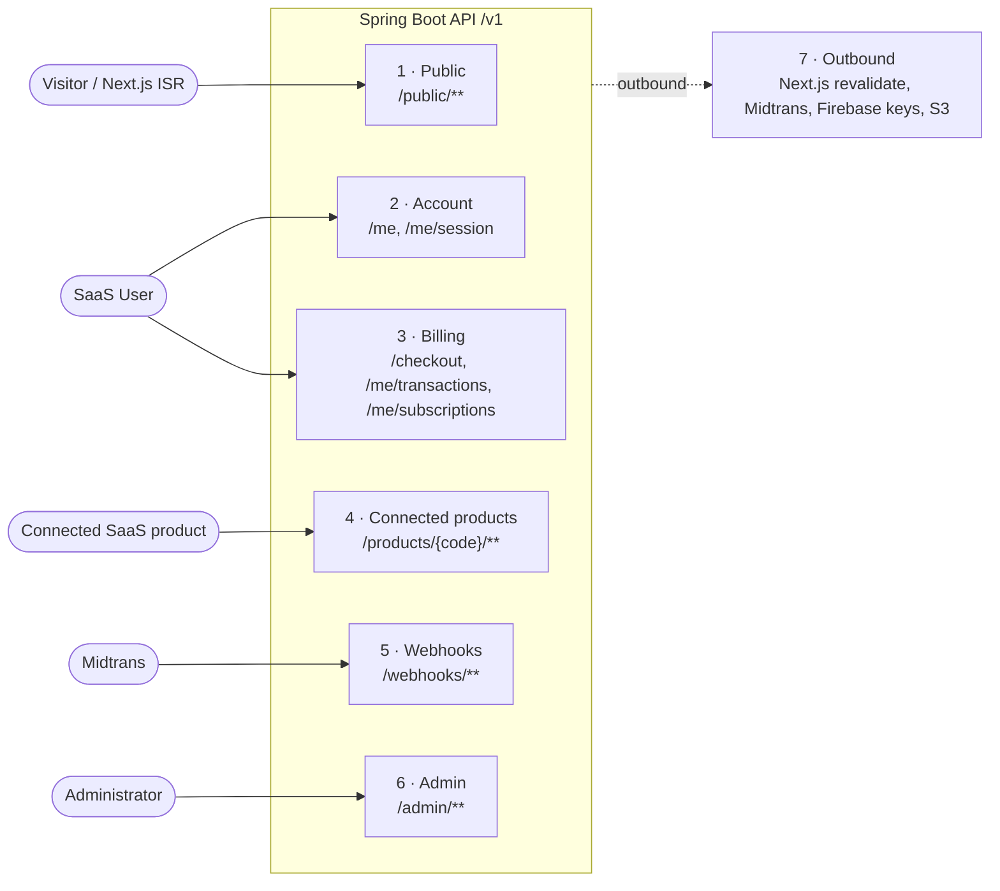

# ADR-003: API Contract

| Author   | Dewa Surya Ariesta                                                                                |
| -------- | ------------------------------------------------------------------------------------------------- |
| Date     | 28 September 2026                                                                                 |
| Status   | Proposed                                                                                          |
| Deciders | Dewa Surya Ariesta                                                                                |
| Related  | [PRD](../PRD.md), [ADR-001](./ADR-001-initial_technology.md), [ADR-002](./ADR-002-usecase.md), [ADR-004](./ADR-004-initial_schema_model.md) |

## 1. Overview

[ADR-001](./ADR-001-initial_technology.md) chose a single Spring Boot REST API behind Nginx on EC2, called by the Next.js app on Vercel, by connected SaaS products, and by Midtrans. [ADR-002](./ADR-002-usecase.md) describes every flow as a use case. This ADR defines the full contract behind those use cases:

| #   | Covered here                                                                                         |
| --- | ---------------------------------------------------------------------------------------------------- |
| 1   | The conventions every endpoint follows (base URL, auth, errors, pagination, formats).               |
| 2   | Every endpoint, **grouped by who calls it and which backend module owns it**.                        |
| 3   | Request and response shapes, status codes, and error codes.                                         |
| 4   | The contract for connected SaaS products (client credentials, entitlement response, caching).       |
| 5   | The outbound calls the API makes to other systems (Next.js revalidation, Midtrans).                 |

## 2. Decision

| #   | Decision                                                                                                                                                 |
| --- | -------------------------------------------------------------------------------------------------------------------------------------------------------- |
| D1  | The API follows the conventions in §3 and the endpoints in §5–§11. A new endpoint is added to this document (or a later ADR) before it is built.         |
| D2  | Endpoints are split into seven groups (§4). Each group has one URL prefix and one security rule, so Spring Security and Nginx are configured per prefix. |
| D3  | Connected products authenticate with **the user's Firebase ID token plus a per-product client credential**, sent server-to-server (§8).                  |
| D4  | The OpenAPI document generated from the code (springdoc-openapi, `/v1/openapi.json`, not public in production) must match this ADR; differences are bugs. |

## 3. Conventions

### 3.1 Base URL and versioning

| Environment | Base URL                          |
| ----------- | --------------------------------- |
| Production  | `https://api.<domain>/v1`         |
| Staging     | `https://api-staging.<domain>/v1` |
| Local       | `http://localhost:8080/v1`        |

- All paths in this document are relative to the base URL. `GET /public/articles` means `GET https://api.<domain>/v1/public/articles`.
- A breaking change creates `/v2` for the affected endpoints; `/v1` stays until every caller (including connected products) has moved.
- Adding a field to a response is **not** breaking. Callers must ignore fields they do not know.

### 3.2 Authentication types

Each endpoint lists one of these types in the **Auth** column.

| Auth       | What the caller sends                                                                  | Checked by                                                                              |
| ---------- | -------------------------------------------------------------------------------------- | --------------------------------------------------------------------------------------- |
| `None`     | Nothing.                                                                               | —                                                                                       |
| `User`     | `Authorization: Bearer <Firebase ID token>`                                            | Spring Security resource server (ADR-001 §5.7).                                         |
| `Admin`    | Same as `User`.                                                                        | As `User`, plus `role = ADMIN` in PostgreSQL.                                           |
| `Product`  | `Authorization: Bearer <user's Firebase ID token>` + `X-Client-Id` + `X-Client-Secret` | As `User`, plus a valid, active product credential that matches `{productCode}` (§8.1). |
| `Midtrans` | Midtrans notification body with `signature_key`.                                       | Signature check (ADR-002 UC-09 step 1).                                                 |

Rules for every authenticated endpoint (ADR-002 §7):

| #   | Rule                                                                                                                                   |
| --- | -------------------------------------------------------------------------------------------------------------------------------------- |
| A1  | Invalid, expired, or missing token → `401 UNAUTHENTICATED`. The frontend refreshes the token with the Firebase SDK and retries **once**. |
| A2  | Non-admin on `/admin/**` → `403 FORBIDDEN`.                                                                                            |
| A3  | The user is always taken from the token, never from a request parameter. `/me/**` endpoints never accept a `userId`.                   |

Sign-in is **Google only** (PRD OQ2), so every token has a verified email; there is no email-verification check.

### 3.3 Request and response format

- Content type is `application/json; charset=utf-8`, except file uploads (`multipart/form-data`) and errors (`application/problem+json`).
- JSON field names are `camelCase`. Enum values are `UPPER_SNAKE_CASE` (for example `PUBLISHED`, `EXPIRED`).
- IDs are UUID strings, except transactions, which are addressed by their `orderId` (for example `DSH-20261028-7F3K9Q`), and products and plans, which also have a stable human `code` (for example `document-doctor`).
- Timestamps are ISO-8601 in UTC with a `Z` suffix: `"2026-10-28T03:15:00Z"`. The frontend converts to the user's time zone (default `Asia/Jakarta`).
- Money is an **integer number of rupiah** plus a currency code; there are no decimals in IDR:

  ```json
  { "amount": 49000, "currency": "IDR" }
  ```

- `null` fields are included in responses (not omitted), so the shape is stable.
- `PATCH` bodies are partial: only the fields sent are changed. `PUT` replaces the whole editable resource.

### 3.4 Pagination, sorting, filtering

List endpoints take:

| Parameter | Default      | Notes                                                                                             |
| --------- | ------------ | ------------------------------------------------------------------------------------------------- |
| `page`    | `1`          | 1-based (Spring `one-indexed-parameters: true`). Matches `?page=n` on the site.                   |
| `size`    | `20`         | Maximum `100`.                                                                                    |
| `sort`    | per endpoint | `field,asc` or `field,desc`. Only the fields listed for the endpoint are allowed; others → `400`. |

Paged response:

```json
{
  "items": [
    /* ... */
  ],
  "page": 1,
  "size": 20,
  "totalItems": 57,
  "totalPages": 3
}
```

### 3.5 Errors

Errors use RFC 9457 Problem Details (`application/problem+json`) with a stable machine-readable `code`:

```json
{
  "type": "https://api.<domain>/problems/validation-failed",
  "title": "Validation failed",
  "status": 400,
  "code": "VALIDATION_FAILED",
  "detail": "One or more fields are invalid.",
  "instance": "/v1/admin/articles",
  "traceId": "6f1c2a9e4b7d3c10",
  "errors": [
    {
      "field": "title",
      "code": "SIZE",
      "message": "Must be between 1 and 200 characters."
    }
  ]
}
```

- Clients branch on `code`, never on `title` or `detail` (those are for humans and may change).
- `errors` is present only for `VALIDATION_FAILED`.
- `traceId` is logged on the server, so a user or admin can quote it when reporting a problem.

Common error codes:

| HTTP | `code`                   | When                                                            |
| ---- | ------------------------ | --------------------------------------------------------------- |
| 400  | `VALIDATION_FAILED`      | Bean Validation failed, or a bad query parameter.               |
| 400  | `MALFORMED_REQUEST`      | Body is not valid JSON or has the wrong type.                   |
| 401  | `UNAUTHENTICATED`        | Missing, invalid, or expired Firebase token.                    |
| 401  | `INVALID_CLIENT`         | Missing or wrong product client credential (§8).                |
| 403  | `FORBIDDEN`              | Signed in but not allowed (for example not an admin).           |
| 404  | `NOT_FOUND`              | Resource does not exist **or the caller may not see it**.       |
| 409  | `CONFLICT`               | Generic state conflict; specific codes are listed per endpoint. |
| 413  | `PAYLOAD_TOO_LARGE`      | Upload over the limit (Nginx or API).                           |
| 415  | `UNSUPPORTED_MEDIA_TYPE` | Upload is not JPEG, PNG, or WebP.                               |
| 429  | `RATE_LIMITED`           | Nginx `limit_req` hit (§3.7). Includes `Retry-After`.           |
| 500  | `INTERNAL_ERROR`         | Unexpected error. Safe to retry `GET`s.                         |
| 502  | `UPSTREAM_ERROR`         | Midtrans or S3 call failed.                                     |

A user asking for another user's resource gets `404`, not `403`, so IDs cannot be probed.

### 3.6 CORS and caching

- CORS allow-list: the Vercel production domain, the staging domain, and `http://localhost:3000`. Allowed headers: `Authorization`, `Content-Type`, `Idempotency-Key`. No cookies (`credentials` not allowed); tokens go in headers (ADR-001 §7.2).
- Connected products call the API **server-to-server**, so CORS does not apply to them.
- `/public/**` responses send `Cache-Control: public, max-age=60, stale-while-revalidate=600` and an `ETag`. Next.js ISR is the main cache; this is a second layer.
- Every other response sends `Cache-Control: no-store`, except the entitlement endpoint (§8.5).

### 3.7 Rate limits (Nginx)

| Prefix / endpoint                                   | Limit per IP                                        |
| --------------------------------------------------- | --------------------------------------------------- |
| `/me/session`                                       | 10 / minute, burst 5                                |
| `/checkout`                                         | 10 / minute, burst 5                                |
| `/products/*/members`, `/products/*/entitlements/*` | 600 / minute per product server IP                  |
| `/admin/media` (upload)                             | 30 / minute                                         |
| `/webhooks/midtrans`                                | Not limited (Midtrans IP ranges only, if published) |
| Everything else                                     | 120 / minute, burst 60                              |

### 3.8 Idempotency

`POST /checkout` accepts an optional `Idempotency-Key` header (UUID generated by the frontend per "Buy" click). A repeat with the same key and same user within 24 hours returns the first response instead of creating a new transaction. Reusing an unexpired pending transaction for the same plan (ADR-002 UC-08) applies even without the header.

## 4. Endpoint Groups



| #   | Group              | Prefix                                                     | Auth       | Caller                                   | Backend module(s)             |
| --- | ------------------ | ---------------------------------------------------------- | ---------- | ---------------------------------------- | ----------------------------- |
| 1   | Public             | `/public/**`                                               | `None`     | Next.js (server), crawlers               | `content`, `product`          |
| 2   | Account            | `/me`, `/me/session`                                       | `User`     | Next.js (browser)                        | `identity`                    |
| 3   | Billing            | `/checkout`, `/me/transactions/**`, `/me/subscriptions`    | `User`     | Next.js (browser)                        | `payment`, `subscription`     |
| 4   | Connected products | `/products/{productCode}/**`                               | `Product`  | Document Doctor backend, future products | `identity`, `subscription`    |
| 5   | Webhooks           | `/webhooks/**`                                             | `Midtrans` | Midtrans                                 | `payment`, `subscription`     |
| 6   | Admin              | `/admin/**`                                                | `Admin`    | Next.js admin dashboard                  | `admin` + owning module       |
| 7   | Outbound           | (calls made **by** the API)                                | —          | —                                        | `content`, `payment`, `media` |

Group 6 is split into sub-groups: 6.1 Users, 6.2 Transactions, 6.3 Articles, 6.4 Media, 6.5 Categories, 6.6 Tags, 6.7 Products & Plans.

### 4.1 All endpoints at a glance

| Group | Method | Path                                          | Use case      | Phase |
| ----- | ------ | --------------------------------------------- | ------------- | ----- |
| 1     | GET    | `/public/articles`                            | UC-01, UC-03  | 1     |
| 1     | GET    | `/public/articles/{slug}`                     | UC-01         | 1     |
| 1     | GET    | `/public/categories`                          | UC-03         | 1     |
| 1     | GET    | `/public/categories/{slug}`                   | UC-03         | 1     |
| 1     | GET    | `/public/tags`                                | UC-03         | 1     |
| 1     | GET    | `/public/tags/{slug}`                         | UC-03         | 1     |
| 1     | GET    | `/public/sitemap`                             | UC-01, FR-C5  | 1     |
| 1     | GET    | `/public/products`                            | UC-02         | 1     |
| 1     | GET    | `/public/products/{productCode}`              | UC-02         | 1     |
| 2     | POST   | `/me/session`                                 | UC-04         | 2     |
| 2     | GET    | `/me`                                         | UC-05         | 2     |
| 3     | POST   | `/checkout`                                   | UC-08, UC-12  | 3     |
| 3     | GET    | `/me/transactions`                            | UC-11         | 3     |
| 3     | GET    | `/me/transactions/{orderId}`                  | UC-08, UC-11  | 3     |
| 3     | GET    | `/me/subscriptions`                           | UC-10         | 3     |
| 4     | POST   | `/products/{productCode}/members`             | UC-06         | 2     |
| 4     | GET    | `/products/{productCode}/entitlements/me`     | UC-07         | 2–3   |
| 5     | POST   | `/webhooks/midtrans`                          | UC-09         | 3     |
| 6.1   | GET    | `/admin/users`                                | UC-14         | 2     |
| 6.1   | GET    | `/admin/users/{id}`                           | UC-14         | 2     |
| 6.1   | GET    | `/admin/users/{id}/transactions`              | UC-14, UC-15  | 3     |
| 6.2   | GET    | `/admin/transactions`                         | UC-15         | 3     |
| 6.2   | GET    | `/admin/transactions/{orderId}`               | UC-15         | 3     |
| 6.2   | POST   | `/admin/transactions/{orderId}/sync`          | UC-15         | 3     |
| 6.3   | GET    | `/admin/articles`                             | UC-18         | 1     |
| 6.3   | POST   | `/admin/articles`                             | UC-16         | 1     |
| 6.3   | GET    | `/admin/articles/{id}`                        | UC-16         | 1     |
| 6.3   | PUT    | `/admin/articles/{id}`                        | UC-16         | 1     |
| 6.3   | DELETE | `/admin/articles/{id}`                        | UC-18         | 1     |
| 6.3   | POST   | `/admin/articles/{id}/publish`                | UC-17         | 1     |
| 6.3   | POST   | `/admin/articles/{id}/unpublish`              | UC-17         | 1     |
| 6.4   | GET    | `/admin/media`                                | UC-19         | 1     |
| 6.4   | POST   | `/admin/media`                                | UC-19         | 1     |
| 6.4   | GET    | `/admin/media/{id}`                           | UC-19         | 1     |
| 6.4   | PATCH  | `/admin/media/{id}`                           | UC-19         | 1     |
| 6.4   | DELETE | `/admin/media/{id}`                           | UC-19         | 1     |
| 6.5   | GET    | `/admin/categories`                           | UC-20         | 1     |
| 6.5   | POST   | `/admin/categories`                           | UC-20         | 1     |
| 6.5   | PATCH  | `/admin/categories/{id}`                      | UC-20         | 1     |
| 6.5   | DELETE | `/admin/categories/{id}`                      | UC-20         | 1     |
| 6.6   | GET    | `/admin/tags`                                 | UC-20         | 1     |
| 6.6   | POST   | `/admin/tags`                                 | UC-20         | 1     |
| 6.6   | PATCH  | `/admin/tags/{id}`                            | UC-20         | 1     |
| 6.6   | DELETE | `/admin/tags/{id}`                            | UC-20         | 1     |
| 6.7   | GET    | `/admin/products`                             | UC-21         | 3     |
| 6.7   | POST   | `/admin/products`                             | UC-21         | 3     |
| 6.7   | GET    | `/admin/products/{id}`                        | UC-21         | 3     |
| 6.7   | PATCH  | `/admin/products/{id}`                        | UC-21         | 3     |
| 6.7   | POST   | `/admin/products/{id}/credentials`            | UC-21         | 3     |
| 6.7   | DELETE | `/admin/products/{id}/credentials/{clientId}` | UC-21         | 3     |
| 6.7   | POST   | `/admin/products/{id}/plans`                  | UC-21         | 3     |
| 6.7   | PATCH  | `/admin/plans/{id}`                           | UC-21         | 3     |

Phase 1 needs the product endpoints in group 1 (`/products` page) before the admin can edit products (6.7, phase 3). Until then, Document Doctor, its plans, and its first client credential are seeded by a Flyway migration (ADR-004 §8).

## 5. Group 1 — Public (`/public/**`)

Read-only, no auth. Called mainly by Next.js on the server during ISR/SSG, so responses contain only published or public data. Owned by `content` and `product`.

### 5.1 Shared shapes

**ArticleSummary**

```json
{
  "id": "0f8c7a4e-6b1d-4b8e-9d2a-1c3e5f7a9b20",
  "slug": "deploy-spring-boot-on-graviton",
  "title": "Deploy Spring Boot on Graviton",
  "excerpt": "A cheap, reproducible setup for a JVM API on a t4g.small.",
  "coverImage": {
    /* Image, see below */
  },
  "category": { "slug": "devops", "name": "DevOps" },
  "tags": [
    { "slug": "aws", "name": "AWS" },
    { "slug": "spring-boot", "name": "Spring Boot" }
  ],
  "publishedAt": "2026-10-28T03:15:00Z",
  "updatedAt": "2026-10-29T08:00:00Z"
}
```

**Image** (also used by admin media)

```json
{
  "id": "5b2e...",
  "alt": "Architecture diagram",
  "width": 1600,
  "height": 900,
  "variants": [
    { "width": 480, "url": "https://cdn.<domain>/images/ab12cd/480.webp" },
    { "width": 960, "url": "https://cdn.<domain>/images/ab12cd/960.webp" },
    { "width": 1600, "url": "https://cdn.<domain>/images/ab12cd/1600.webp" }
  ]
}
```

The frontend builds `srcset` from `variants`. URLs are CloudFront URLs and never change for the same content (ADR-001 §5.9).

### 5.2 Endpoints

| Method | Path                             | Description                                                                                                                                                    |
| ------ | -------------------------------- | -------------------------------------------------------------------------------------------------------------------------------------------------------------- |
| GET    | `/public/articles`               | Paged list of `PUBLISHED` articles, newest first. Query: `category` (slug), `tag` (slug), `page`, `size`. Returns `Page<ArticleSummary>`.                      |
| GET    | `/public/articles/{slug}`        | One published article: `ArticleSummary` + `body` (Markdown), `bodyHtml` (sanitized), `metaTitle`, `metaDescription`, `canonicalUrl`.                           |
| GET    | `/public/categories`             | All categories that have at least one published article: `[{ slug, name, articleCount }]`.                                                                     |
| GET    | `/public/categories/{slug}`      | One category `{ slug, name, articleCount }`. Used by `generateMetadata` on the category page (UC-03 step 3).                                                  |
| GET    | `/public/tags`                   | Same as categories, for tags.                                                                                                                                  |
| GET    | `/public/tags/{slug}`            | Same as one category, for a tag.                                                                                                                               |
| GET    | `/public/sitemap`                | Every URL Next.js must put in `sitemap.xml`: `{ articles: [{ slug, updatedAt }], categories: [{ slug, updatedAt }], tags: [{ slug, updatedAt }] }`. Not paged. |
| GET    | `/public/products`               | Active products with their **public, active** plans (see Product shape).                                                                                       |
| GET    | `/public/products/{productCode}` | One active product with its public, active plans.                                                                                                              |

**Product (public)**

```json
{
  "code": "document-doctor",
  "name": "Document Doctor",
  "description": "Fix, convert, and check documents in your browser.",
  "websiteUrl": "https://documentdoctor.<domain>",
  "plans": [
    {
      "id": "b04f...",
      "code": "dd-free",
      "name": "Free",
      "price": { "amount": 0, "currency": "IDR" },
      "billingPeriod": null,
      "features": { "removeAds": false }
    },
    {
      "id": "c1a9...",
      "code": "dd-pro-monthly",
      "name": "Pro",
      "price": { "amount": 49000, "currency": "IDR" },
      "billingPeriod": "MONTHLY",
      "features": { "removeAds": true }
    }
  ]
}
```

Per PRD OQ3, the only difference between Free and Pro at launch is `removeAds`. Prices here are examples.

### 5.3 Status codes and rules

| Case                                                        | Response                                                                                                                                                                                        |
| ----------------------------------------------------------- | ----------------------------------------------------------------------------------------------------------------------------------------------------------------------------------------------- |
| Unknown slug, draft article, or unknown category/tag        | `404 NOT_FOUND` → Next.js `notFound()` (UC-01, UC-03).                                                                                                                                          |
| Old slug of a renamed published article (UC-16)             | `301 Moved Permanently`, `Location: /v1/public/articles/{newSlug}`, body `{ "slug": "<newSlug>" }`. Next.js fetches with `redirect: "manual"` and calls `permanentRedirect("/blog/<newSlug>")`. |
| Unknown or inactive product                                 | `404 NOT_FOUND`.                                                                                                                                                                                |
| Filter matches but no articles                              | `200` with empty `items` (UC-03).                                                                                                                                                               |

## 6. Group 2 — Account (`/me`, `/me/session`)

The signed-in user's own identity and profile. Owned by `identity`. Auth `User`. The profile comes from the Google account and is **read-only** in the hub (PRD US-2.1).

### 6.1 `POST /me/session` — sign in / sign up (UC-04)

Called once after Firebase sign-in. Finds or creates the user row by Firebase `uid`, then copies `email`, `name`, and `picture` from the token claims and sets `lastSignInAt`. No body.

`200 OK` for an existing user, `201 Created` for a new one. Body is `Me`:

```json
{
  "id": "9d3b...",
  "firebaseUid": "u8Kx...",
  "email": "user@example.com",
  "name": "Putu Ayu",
  "avatarUrl": "https://lh3.googleusercontent.com/a/...",
  "role": "USER",
  "products": [
    {
      "code": "document-doctor",
      "name": "Document Doctor",
      "joinedAt": "2026-10-01T02:00:00Z"
    }
  ],
  "createdAt": "2026-10-01T02:00:00Z",
  "lastSignInAt": "2026-10-28T02:00:00Z"
}
```

Errors: `401 UNAUTHENTICATED`.

Any other `/me/**` call also creates the user row if it is missing (PRD OQ4), so `POST /me/session` is a convenience, not a requirement.

### 6.2 `GET /me` — view profile (UC-05)

| Method | Path  | Body | Success    | Errors |
| ------ | ----- | ---- | ---------- | ------ |
| GET    | `/me` | —    | `200` `Me` | —      |

- There is no `PATCH /me` and no avatar upload. Name, email, and avatar change in the Google account and are synced on the next `POST /me/session`.
- `avatarUrl` is the Google profile picture URL, used as is (not copied to S3).
- Sign out needs no API call (UC-04).

## 7. Group 3 — Billing (`/checkout`, `/me/transactions/**`, `/me/subscriptions`)

Purchases, payment status, and subscription status for the signed-in user. Owned by `payment` and `subscription`. Auth `User`. All purchases are **one-time payments** (PRD G5); nothing is charged automatically.

### 7.1 Shared shapes

**Transaction**

```json
{
  "orderId": "DSH-20261028-7F3K9Q",
  "status": "PENDING",
  "product": { "code": "document-doctor", "name": "Document Doctor" },
  "plan": {
    "id": "c1a9...",
    "code": "dd-pro-monthly",
    "name": "Pro",
    "billingPeriod": "MONTHLY"
  },
  "price": { "amount": 49000, "currency": "IDR" },
  "paymentMethod": "QRIS",
  "snap": {
    "token": "66e4fa55-...",
    "redirectUrl": "https://app.midtrans.com/snap/v4/redirection/66e4...",
    "expiresAt": "2026-10-29T03:15:00Z"
  },
  "failureReason": null,
  "subscriptionId": null,
  "createdAt": "2026-10-28T03:15:00Z",
  "paidAt": null
}
```

- `status`: `PENDING` | `PAID` | `FAILED` | `REFUNDED` (ADR-002 §6.1).
- `snap` is present only while `status = PENDING` and not expired; otherwise `null`.
- `paymentMethod` is filled from Midtrans once known (`QRIS`, `BANK_TRANSFER`, `GOPAY`, `SHOPEEPAY`, `CREDIT_CARD`, `OTHER`), else `null`.

**Subscription**

```json
{
  "id": "a7e2...",
  "product": { "code": "document-doctor", "name": "Document Doctor" },
  "plan": {
    "id": "c1a9...",
    "code": "dd-pro-monthly",
    "name": "Pro",
    "billingPeriod": "MONTHLY",
    "price": { "amount": 49000, "currency": "IDR" },
    "active": true
  },
  "status": "ACTIVE",
  "startDate": "2026-10-28T03:20:00Z",
  "endDate": "2026-11-28T03:20:00Z",
  "entitled": true
}
```

- `status`: `ACTIVE` | `EXPIRED` | `CANCELLED` (ADR-002 §6.2). `CANCELLED` only happens after a refund.
- `entitled` = `status = ACTIVE` and `now < endDate`, computed by the server so the frontend never re-implements the rule.
- `plan.active = false` tells the frontend the plan is no longer sold, so "Renew" must ask for another plan (UC-12).

### 7.2 `POST /checkout` — start a purchase or renewal (UC-08, UC-12)

Request:

```http
POST /v1/checkout
Authorization: Bearer <token>
Idempotency-Key: 3b0b6a8e-2f8d-4d8a-9a7a-1b1f7c0e5d11
Content-Type: application/json

{ "planId": "c1a9..." }
```

Responses:

| Status                          | When                                                                                          | Body                                   |
| ------------------------------- | --------------------------------------------------------------------------------------------- | -------------------------------------- |
| `201 Created`                   | New `PENDING` transaction created and Snap token obtained.                                    | `Transaction` (with `snap`)            |
| `200 OK`                        | Reused an unexpired `PENDING` transaction for the same plan, or same `Idempotency-Key`.       | `Transaction` (with `snap`)            |
| `400 VALIDATION_FAILED`         | `planId` missing.                                                                             | Problem                                |
| `404 NOT_FOUND`                 | Plan does not exist.                                                                          | Problem                                |
| `409 PLAN_NOT_PURCHASABLE`      | Plan inactive, product inactive, or price is 0 (free plans are never bought, ADR-002 R4).     | Problem                                |
| `409 PLAN_CHANGE_NOT_SUPPORTED` | User has an entitled subscription to the same product on a **different** plan (UC-08).        | Problem                                |
| `502 UPSTREAM_ERROR`            | Midtrans Snap call failed; the transaction is saved as `FAILED` (UC-08).                      | Problem with `orderId` extension field |

Buying the **same** plan while entitled is a renewal (UC-12) and is allowed; UC-09 extends `endDate` from `max(now, endDate)`.

The frontend opens Snap with `snap.token`, then polls `GET /me/transactions/{orderId}` (§7.3). The browser callback from Snap **never** grants access (FR-P2).

### 7.3 Transaction and subscription endpoints

| Method | Path                         | Description                                                                                                                                  | Success                                                              | Errors                                     |
| ------ | ---------------------------- | -------------------------------------------------------------------------------------------------------------------------------------------- | -------------------------------------------------------------------- | ------------------------------------------ |
| GET    | `/me/transactions`           | Own transactions, newest first. Query: `status`, `page`, `size`. `sort`: `createdAt`. (UC-11)                                                | `200` `Page<Transaction>`                                            | —                                          |
| GET    | `/me/transactions/{orderId}` | One own transaction. Used for polling after Snap closes (UC-08 step 7): poll every 3 s for up to 2 min, then show the pending instructions. | `200` `Transaction`                                                  | `404` if not found **or not the caller's** |
| GET    | `/me/subscriptions`          | Own subscriptions, one per product, entitled first. (UC-10)                                                                                  | `200` `{ "items": [Subscription] }` (not paged; one row per product) | —                                          |

There are no cancel or resume endpoints: with one-time payments a subscription simply ends at `endDate` if it is not renewed (ADR-002 §4).

## 8. Group 4 — Connected Products (`/products/{productCode}/**`)

The contract for Document Doctor and every future product (PRD OQ2, FR-U1–FR-U3). Owned by `identity` (membership) and `subscription` (entitlement). Auth `Product`.

### 8.1 Client credentials

| Rule | Description                                                                                                                                  |
| ---- | -------------------------------------------------------------------------------------------------------------------------------------------- |
| C1   | Each product has one or two client credentials created by the admin (§10.7). `clientId` is public (for example `dd_live_4F7K2M9Q`); `clientSecret` is 40+ random characters, shown **once**. The hub stores only an Argon2id hash. |
| C2   | A credential belongs to exactly one product. A request whose `X-Client-Id` belongs to a different product than `{productCode}` → `403 FORBIDDEN`. |
| C3   | Two credentials may be active at once so a product can rotate its secret without downtime: create new → deploy product with the new one → revoke old. |
| C4   | Credentials are **server-side only**. The product's frontend never holds `clientSecret`; the product's backend forwards the user's Firebase ID token to the hub. |

### 8.2 Request headers

```http
Authorization: Bearer <user's Firebase ID token>
X-Client-Id: dd_live_4F7K2M9Q
X-Client-Secret: <secret>
```

Check order: client credential (→ `401 INVALID_CLIENT`), product active (→ `403 PRODUCT_INACTIVE`), user token (→ `401 UNAUTHENTICATED`).

Because both apps use the same Firebase project (ADR-001 §5.7), the product's own backend can verify the same token itself; it calls the hub only for membership and entitlements.

### 8.3 `POST /products/{productCode}/members` — join a product (UC-06)

Called by the product backend when a user signs in to the product (safe to call on every sign-in). No body.

Behaviour: find or create the user (as `POST /me/session`), create the membership if missing, then return the profile and current entitlement.

| Status        | When                          |
| ------------- | ----------------------------- |
| `201 Created` | Membership created now.       |
| `200 OK`      | Membership already existed.   |

Body:

```json
{
  "user": {
    "id": "9d3b...",
    "firebaseUid": "u8Kx...",
    "email": "user@example.com",
    "name": "Putu Ayu",
    "avatarUrl": "https://lh3.googleusercontent.com/a/..."
  },
  "membership": {
    "productCode": "document-doctor",
    "joinedAt": "2026-10-01T02:00:00Z"
  },
  "entitlement": {
    /* Entitlement, §8.4 */
  }
}
```

The product should key its own user records by `user.id` (hub ID) or `firebaseUid`; both are stable. Email is not stable (it follows the Google account).

### 8.4 `GET /products/{productCode}/entitlements/me` — check entitlement (UC-07)

Returns whether the user may use paid features right now.

**Entitlement** (entitled):

```json
{
  "productCode": "document-doctor",
  "userId": "9d3b...",
  "entitled": true,
  "status": "ACTIVE",
  "plan": {
    "code": "dd-pro-monthly",
    "name": "Pro",
    "billingPeriod": "MONTHLY"
  },
  "endDate": "2026-11-28T03:20:00Z",
  "features": { "removeAds": true },
  "checkedAt": "2026-10-28T04:00:00Z"
}
```

Not entitled (no subscription, expired, or cancelled):

```json
{
  "productCode": "document-doctor",
  "userId": "9d3b...",
  "entitled": false,
  "status": "EXPIRED",
  "plan": { "code": "dd-free", "name": "Free", "billingPeriod": null },
  "endDate": "2026-09-28T03:20:00Z",
  "features": { "removeAds": false },
  "checkedAt": "2026-10-28T04:00:00Z"
}
```

| Rule | Description                                                                                                                                     |
| ---- | ----------------------------------------------------------------------------------------------------------------------------------------------- |
| N1   | `status` and `endDate` are `null` when the user never had a subscription.                                                                      |
| N2   | When not entitled, `plan` and `features` are the product's **free plan** (a public, active plan with price 0) if one exists; otherwise both are `null` and the product must deny paid features. |
| N3   | `features` is the plan's JSONB object passed through unchanged. Its keys are defined by each product; the hub does not interpret them.        |
| N4   | A user who has not joined the product still gets a valid response (`entitled: false`); joining is not a precondition for asking.              |

Errors: `401 INVALID_CLIENT`, `401 UNAUTHENTICATED`, `403 FORBIDDEN`, `403 PRODUCT_INACTIVE`, `404` unknown `productCode`.

### 8.5 Caching rules for products

- Response header: `Cache-Control: private, max-age=300`.
- A product **may** cache the entitlement per user for up to 5 minutes.
- A product **must** drop its cache and re-check when:
  - the user returns from the hub's checkout or subscription pages (the hub links back with `?entitlement=refresh`),
  - the cached `endDate` is in the past.
- Products must not store their own copy of the subscription (ADR-002 rule E2). Push notifications from the hub to products (webhooks) are out of scope; if needed, a later ADR adds them.

## 9. Group 5 — Webhooks (`/webhooks/**`)

Owned by `payment`, which calls `subscription`. Auth `Midtrans`.

### 9.1 `POST /webhooks/midtrans` — payment notification (UC-09)

Configured as the **Payment Notification URL** in the Midtrans dashboard: `https://api.<domain>/v1/webhooks/midtrans`.

Request (fields used by the hub; Midtrans sends more):

```json
{
  "order_id": "DSH-20261028-7F3K9Q",
  "status_code": "200",
  "gross_amount": "49000.00",
  "signature_key": "<sha512 hex>",
  "transaction_status": "settlement",
  "fraud_status": "accept",
  "payment_type": "qris",
  "transaction_id": "b3f1..."
}
```

Processing follows ADR-002 UC-09 exactly: verify signature → fetch Midtrans Status API → lock row → map status → check amount → update → create/extend the subscription on `PAID`, or cancel it on `REFUNDED`.

| Status          | When                                                                                                        | Midtrans behaviour                           |
| --------------- | ----------------------------------------------------------------------------------------------------------- | -------------------------------------------- |
| `200 OK`        | Applied, no change needed, unknown `order_id`, invalid transition, or amount mismatch (flagged for review). | Stops retrying.                              |
| `403 FORBIDDEN` | Signature invalid.                                                                                          | Retries, then gives up; logged as a warning. |
| `5xx`           | Database or Status API failure.                                                                             | Retries later; processing is idempotent.     |

Response body is always `{ "received": true }` (Midtrans ignores it). This endpoint does **not** use Problem Details, and the field names are Midtrans's `snake_case`, not the hub's `camelCase`.

Refunds are made in the Midtrans dashboard (PRD OQ6). The resulting `refund` / `partial_refund` notification is the only way a transaction becomes `REFUNDED`.

## 10. Group 6 — Admin (`/admin/**`)

The admin dashboard. Auth `Admin`. Admin screens for users and payments are **read-only** (PRD A-3.1, A-3.2); the admin changes only content, media, and products.

### 10.1 Users (UC-14)

| Method | Path                             | Description                                                                                                                                              | Success                        | Errors |
| ------ | -------------------------------- | -------------------------------------------------------------------------------------------------------------------------------------------------------- | ------------------------------ | ------ |
| GET    | `/admin/users`                   | Query: `q` (name or email, contains, case-insensitive), `productCode`, `page`, `size`. `sort`: `createdAt`, `name`, `email`, `lastSignInAt`, `paidAmount`. | `200` `Page<AdminUserSummary>` | —      |
| GET    | `/admin/users/{id}`              | Profile, joined products, subscriptions, transaction summary.                                                                                            | `200` `AdminUser`              | `404`  |
| GET    | `/admin/users/{id}/transactions` | Same as `GET /admin/transactions?userId={id}`.                                                                                                           | `200` `Page<AdminTransaction>` | `404`  |

**AdminUserSummary**

```json
{
  "id": "9d3b...",
  "email": "user@example.com",
  "name": "Putu Ayu",
  "role": "USER",
  "products": [{ "code": "document-doctor", "name": "Document Doctor" }],
  "paymentSummary": {
    "paidCount": 3,
    "paidAmount": { "amount": 147000, "currency": "IDR" },
    "lastPaidAt": "2026-10-28T03:20:00Z"
  },
  "createdAt": "2026-10-01T02:00:00Z",
  "lastSignInAt": "2026-10-28T02:00:00Z"
}
```

**AdminUser** = `AdminUserSummary` + `{ firebaseUid, avatarUrl, products[].joinedAt, subscriptions: [Subscription] }`.

### 10.2 Transactions (UC-15)

| Method | Path                                 | Description                                                                                                                                                                                                    | Success                                                | Errors                      |
| ------ | ------------------------------------ | -------------------------------------------------------------------------------------------------------------------------------------------------------------------------------------------------------------- | ------------------------------------------------------ | --------------------------- |
| GET    | `/admin/transactions`                | Query: `userId`, `productCode`, `status` (repeatable), `from`, `to` (ISO dates, on `createdAt`), `q` (`orderId` or email), `needsReview` (bool), `page`, `size`. `sort`: `createdAt` (default desc), `amount`. | `200` `Page<AdminTransaction>` + `summary`             | —                           |
| GET    | `/admin/transactions/{orderId}`      | Full detail incl. status history and linked subscription.                                                                                                                                                      | `200` `AdminTransactionDetail`                         | `404`                       |
| POST   | `/admin/transactions/{orderId}/sync` | Fetch Midtrans Status API and apply UC-09 steps 3–8. No body.                                                                                                                                                  | `200` `AdminTransactionDetail` (`changed: true/false`) | `404`, `502 UPSTREAM_ERROR` |

List response adds a summary for the whole filtered set (UC-15 step 2):

```json
{
  "items": [
    /* AdminTransaction */
  ],
  "page": 1,
  "size": 20,
  "totalItems": 134,
  "totalPages": 7,
  "summary": {
    "count": 134,
    "paidCount": 118,
    "paidAmount": { "amount": 5782000, "currency": "IDR" }
  }
}
```

**AdminTransaction** = `Transaction` (without `snap`) + `{ user: { id, email, name }, gatewayTransactionId, needsReview }`. **AdminTransactionDetail** adds `statusHistory: [{ status, source: "CHECKOUT" | "WEBHOOK" | "SYNC", at, note }]` and `subscription` (or `null`).

There is no refund endpoint (PRD OQ6).

### 10.3 Articles (UC-16, UC-17, UC-18)

| Method | Path                             | Description                                                                                                                                                  | Success                                 | Errors                                                                |
| ------ | -------------------------------- | ------------------------------------------------------------------------------------------------------------------------------------------------------------ | --------------------------------------- | --------------------------------------------------------------------- |
| GET    | `/admin/articles`                | Query: `q` (title), `status` (`DRAFT`/`PUBLISHED`), `category` (id), `tag` (id), `page`, `size`. `sort`: `updatedAt` (default desc), `publishedAt`, `title`. | `200` `Page<AdminArticleSummary>`       | —                                                                     |
| POST   | `/admin/articles`                | Create; always saved as `DRAFT`. Body `ArticleInput`.                                                                                                        | `201` `AdminArticle`, `Location` header | `400`, `409 SLUG_TAKEN`                                               |
| GET    | `/admin/articles/{id}`           | Full article for the editor.                                                                                                                                 | `200` `AdminArticle`                    | `404`                                                                 |
| PUT    | `/admin/articles/{id}`           | Replace editable fields. If published, triggers revalidation (§11.1); a slug change on a published article keeps the old slug as a redirect (UC-16).         | `200` `AdminArticle` (+ `revalidation`) | `400`, `404`, `409 SLUG_TAKEN`, `409 VERSION_CONFLICT`                |
| DELETE | `/admin/articles/{id}`           | Unpublish + revalidate if needed, then delete (UC-18 step 3).                                                                                                | `204`                                   | `404`                                                                 |
| POST   | `/admin/articles/{id}/publish`   | `DRAFT → PUBLISHED`; sets `publishedAt` on first publish; revalidates.                                                                                       | `200` `AdminArticle` (+ `revalidation`) | `404`, `422 ARTICLE_INCOMPLETE` (missing title/slug/excerpt/category) |
| POST   | `/admin/articles/{id}/unpublish` | `PUBLISHED → DRAFT`; revalidates.                                                                                                                            | `200` `AdminArticle` (+ `revalidation`) | `404`                                                                 |

Publish/unpublish are idempotent (`200`, no revalidation if nothing changed).

**ArticleInput**

```json
{
  "title": "Deploy Spring Boot on Graviton",
  "slug": "deploy-spring-boot-on-graviton",
  "excerpt": "A cheap, reproducible setup for a JVM API on a t4g.small.",
  "body": "## Why Graviton\n...",
  "coverImageId": "5b2e...",
  "categoryId": "1e4d...",
  "tagIds": ["7a1c...", "9b2d..."],
  "metaTitle": "Deploy Spring Boot on AWS Graviton (t4g.small)",
  "metaDescription": "Step-by-step guide ...",
  "version": 3
}
```

| Field     | Rule                                                                                                                           |
| --------- | ------------------------------------------------------------------------------------------------------------------------------ |
| `slug`    | Optional on create (generated from `title`); lowercase `a-z0-9-`, max 120 chars.                                               |
| `version` | Optimistic-lock version returned by the last `GET`; a stale value → `409 VERSION_CONFLICT`, so two browser tabs cannot overwrite each other. Not required on create. |
| `excerpt`, `categoryId` | May be empty on a draft; required only to publish.                                                               |

**AdminArticle** = `ArticleInput` fields + `{ id, status, coverImage, category, tags, publishedAt, createdAt, updatedAt, previousSlugs: [] }`.

**Revalidation result** (on responses that changed the public site): `"revalidation": { "status": "OK" | "PENDING_RETRY", "paths": ["/blog/deploy-spring-boot-on-graviton", "/blog", "/sitemap.xml"] }`. `PENDING_RETRY` shows the warning from UC-17; the save itself succeeded.

### 10.4 Media (UC-19)

| Method | Path                | Description                                                                                              | Success                                                                                | Errors                                                              |
| ------ | ------------------- | -------------------------------------------------------------------------------------------------------- | -------------------------------------------------------------------------------------- | ------------------------------------------------------------------- |
| GET    | `/admin/media`      | Query: `q` (alt text or file name), `unused` (bool), `page`, `size`. `sort`: `createdAt` (default desc). | `200` `Page<AdminImage>`                                                               | —                                                                   |
| POST   | `/admin/media`      | `multipart/form-data`: `file` (JPEG/PNG/WebP, max 10 MB), `alt` (required, 1–250 chars).                 | `201` `AdminImage` new; `200` `AdminImage` if the content hash already exists (UC-19) | `400`, `413`, `415`, `400 IMAGE_UNREADABLE`                         |
| GET    | `/admin/media/{id}` | Image with usage.                                                                                        | `200` `AdminImage`                                                                     | `404`                                                               |
| PATCH  | `/admin/media/{id}` | `{ "alt": "..." }`                                                                                       | `200` `AdminImage`                                                                     | `400`, `404`                                                        |
| DELETE | `/admin/media/{id}` | Delete record and S3 objects.                                                                            | `204`                                                                                  | `404`, `409 IMAGE_IN_USE` with `articles: [{ id, title }]` (UC-19) |

**AdminImage** = `Image` (§5.1) + `{ fileName, contentHash, sizeBytes, usedBy: [{ id, title, usage: "COVER" | "BODY" }], createdAt }`.

Nginx allows `client_max_body_size 11m` on `/v1/admin/media`; the API checks again.

### 10.5 Categories (UC-20)

| Method | Path                     | Body / query                                             | Success                                                               | Errors                                                  |
| ------ | ------------------------ | -------------------------------------------------------- | --------------------------------------------------------------------- | ------------------------------------------------------- |
| GET    | `/admin/categories`      | — (not paged)                                            | `200` `{ items: [{ id, name, slug, articleCount, publishedCount }] }` | —                                                       |
| POST   | `/admin/categories`      | `{ "name": "DevOps", "slug": "devops" }` (slug optional) | `201` Category                                                        | `400`, `409 NAME_TAKEN`, `409 SLUG_TAKEN`               |
| PATCH  | `/admin/categories/{id}` | `{ "name"?, "slug"? }` — revalidates pages that use it   | `200` Category (+ `revalidation`)                                     | `400`, `404`, `409`                                     |
| DELETE | `/admin/categories/{id}` | —                                                        | `204`                                                                 | `404`, `409 CATEGORY_IN_USE` with `articleCount` (UC-20) |

### 10.6 Tags (UC-20)

Same shape as categories, with one difference:

| Method | Path               | Notes                                                                                                                                                  |
| ------ | ------------------ | ------------------------------------------------------------------------------------------------------------------------------------------------------ |
| GET    | `/admin/tags`      | `{ items: [{ id, name, slug, articleCount, publishedCount }] }`                                                                                        |
| POST   | `/admin/tags`      | `409 NAME_TAKEN` / `409 SLUG_TAKEN`                                                                                                                    |
| PATCH  | `/admin/tags/{id}` | Revalidates pages that use it.                                                                                                                         |
| DELETE | `/admin/tags/{id}` | Removes the tag from all articles and revalidates them (UC-20). The frontend shows the confirmation using `articleCount`; the API does not ask. `204`. |

### 10.7 Products & plans (UC-21)

| Method | Path                                          | Description                                                                                                                                                  | Success                                                                   | Errors                                                |
| ------ | --------------------------------------------- | ------------------------------------------------------------------------------------------------------------------------------------------------------------ | ------------------------------------------------------------------------- | ----------------------------------------------------- |
| GET    | `/admin/products`                             | All products incl. inactive, with plan counts.                                                                                                               | `200` `{ items: [AdminProduct] }`                                         | —                                                     |
| POST   | `/admin/products`                             | `{ "code": "document-doctor", "name": "...", "description": "...", "websiteUrl": "https://...", "active": true }`. Also creates the first client credential. | `201` `AdminProduct` + `credential` (with `clientSecret`, **shown once**) | `400`, `409 CODE_TAKEN`                               |
| GET    | `/admin/products/{id}`                        | Product, all plans, credentials (without secrets).                                                                                                           | `200` `AdminProduct`                                                      | `404`                                                 |
| PATCH  | `/admin/products/{id}`                        | `{ "name"?, "description"?, "websiteUrl"?, "active"? }`. `code` is immutable (products use it in URLs).                                                      | `200` `AdminProduct`                                                      | `400`, `404`                                          |
| POST   | `/admin/products/{id}/credentials`            | Create an extra credential for rotation. Max 2 active.                                                                                                       | `201` `{ clientId, clientSecret, createdAt }`                             | `404`, `409 CREDENTIAL_LIMIT`                         |
| DELETE | `/admin/products/{id}/credentials/{clientId}` | Revoke immediately.                                                                                                                                          | `204`                                                                     | `404`, `409 LAST_CREDENTIAL` (create a new one first) |
| POST   | `/admin/products/{id}/plans`                  | `PlanInput`.                                                                                                                                                 | `201` `AdminPlan`                                                         | `400`, `404`, `409 CODE_TAKEN`                        |
| PATCH  | `/admin/plans/{id}`                           | `{ "name"?, "features"?, "public"?, "active"? }` always allowed. `price` and `billingPeriod` allowed **only if never sold**.                                 | `200` `AdminPlan`                                                         | `400`, `404`, `409 PLAN_SOLD`                         |

**PlanInput**

```json
{
  "code": "dd-pro-monthly",
  "name": "Pro",
  "price": { "amount": 49000, "currency": "IDR" },
  "billingPeriod": "MONTHLY",
  "features": { "removeAds": true },
  "public": true,
  "active": true
}
```

| Field           | Rule                                                                              |
| --------------- | --------------------------------------------------------------------------------- |
| `billingPeriod` | `MONTHLY` \| `YEARLY` for a paid plan; `null` for a free plan (`price.amount = 0`). It is the length of access one payment buys, not a recurring charge. |
| `features`      | Must be a JSON object (max 8 KB); its keys are owned by the product.             |
| —               | Plans are never deleted; deactivate them instead (ADR-002 rule P1).              |

**AdminProduct** = `{ id, code, name, description, websiteUrl, active, plans: [AdminPlan], credentials: [{ clientId, createdAt, lastUsedAt }], memberCount, createdAt }`. **AdminPlan** = `PlanInput` + `{ id, sold: boolean, activeSubscriptions, createdAt }`.

## 11. Group 7 — Outbound Calls (made by the API)

Not endpoints of the hub, but part of its contract with other systems.

### 11.1 Next.js on-demand revalidation (UC-16, UC-17, UC-20)

Implemented as a Next.js Route Handler.

```http
POST https://<site-domain>/api/revalidate
Content-Type: application/json
X-Revalidate-Secret: <shared secret from SSM>

{ "paths": ["/blog/deploy-spring-boot-on-graviton", "/blog", "/blog/category/devops", "/blog/tag/aws", "/sitemap.xml"] }
```

- Next.js calls `revalidatePath()` for each path and returns `200 { "revalidated": true }`; wrong secret → `401`.
- The API sends it **after** the database commit, retries 3 times with backoff (1 s, 5 s, 30 s), and reports `PENDING_RETRY` to the admin if all fail (UC-17). ISR time-based revalidation is the fallback.
- Old slugs are included when a slug changes, so the old page turns into the redirect.

### 11.2 Other outbound calls

| Target                      | Call                                                                                                                         | Used by                          |
| --------------------------- | ---------------------------------------------------------------------------------------------------------------------------- | -------------------------------- |
| Midtrans Snap API           | `POST /snap/v1/transactions`                                                                                                 | `POST /checkout`                 |
| Midtrans Status API         | `GET /v2/{order_id}/status`                                                                                                  | Webhook, admin sync              |
| Firebase public keys (JWKS) | `GET https://www.googleapis.com/service_accounts/v1/jwk/securetoken@system.gserviceaccount.com` (cached per `Cache-Control`) | Every authenticated request      |
| AWS S3                      | `PutObject`, `DeleteObject` on the image bucket                                                                              | Media                            |
| Email provider (ADR-006)    | Renewal reminders                                                                                                            | Scheduler (UC-13, phase 4, optional) |

The scheduler (UC-13) has no HTTP endpoint; it runs inside the API with `@Scheduled`.

## 12. Error Code Catalog

Endpoint-specific codes, in addition to §3.5:

| HTTP | `code`                                   | Endpoint(s)                                 |
| ---- | ---------------------------------------- | ------------------------------------------- |
| 400  | `IMAGE_UNREADABLE`                       | `POST /admin/media`                         |
| 403  | `PRODUCT_INACTIVE`                       | Group 4                                     |
| 409  | `PLAN_NOT_PURCHASABLE`                   | `POST /checkout`                            |
| 409  | `PLAN_CHANGE_NOT_SUPPORTED`              | `POST /checkout`                            |
| 409  | `SLUG_TAKEN`, `NAME_TAKEN`, `CODE_TAKEN` | Articles, categories, tags, products, plans |
| 409  | `VERSION_CONFLICT`                       | `PUT /admin/articles/{id}`                  |
| 409  | `IMAGE_IN_USE`                           | `DELETE /admin/media/{id}`                  |
| 409  | `CATEGORY_IN_USE`                        | `DELETE /admin/categories/{id}`             |
| 409  | `PLAN_SOLD`                              | `PATCH /admin/plans/{id}`                   |
| 409  | `CREDENTIAL_LIMIT`, `LAST_CREDENTIAL`    | Product credentials                         |
| 422  | `ARTICLE_INCOMPLETE`                     | `POST /admin/articles/{id}/publish`         |

## 13. Traceability

| Use case | Endpoint(s)                                                                                                   | Group |
| -------- | ------------------------------------------------------------------------------------------------------------- | ----- |
| UC-01    | `GET /public/articles/{slug}`, `GET /public/sitemap`                                                          | 1     |
| UC-02    | `GET /public/products`, `GET /public/products/{productCode}`                                                  | 1     |
| UC-03    | `GET /public/articles?category=&tag=`, `GET /public/categories[/{slug}]`, `GET /public/tags[/{slug}]`         | 1     |
| UC-04    | `POST /me/session`                                                                                            | 2     |
| UC-05    | `GET /me`                                                                                                     | 2     |
| UC-06    | `POST /products/{productCode}/members`                                                                        | 4     |
| UC-07    | `GET /products/{productCode}/entitlements/me`                                                                 | 4     |
| UC-08    | `POST /checkout`, `GET /me/transactions/{orderId}`                                                            | 3     |
| UC-09    | `POST /webhooks/midtrans`                                                                                     | 5     |
| UC-10    | `GET /me/subscriptions`                                                                                       | 3     |
| UC-11    | `GET /me/transactions`, `GET /me/transactions/{orderId}`                                                      | 3     |
| UC-12    | `POST /checkout` (same plan)                                                                                  | 3     |
| UC-13    | — (internal scheduler)                                                                                        | —     |
| UC-14    | `/admin/users/**`                                                                                             | 6.1   |
| UC-15    | `/admin/transactions/**` (list, detail, sync)                                                                 | 6.2   |
| UC-16    | `POST/GET/PUT /admin/articles[/{id}]`                                                                         | 6.3   |
| UC-17    | `POST /admin/articles/{id}/publish` / `unpublish`, outbound revalidate                                        | 6.3, 7 |
| UC-18    | `GET /admin/articles`, `DELETE /admin/articles/{id}`                                                          | 6.3   |
| UC-19    | `/admin/media/**`                                                                                             | 6.4   |
| UC-20    | `/admin/categories/**`, `/admin/tags/**`                                                                      | 6.5, 6.6 |
| UC-21    | `/admin/products/**`, `/admin/plans/{id}`                                                                     | 6.7   |

## 14. Consequences

### 14.1 Positive

- One prefix per group means one Spring Security rule per group, and one Nginx rate-limit rule per group.
- Connected products get a small, stable contract (two endpoints) that does not change when the hub's internals do.
- Problem Details with stable `code`s let the frontend show the right message without parsing text.
- `entitled` is computed only on the server, so the access rule from ADR-002 §6.2 lives in one place.
- Read-only admin screens for users and payments mean fewer endpoints that can change money or access.

### 14.2 Negative and risks

| Risk                                                                    | Mitigation                                                                                                   |
| ----------------------------------------------------------------------- | ------------------------------------------------------------------------------------------------------------ |
| Client secrets in connected products can leak.                          | Server-side only; hashed in the hub; two active credentials for rotation; `lastUsedAt` shown to the admin.   |
| Up to 5 minutes of stale entitlement in products (for example after a refund). | Short cache; forced refresh after checkout; refunds are rare. Add hub → product webhooks later if needed. |
| Polling `GET /me/transactions/{orderId}` adds load after each checkout. | 3 s interval, 2 min cap; the endpoint is a single indexed lookup.                                            |
| No admin endpoint to fix a user's access by hand.                       | `POST /admin/transactions/{orderId}/sync` fixes missed webhooks; add grant/extend endpoints if support needs them. |
| This document and the generated OpenAPI can drift.                      | Contract tests (Spring REST Docs or OpenAPI diff in CI, ADR-007) fail the build on mismatch.                 |

## 15. Follow-up

| ADR     | Topic                                   | Effect on this contract                                                              |
| ------- | --------------------------------------- | ------------------------------------------------------------------------------------ |
| ADR-004 | Initial schema model                    | Tables behind every shape in this document.                                          |
| ADR-006 | Domain, DNS, and email provider         | Adds the reminder email contract for UC-13.                                          |
| ADR-007 | CI/CD pipeline                          | Must include a contract test step that compares the generated OpenAPI with this ADR. |
| Later   | Hub → product webhooks                  | `subscription.updated` events if products need push updates.                         |
| Later   | Usage per plan (PRD OQ5)                | Endpoint for products to report usage.                                               |
