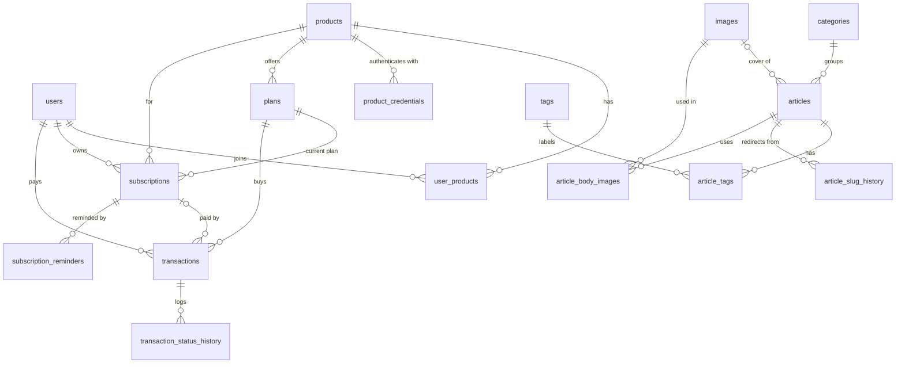

# ADR-004: Initial Schema Model

| Author   | Dewa Surya Ariesta                                                                                                                         |
| -------- | ------------------------------------------------------------------------------------------------------------------------------------------ |
| Date     | 28 September 2026                                                                                                                          |
| Status   | Proposed                                                                                                                                   |
| Deciders | Dewa Surya Ariesta                                                                                                                         |
| Related  | [PRD](../PRD.md), [ADR-001](./ADR-001-initial_technology.md), [ADR-002](./ADR-002-usecase.md), [ADR-003](./ADR-003-api-contract.md) |

## 1. Overview

[ADR-001](./ADR-001-initial_technology.md) chose **PostgreSQL** with **Flyway** migrations and Hibernate `ddl-auto = validate`. [ADR-002](./ADR-002-usecase.md) defines the use cases and status rules, and [ADR-003](./ADR-003-api-contract.md) defines the API shapes. This ADR defines the tables behind them:

| #   | Covered here                                                             |
| --- | ------------------------------------------------------------------------ |
| 1   | Naming and type conventions for every table.                             |
| 2   | Every table, column, constraint, and index for the first release.        |
| 3   | The database rules that protect money and access (constraints, locks).   |
| 4   | The Flyway migration order, matched to the PRD release phases.           |

## 2. Decision Drivers

| #   | Driver                                                                                                   | Source                              |
| --- | -------------------------------------------------------------------------------------------------------- | ----------------------------------- |
| D1  | A new SaaS product needs **data, not schema changes**.                                                   | PRD NFR Extensibility, G3           |
| D2  | Payment webhooks are idempotent and retry-safe; money is never counted twice.                            | PRD NFR Reliability, FR-P2          |
| D3  | Each transaction stores amount, currency, status, gateway reference, and timestamps.                     | PRD FR-P3                           |
| D4  | One user has at most one subscription per product; access = `ACTIVE` and `now < end_date`.              | ADR-002 §6.2                        |
| D5  | Articles have one category, many tags, Draft/Published states, and a publish date.                       | PRD FR-C2, FR-C3, A-3.6             |
| D6  | The hub records which products each user has joined.                                                     | PRD FR-U3                           |
| D7  | The schema fits a small, self-hosted PostgreSQL on one EC2 instance.                                      | ADR-001 §5.4, §5.6                  |

## 3. Conventions

| Topic         | Rule                                                                                                                                                         |
| ------------- | ------------------------------------------------------------------------------------------------------------------------------------------------------------ |
| Names         | `snake_case`, plural table names (`users`, `plans`). Join tables are `<a>_<b>` (`article_tags`).                                                             |
| Primary keys  | `id uuid`. Generated by the application (time-ordered UUIDv7 where the Hibernate version supports it, else random v4). Seeds use `gen_random_uuid()`.       |
| Human codes   | Products and plans also have a unique `code` (`document-doctor`, `dd-pro-monthly`) used in URLs and seeds. Codes never change.                              |
| Timestamps    | `timestamptz`, stored in UTC (`hibernate.jdbc.time_zone = UTC`). Every table has `created_at`; editable tables also have `updated_at` (set by Hibernate).  |
| Money         | `bigint` number of **rupiah** + `currency char(3)`. No decimals, no `numeric`, no floats (ADR-003 §3.3).                                                      |
| Enums         | `varchar` + `CHECK (... IN (...))`, mapped with `@Enumerated(EnumType.STRING)`. Not PostgreSQL `ENUM` types, which are awkward to change with Flyway.        |
| Flexible data | `jsonb` only where the hub does not interpret the content (plan `features`, gateway payloads).                                                               |
| Foreign keys  | Always declared. `ON DELETE RESTRICT` by default; `CASCADE` only for article join tables. Every foreign key column has an index.                              |
| Deletes       | Hard delete for content (articles, images, categories, tags). **Never delete** users, products, plans, subscriptions, or transactions at launch.             |
| Schema change | Only through Flyway files in `src/main/resources/db/migration`. Never edit a migration that has run in production; add a new one.                            |

## 4. Entity Overview

| Module (ADR-001 §5.3) | Tables                                                                                     | Phase |
| --------------------- | ------------------------------------------------------------------------------------------ | ----- |
| `content`, `media`    | `categories`, `tags`, `images`, `articles`, `article_tags`, `article_slug_history`, `article_body_images` | 1     |
| `product`             | `products`, `plans`, `product_credentials`                                                 | 1–2   |
| `identity`            | `users`, `user_products`                                                                   | 2     |
| `subscription`        | `subscriptions`, `subscription_reminders`                                                  | 3–4   |
| `payment`             | `transactions`, `transaction_status_history`                                               | 3     |
| (infrastructure)      | `shedlock`, `flyway_schema_history`                                                        | 1–3   |

## 5. Tables

### 5.1 Identity

#### `users`

One row per person, keyed by Firebase `uid`. The profile is copied from the Google account on every sign-in (ADR-002 UC-04); the hub does not edit it (PRD US-2.1).

| Column            | Type           | Null | Default  | Notes                                                        |
| ----------------- | -------------- | ---- | -------- | ------------------------------------------------------------ |
| `id`              | `uuid`         | no   |          | PK.                                                          |
| `firebase_uid`    | `varchar(128)` | no   |          | **Unique.** Token `sub` claim.                               |
| `email`           | `varchar(320)` | no   |          | From the token. Not unique (it can move between accounts).   |
| `name`            | `varchar(200)` | no   |          | From the token; falls back to the part of the email before `@`. |
| `avatar_url`      | `text`         | yes  |          | Google `picture` URL, used as is.                            |
| `role`            | `varchar(16)`  | no   | `'USER'` | `CHECK IN ('USER','ADMIN')` (PRD FR-U4).                     |
| `last_sign_in_at` | `timestamptz`  | yes  |          | Set by `POST /me/session` and `POST /products/*/members`.    |
| `created_at`      | `timestamptz`  | no   | `now()`  |                                                              |
| `updated_at`      | `timestamptz`  | no   | `now()`  |                                                              |

Indexes: `UNIQUE (firebase_uid)`, `(lower(email))`, `(created_at DESC)`.

Admin search (`q` on name or email, ADR-003 §10.1) uses `ILIKE` and a sequential scan at launch. Add a `pg_trgm` GIN index when the table passes about 50 000 rows.

#### `user_products`

Which products a user has joined (PRD FR-U3, ADR-002 UC-06).

| Column       | Type          | Null | Default | Notes                         |
| ------------ | ------------- | ---- | ------- | ----------------------------- |
| `user_id`    | `uuid`        | no   |         | FK → `users.id`.              |
| `product_id` | `uuid`        | no   |         | FK → `products.id`.           |
| `joined_at`  | `timestamptz` | no   | `now()` |                               |

Keys: `PRIMARY KEY (user_id, product_id)`, index `(product_id, joined_at)`. `INSERT ... ON CONFLICT DO NOTHING` makes joining idempotent.

### 5.2 Products and plans

#### `products`

| Column        | Type           | Null | Default | Notes                                                    |
| ------------- | -------------- | ---- | ------- | -------------------------------------------------------- |
| `id`          | `uuid`         | no   |         | PK.                                                      |
| `code`        | `varchar(64)`  | no   |         | **Unique.** `CHECK (code ~ '^[a-z0-9-]+$')`. Immutable.  |
| `name`        | `varchar(120)` | no   |         |                                                          |
| `description` | `text`         | yes  |         |                                                          |
| `website_url` | `text`         | yes  |         | "Learn more" link (UC-02).                               |
| `active`      | `boolean`      | no   | `true`  | Inactive products are hidden and cannot be bought.       |
| `created_at`  | `timestamptz`  | no   | `now()` |                                                          |
| `updated_at`  | `timestamptz`  | no   | `now()` |                                                          |

#### `product_credentials`

Server-to-server credentials for connected products (ADR-003 §8.1).

| Column         | Type          | Null | Default | Notes                                                   |
| -------------- | ------------- | ---- | ------- | ------------------------------------------------------- |
| `id`           | `uuid`        | no   |         | PK.                                                     |
| `product_id`   | `uuid`        | no   |         | FK → `products.id`.                                     |
| `client_id`    | `varchar(64)` | no   |         | **Unique.** Public, for example `dd_live_4F7K2M9Q`.    |
| `secret_hash`  | `text`        | no   |         | Argon2id hash. The plain secret is never stored.        |
| `last_used_at` | `timestamptz` | yes  |         | Updated at most once per minute to limit writes.        |
| `revoked_at`   | `timestamptz` | yes  |         | Set on revoke; the row is kept for history.             |
| `created_at`   | `timestamptz` | no   | `now()` |                                                         |

Indexes: `UNIQUE (client_id)`, `(product_id) WHERE revoked_at IS NULL`. The limit of two active credentials per product is checked in the service, inside a transaction that locks the product row.

#### `plans`

A priced offering of a product (PRD glossary). `features` holds what the plan unlocks; for Document Doctor at launch that is only `removeAds` (PRD OQ3).

| Column           | Type           | Null | Default  | Notes                                                                        |
| ---------------- | -------------- | ---- | -------- | ---------------------------------------------------------------------------- |
| `id`             | `uuid`         | no   |          | PK.                                                                          |
| `product_id`     | `uuid`         | no   |          | FK → `products.id`.                                                          |
| `code`           | `varchar(64)`  | no   |          | **Unique** (global). `CHECK (code ~ '^[a-z0-9-]+$')`.                        |
| `name`           | `varchar(120)` | no   |          |                                                                              |
| `price_amount`   | `bigint`       | no   |          | Rupiah. `CHECK (price_amount >= 0)`.                                         |
| `currency`       | `char(3)`      | no   | `'IDR'`  | `CHECK (currency = 'IDR')` at launch (PRD OQ1).                              |
| `billing_period` | `varchar(16)`  | yes  |          | `CHECK IN ('MONTHLY','YEARLY')`. Length of access one payment buys.         |
| `features`       | `jsonb`        | no   | `'{}'`   | `CHECK (jsonb_typeof(features) = 'object')`. Keys owned by the product.     |
| `is_public`      | `boolean`      | no   | `true`   | Shown on `/products`.                                                        |
| `active`         | `boolean`      | no   | `true`   | Inactive plans cannot be bought.                                             |
| `created_at`     | `timestamptz`  | no   | `now()`  |                                                                              |
| `updated_at`     | `timestamptz`  | no   | `now()`  |                                                                              |

Constraints and indexes:

| Name                        | Definition                                                                         | Why                                                                 |
| --------------------------- | ---------------------------------------------------------------------------------- | ------------------------------------------------------------------- |
| `plans_free_has_no_period`  | `CHECK ((price_amount = 0) = (billing_period IS NULL))`                            | A free plan has no period; a paid plan must have one.               |
| `plans_id_product_uq`       | `UNIQUE (id, product_id)`                                                          | Target of composite foreign keys, so a subscription or transaction can never point at a plan of another product. |
| `plans_one_free_per_product`| `UNIQUE (product_id) WHERE price_amount = 0 AND active`                            | ADR-003 rule N2 needs exactly one free plan to fall back to.        |
| index                       | `(product_id) WHERE active AND is_public`                                          | `GET /public/products`.                                             |

A plan is "sold" when a `PAID` or `REFUNDED` transaction points at it. The service then refuses to change `price_amount` or `billing_period` (`409 PLAN_SOLD`).

### 5.3 Subscriptions

#### `subscriptions`

At most **one row per user and product**; renewing updates the same row (ADR-002 rule R2). A row is created only when a payment is confirmed (rule R1).

| Column       | Type          | Null | Default | Notes                                                    |
| ------------ | ------------- | ---- | ------- | -------------------------------------------------------- |
| `id`         | `uuid`        | no   |         | PK.                                                      |
| `user_id`    | `uuid`        | no   |         | FK → `users.id`.                                         |
| `product_id` | `uuid`        | no   |         | FK → `products.id`.                                      |
| `plan_id`    | `uuid`        | no   |         | Plan of the latest paid period.                          |
| `status`     | `varchar(16)` | no   |         | `CHECK IN ('ACTIVE','EXPIRED','CANCELLED')`.             |
| `start_date` | `timestamptz` | no   |         | First time the user got access.                          |
| `end_date`   | `timestamptz` | no   |         | Access ends here. `CHECK (end_date >= start_date)`.      |
| `created_at` | `timestamptz` | no   | `now()` |                                                          |
| `updated_at` | `timestamptz` | no   | `now()` |                                                          |

Constraints and indexes:

| Name                          | Definition                                                           | Why                                          |
| ----------------------------- | -------------------------------------------------------------------- | -------------------------------------------- |
| `subscriptions_user_product_uq` | `UNIQUE (user_id, product_id)`                                     | Rule R2; also the entitlement lookup (UC-07). |
| `subscriptions_plan_fk`       | `FOREIGN KEY (plan_id, product_id) REFERENCES plans (id, product_id)` | Plan must belong to the same product.       |
| index                         | `(end_date) WHERE status = 'ACTIVE'`                                 | Scheduler finds subscriptions to expire (UC-13). |
| index                         | `(product_id, status)`                                               | Admin counts of active subscriptions per plan/product. |

Entitlement is computed on read (`status = 'ACTIVE' AND now() < end_date`), never stored, so a late scheduler cannot give free access (ADR-002 rule S1).

#### `subscription_reminders` (phase 4, optional)

Makes renewal reminder emails send once per period (ADR-002 UC-13 step 3).

| Column            | Type          | Null | Default | Notes                                   |
| ----------------- | ------------- | ---- | ------- | --------------------------------------- |
| `subscription_id` | `uuid`        | no   |         | FK → `subscriptions.id`.                |
| `kind`            | `varchar(8)`  | no   |         | `CHECK IN ('D7','D1')` (days before end). |
| `end_date`        | `timestamptz` | no   |         | The `end_date` the reminder was for.    |
| `sent_at`         | `timestamptz` | no   | `now()` |                                         |

Key: `PRIMARY KEY (subscription_id, kind, end_date)`. When the user renews, `end_date` changes, so the next period gets new reminders.

### 5.4 Payments

#### `transactions`

One row per payment attempt (PRD FR-P3). Amount, currency, and period are **copied** from the plan at checkout, so later plan changes never change history.

| Column                   | Type           | Null | Default   | Notes                                                                   |
| ------------------------ | -------------- | ---- | --------- | ----------------------------------------------------------------------- |
| `id`                     | `uuid`         | no   |           | PK (internal).                                                          |
| `order_id`               | `varchar(40)`  | no   |           | **Unique.** Sent to Midtrans, for example `DSH-20261028-7F3K9Q`.        |
| `user_id`                | `uuid`         | no   |           | FK → `users.id`.                                                        |
| `product_id`             | `uuid`         | no   |           | Copied from the plan, for filters without a join.                       |
| `plan_id`                | `uuid`         | no   |           | Composite FK `(plan_id, product_id)` → `plans (id, product_id)`.        |
| `subscription_id`        | `uuid`         | yes  |           | FK → `subscriptions.id`. Set when the payment becomes `PAID`.           |
| `amount`                 | `bigint`       | no   |           | Rupiah. `CHECK (amount > 0)`.                                           |
| `currency`               | `char(3)`      | no   | `'IDR'`   |                                                                         |
| `billing_period`         | `varchar(16)`  | no   |           | `CHECK IN ('MONTHLY','YEARLY')`. Period this payment buys.              |
| `status`                 | `varchar(16)`  | no   | `'PENDING'` | `CHECK IN ('PENDING','PAID','FAILED','REFUNDED')`.                    |
| `payment_method`         | `varchar(32)`  | yes  |           | `QRIS`, `BANK_TRANSFER`, `GOPAY`, `SHOPEEPAY`, `CREDIT_CARD`, `OTHER`.  |
| `gateway_transaction_id` | `varchar(64)`  | yes  |           | Midtrans `transaction_id`.                                              |
| `snap_token`             | `varchar(64)`  | yes  |           | Returned while pending.                                                 |
| `snap_redirect_url`      | `text`         | yes  |           |                                                                         |
| `snap_expires_at`        | `timestamptz`  | yes  |           | After this, a new checkout creates a new transaction.                   |
| `failure_reason`         | `text`         | yes  |           | Shown to the user on `FAILED`.                                          |
| `needs_review`           | `boolean`      | no   | `false`   | Set on amount mismatch (UC-09); shown in UC-15.                         |
| `idempotency_key`        | `uuid`         | yes  |           | From the `Idempotency-Key` header (ADR-003 §3.8).                       |
| `paid_at`                | `timestamptz`  | yes  |           | `CHECK (status <> 'PAID' OR paid_at IS NOT NULL)`.                      |
| `created_at`             | `timestamptz`  | no   | `now()`   |                                                                         |
| `updated_at`             | `timestamptz`  | no   | `now()`   |                                                                         |

Indexes:

| Definition                                       | Used by                                                   |
| ------------------------------------------------ | --------------------------------------------------------- |
| `UNIQUE (order_id)`                              | Webhook lookup; stops double processing (D2).             |
| `UNIQUE (user_id, idempotency_key)`              | Repeated "Buy" clicks return the first response.          |
| `(user_id, created_at DESC)`                     | `GET /me/transactions` (UC-11), admin user detail (UC-14). |
| `(user_id, plan_id) WHERE status = 'PENDING'`    | Reuse an unexpired pending transaction (UC-08).           |
| `(created_at DESC)`                              | Admin list and date filters (UC-15).                      |
| `(product_id, status, created_at)`               | Admin filters and paid totals (UC-15).                    |
| `(created_at) WHERE needs_review`                | "Needs review" filter.                                    |
| `(subscription_id)`, `(plan_id, product_id)`     | Foreign keys; "plan is sold" check.                       |

Status changes follow ADR-002 §6.1. The webhook handler loads the row with `SELECT ... FOR UPDATE`, checks the change is allowed, and writes the new status and a history row in the same database transaction.

#### `transaction_status_history`

Every status change, for support and for the admin detail view (ADR-003 §10.2).

| Column            | Type          | Null | Default | Notes                                                          |
| ----------------- | ------------- | ---- | ------- | -------------------------------------------------------------- |
| `id`              | `bigint`      | no   | identity | PK.                                                           |
| `transaction_id`  | `uuid`        | no   |         | FK → `transactions.id`.                                        |
| `from_status`     | `varchar(16)` | yes  |         | `null` for the first row.                                      |
| `to_status`       | `varchar(16)` | no   |         |                                                                |
| `source`          | `varchar(16)` | no   |         | `CHECK IN ('CHECKOUT','WEBHOOK','SYNC')`.                      |
| `note`            | `text`        | yes  |         | For example "amount mismatch: expected 49000, got 4900".      |
| `gateway_payload` | `jsonb`       | yes  |         | Midtrans Status API response (no server key or signature).    |
| `created_at`      | `timestamptz` | no   | `now()` |                                                                |

Index: `(transaction_id, created_at)`.

### 5.5 Content and media

#### `categories` and `tags`

Both tables have the same columns.

| Column       | Type           | Null | Default | Notes                                                 |
| ------------ | -------------- | ---- | ------- | ----------------------------------------------------- |
| `id`         | `uuid`         | no   |         | PK.                                                   |
| `name`       | `varchar(80)`  | no   |         | Unique, case-insensitive: `UNIQUE (lower(name))`.     |
| `slug`       | `varchar(120)` | no   |         | **Unique.** `CHECK (slug ~ '^[a-z0-9-]+$')`.          |
| `created_at` | `timestamptz`  | no   | `now()` |                                                       |
| `updated_at` | `timestamptz`  | no   | `now()` | Used for `sitemap.xml` (`GET /public/sitemap`).       |

#### `images`

The media library (PRD A-3.7, FR-C4). Only resized WebP variants are stored in S3 (ADR-001 §5.9).

| Column           | Type           | Null | Default              | Notes                                                                        |
| ---------------- | -------------- | ---- | -------------------- | ---------------------------------------------------------------------------- |
| `id`             | `uuid`         | no   |                      | PK.                                                                          |
| `content_hash`   | `char(64)`     | no   |                      | **Unique.** SHA-256 hex of the original file; same upload → same row.       |
| `s3_key_prefix`  | `varchar(200)` | no   |                      | For example `images/<hash>/`. Variant key = prefix + `<width>.webp`.         |
| `variant_widths` | `int[]`        | no   | `'{480,960,1600}'`   | Smaller originals get fewer variants (never upscaled).                      |
| `width`          | `int`          | no   |                      | Width of the largest variant.                                                |
| `height`         | `int`          | no   |                      | Height of the largest variant.                                               |
| `file_name`      | `varchar(255)` | no   |                      | Original file name, for search.                                              |
| `size_bytes`     | `bigint`       | no   |                      | Original upload size.                                                        |
| `alt`            | `varchar(250)` | no   |                      | Required alt text (SEO, accessibility).                                      |
| `created_at`     | `timestamptz`  | no   | `now()`              |                                                                              |
| `updated_at`     | `timestamptz`  | no   | `now()`              |                                                                              |

Index: `UNIQUE (content_hash)`, `(created_at DESC)`.

#### `articles`

| Column             | Type           | Null | Default   | Notes                                                                   |
| ------------------ | -------------- | ---- | --------- | ----------------------------------------------------------------------- |
| `id`               | `uuid`         | no   |           | PK.                                                                     |
| `slug`             | `varchar(120)` | no   |           | **Unique.** `CHECK (slug ~ '^[a-z0-9-]+$')`.                            |
| `title`            | `varchar(200)` | no   |           |                                                                         |
| `excerpt`          | `varchar(500)` | yes  |           | Required to publish.                                                    |
| `body`             | `text`         | no   | `''`      | Markdown source.                                                        |
| `body_html`        | `text`         | no   | `''`      | Rendered and sanitized on save, so public reads do no work.            |
| `cover_image_id`   | `uuid`         | yes  |           | FK → `images.id` (`RESTRICT`: a cover image cannot be deleted).         |
| `category_id`      | `uuid`         | yes  |           | FK → `categories.id` (`RESTRICT`). Required to publish (FR-C3).         |
| `meta_title`       | `varchar(200)` | yes  |           | Falls back to `title`.                                                  |
| `meta_description` | `varchar(320)` | yes  |           | Falls back to `excerpt`.                                                |
| `status`           | `varchar(16)`  | no   | `'DRAFT'` | `CHECK IN ('DRAFT','PUBLISHED')` (FR-C2).                               |
| `published_at`     | `timestamptz`  | yes  |           | Set on first publish and kept on unpublish (A-3.6).                     |
| `version`          | `int`          | no   | `0`       | Optimistic lock (`@Version`) → `409 VERSION_CONFLICT`.                  |
| `created_at`       | `timestamptz`  | no   | `now()`   |                                                                         |
| `updated_at`       | `timestamptz`  | no   | `now()`   |                                                                         |

Constraints and indexes:

| Name                        | Definition                                                                                                   | Why                                       |
| --------------------------- | ------------------------------------------------------------------------------------------------------------ | ----------------------------------------- |
| `articles_publish_complete` | `CHECK (status <> 'PUBLISHED' OR (excerpt IS NOT NULL AND category_id IS NOT NULL AND published_at IS NOT NULL))` | A published article is always complete (UC-17). |
| index                       | `(published_at DESC) WHERE status = 'PUBLISHED'`                                                             | Blog list and sitemap (UC-01).            |
| index                       | `(category_id, published_at DESC)`                                                                           | Category pages (UC-03), `CATEGORY_IN_USE`. |
| index                       | `(updated_at DESC)`                                                                                          | Admin article list (UC-18).               |
| index                       | `(cover_image_id)`                                                                                           | "Image in use" check (UC-19).             |

#### `article_tags`

| Column       | Type   | Null | Notes                                   |
| ------------ | ------ | ---- | --------------------------------------- |
| `article_id` | `uuid` | no   | FK → `articles.id` `ON DELETE CASCADE`. |
| `tag_id`     | `uuid` | no   | FK → `tags.id` `ON DELETE CASCADE`.     |

Keys: `PRIMARY KEY (article_id, tag_id)`, index `(tag_id)`. Deleting a tag removes it from all articles (UC-20).

#### `article_slug_history`

Old slugs of published articles, so old links redirect with `301` (UC-16).

| Column       | Type           | Null | Default | Notes                                   |
| ------------ | -------------- | ---- | ------- | --------------------------------------- |
| `old_slug`   | `varchar(120)` | no   |         | PK.                                     |
| `article_id` | `uuid`         | no   |         | FK → `articles.id` `ON DELETE CASCADE`. |
| `created_at` | `timestamptz`  | no   | `now()` |                                         |

A slug may not be used as a new article slug while it is in this table; the service checks both tables (`409 SLUG_TAKEN`). If an article takes back one of its own old slugs, that history row is deleted.

#### `article_body_images`

Images inserted into an article body. Rebuilt from the Markdown on every save, so deleting an image can check where it is used (UC-19).

| Column       | Type   | Null | Notes                                   |
| ------------ | ------ | ---- | --------------------------------------- |
| `article_id` | `uuid` | no   | FK → `articles.id` `ON DELETE CASCADE`. |
| `image_id`   | `uuid` | no   | FK → `images.id` (`RESTRICT`).          |

Keys: `PRIMARY KEY (article_id, image_id)`, index `(image_id)`. The API's `usedBy` list (ADR-003 §10.4) is `articles.cover_image_id` (usage `COVER`) plus this table (usage `BODY`).

### 5.6 Infrastructure

| Table                   | Purpose                                                                                                                                                              |
| ----------------------- | -------------------------------------------------------------------------------------------------------------------------------------------------------------------- |
| `shedlock`              | Standard ShedLock table (`name` PK, `lock_until`, `locked_at`, `locked_by`). During a blue/green deploy two API instances run; the lock makes sure only one runs the scheduler (ADR-002 rule S2). |
| `flyway_schema_history` | Created and owned by Flyway.                                                                                                                                         |

## 6. Rules That Protect Money and Access

| #   | Rule                                                                                                                          | Enforced by                                                   |
| --- | ----------------------------------------------------------------------------------------------------------------------------- | ------------------------------------------------------------- |
| M1  | A Midtrans order is processed once.                                                                                           | `UNIQUE (order_id)` + `SELECT ... FOR UPDATE` in the webhook. |
| M2  | A transaction never goes back to `PENDING`, and `PAID` only moves to `REFUNDED`.                                               | Service check under the row lock; every change logged in `transaction_status_history`. |
| M3  | Access is given only by a `PAID` transaction.                                                                                  | Subscriptions are written only by the webhook/sync code path. |
| M4  | One subscription per user and product.                                                                                         | `UNIQUE (user_id, product_id)`; the webhook locks this row when it extends it. |
| M5  | A subscription or transaction always points at a plan of the same product.                                                    | Composite FK `(plan_id, product_id)`.                         |
| M6  | History never changes when a plan changes.                                                                                     | Amount and period copied into `transactions`; `PLAN_SOLD` check; plans never deleted. |
| M7  | Money is exact.                                                                                                                | `bigint` rupiah; Midtrans `gross_amount` (`"49000.00"`) is parsed to an integer before comparing. |

The first admin: on sign-in, if the user's Firebase `uid` equals the config value `hub.bootstrap-admin-uid` (from SSM), the service sets `role = 'ADMIN'`. There is no API to change roles.

## 7. Migration Plan (Flyway)

Migrations follow the PRD release phases, so each phase ships only the tables it needs.

| File                                  | Contents                                                                                       | Phase |
| ------------------------------------- | ---------------------------------------------------------------------------------------------- | ----- |
| `V1__content.sql`                     | `categories`, `tags`, `images`, `articles`, `article_tags`, `article_slug_history`, `article_body_images` | 1 |
| `V2__products.sql`                    | `products`, `plans`                                                                            | 1     |
| `V3__seed_document_doctor.sql`        | Document Doctor product, `dd-free` plan (price 0, `removeAds: false`), `dd-pro-monthly` plan (`removeAds: true`) | 1 |
| `V4__identity.sql`                    | `users`, `user_products`, `product_credentials`                                                | 2     |
| `V5__seed_document_doctor_client.sql` | First Document Doctor credential. The secret **hash** comes from a Flyway placeholder filled from SSM at deploy; nothing secret is in the repository. | 2 |
| `V6__billing.sql`                     | `subscriptions`, `transactions`, `transaction_status_history`, `shedlock`                      | 3     |
| `V7__subscription_reminders.sql`      | `subscription_reminders` (only if reminder emails are built)                                   | 4     |

Rules:

- Each migration runs on application start. A failed migration stops the new container, so blue/green deploy keeps the old one running (ADR-001 §5.5).
- Migrations must work while the old version is still running: add columns as nullable or with defaults, and drop old columns only in a later release.
- Integration tests run all migrations against a real PostgreSQL with Testcontainers (ADR-001 §5.3), then Hibernate `validate` checks the entities match.

## 8. Seed Data

`V3__seed_document_doctor.sql` creates the data the public `/products` page needs in phase 1, before the admin product screen exists (ADR-003 §4.1):

| Table      | `code`            | Values                                                                                            |
| ---------- | ----------------- | ------------------------------------------------------------------------------------------------- |
| `products` | `document-doctor` | name "Document Doctor", `active = true`                                                           |
| `plans`    | `dd-free`         | price 0, `billing_period = null`, `features = {"removeAds": false}`, public, active               |
| `plans`    | `dd-pro-monthly`  | price 49 000 IDR (example), `billing_period = 'MONTHLY'`, `features = {"removeAds": true}`, public, active |

The final Pro price is set before phase 3 (PRD OQ3). Because the plan is not sold yet, it can be changed with a new migration or, after phase 3, in the admin screen.

## 9. Traceability

| Table                                                   | Use case(s) (ADR-002)            | PRD                         |
| ------------------------------------------------------- | -------------------------------- | --------------------------- |
| `users`                                                 | UC-04, UC-05, UC-14              | US-2.1, A-3.1, FR-U1, FR-U4 |
| `user_products`                                         | UC-06, UC-14                     | FR-U3                       |
| `products`, `plans`                                     | UC-02, UC-08, UC-21              | V-1.2, G3, NFR Extensibility |
| `product_credentials`                                   | UC-06, UC-07, UC-21              | FR-U2                       |
| `subscriptions`                                         | UC-07, UC-09, UC-10, UC-12, UC-13 | US-2.2, US-2.4, FR-U2      |
| `subscription_reminders`                                | UC-13                            | PRD §8 renewal rate         |
| `transactions`, `transaction_status_history`            | UC-08, UC-09, UC-11, UC-15       | US-2.3, A-3.2, FR-P1–FR-P3  |
| `articles`, `article_tags`, `article_slug_history`      | UC-01, UC-03, UC-16–UC-18        | V-1.1, V-1.3, A-3.3–A-3.6, FR-C1–FR-C3, FR-C5 |
| `categories`, `tags`                                    | UC-03, UC-20                     | A-3.8, FR-C3                |
| `images`, `article_body_images`                         | UC-19                            | A-3.7, FR-C4                |

## 10. Consequences

### 10.1 Positive

- A new product is three inserts (product, plans, credential) and no migration (D1).
- The most important money rules (M1, M4, M5, M7) are enforced by the database, not only by code.
- One subscription row per product keeps the entitlement check a single indexed lookup.
- Phased migrations mean phase 1 ships without any billing tables.

### 10.2 Negative and risks

| Risk                                                                            | Mitigation                                                                                          |
| ------------------------------------------------------------------------------- | --------------------------------------------------------------------------------------------------- |
| One subscription row per product keeps no history of past periods.            | Past periods are visible through the linked `transactions` (amount, period, `paid_at`).           |
| `varchar` + `CHECK` enums need a migration to add a value.                     | Status lists are fixed by ADR-002 §6; adding one needs an ADR update anyway.                       |
| `body_html` can drift from `body` if the renderer changes.                     | Re-render all articles in a one-off job when the Markdown renderer or sanitizer is upgraded.      |
| Admin text search has no index at launch.                                      | Add `pg_trgm` GIN indexes when tables grow (see `users`).                                          |
| No user or account deletion.                                                   | Not in the PRD. When needed, add anonymisation (keep transactions, clear profile fields) in a later ADR. |

## 11. Later (not in this schema)

| Item                                               | Source             | Likely tables                                    |
| -------------------------------------------------- | ------------------ | ------------------------------------------------ |
| Post interactions: votes, comments, tagging users  | PRD §3.2, §11      | `article_votes`, `comments`, `comment_mentions`  |
| Feedback about the application                      | PRD §11            | `feedback`                                       |
| Usage per plan                                     | PRD OQ5            | `usage_records` (product, user, metric, period)  |
| Admin audit log (if admin can change access later) | ADR-002 §10        | `audit_logs`                                     |
| Quotation and freelance flow tools                  | PRD §11            | Separate product; connects through `user_products` |
