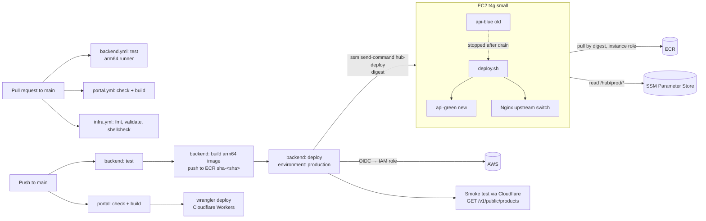

# ADR-007: CI/CD Pipeline (Spring Boot ARM Image to EC2)

| Author   | Dewa Surya Ariesta                                                                                                                                                                                                                                                                                                                           |
| -------- | -------------------------------------------------------------------------------------------------------------------------------------------------------------------------------------------------------------------------------------------------------------------------------------------------------------------------------------------- |
| Date     | 29 September 2026                                                                                                                                                                                                                                                                                                                            |
| Status   | Proposed                                                                                                                                                                                                                                                                                                                                     |
| Deciders | Dewa Surya Ariesta                                                                                                                                                                                                                                                                                                                           |
| Related  | [PRD](../PRD.md), [ADR-001](./ADR-001-initial_technology.md), [ADR-003](./ADR-003-api-contract.md), [ADR-004](./ADR-004-initial_schema_model.md), [ADR-005](./ADR-005-ads_and_consent.md), [ADR-006](./ADR-006-domain_dns_and_email.md), [ADR-008](./ADR-008-portal_structure.md), [ADR-009](./ADR-009-article_authoring_and_display.md) |

## 1. Overview

ADR-001 runs the Spring Boot API as a `linux/arm64` Docker image on one Graviton EC2 instance behind Nginx, with blue/green deploys and secrets in SSM Parameter Store. It leaves the pipeline that builds and ships that image to ADR-007. Other ADRs have also handed CI work to this one:

| Already decided or assumed                                                                                             | Where                  |
| ---------------------------------------------------------------------------------------------------------------------- | ---------------------- |
| Image for `linux/arm64`; `t4g.small` in `ap-southeast-1`; Docker Compose on the instance.                              | ADR-001 §5.3, §5.4     |
| Blue/green: start new container, wait for `/actuator/health` `UP`, switch the Nginx upstream, reload, stop the old one. | ADR-001 §5.5           |
| Flyway runs on startup; `ddl-auto: validate`; ShedLock keeps jobs single during a deploy.                              | ADR-001 §5.3, §5.6     |
| Secrets in SSM `SecureString`; instance role instead of access keys.                                                   | ADR-001 §5.3, §5.10    |
| SSH only from Dewa's IP, or Session Manager with port 22 closed.                                                       | ADR-001 §5.4           |
| Port 443 only from Cloudflare IP ranges; port 80 closed.                                                               | ADR-006 §6 T1          |
| Portal deploys with `wrangler` from CI; `NEXT_PUBLIC_*` go in `.env.production` at build time; no real ads in previews. | ADR-001 §5.2, ADR-005 §4 |
| CI must compare the generated OpenAPI with the API contract.                                                           | ADR-003 §14, §15       |
| CI runs the `contracts/article/` fixture tests (backend and portal).                                                   | ADR-009 §8, §12        |
| Portal CI job: lint, type-check, test, build, OpenNext build.                                                          | ADR-008 §8, §13        |

### 1.1 What the code does today

| Item                                                  | State                                                                                                                                                                              |
| ----------------------------------------------------- | ---------------------------------------------------------------------------------------------------------------------------------------------------------------------------------- |
| `.github/`                                            | **Does not exist.** No CI runs on any push or PR.                                                                                                                                  |
| `apps/coreservices/Dockerfile`                        | Good multi-stage `linux/arm64` build (layered jar, non-root user, readiness `HEALTHCHECK`). The build stage is pinned to `linux/arm64`, so on an x86 host Gradle runs under QEMU.   |
| `make deploy`                                         | Builds on Dewa's laptop, pushes `sdewa/core-service-dep:{latest,<sha>}` to **Docker Hub**, then `tf-redeploy` pipes the rendered `user_data` over **SSH** and runs it as root.      |
| `infra/terraform/main.tf`                             | `t3.micro` with an **x86_64** AMI and an x86_64 Compose plugin. It **cannot run the arm64 image** (`exec format error`). No Elastic IP, no instance role, SSH open to `0.0.0.0/0` by default. |
| `user_data.sh.tpl` → `app.env`                        | Writes `DB_DRIVER`, `DB_SOURCE`, `JWT_SECRET_KEY`, `SERVER_ADDRESS`, `RATE_LIMIT_*`, carried over from an earlier Go service. Spring Boot reads **none** of them. The `prod` profile needs `DB_URL`, `MIDTRANS_SERVER_KEY`, etc., so the API would not start. |
| Secrets                                               | Passed as Terraform variables, so they sit in plain text in `terraform.tfstate` and in the `rendered_user_data` output.                                                            |
| `infra/terraform/nginx.conf`                          | One rate-limit zone, port 80, and no `/actuator` block, so health and info are public. It has drifted from `apps/nginx/nginx.conf` (seven zones, error envelopes, actuator blocked). |
| `infra/terraform/docs/ci_cd_implementation.md`        | Describes `core-service-ci.yml`, `Dockerfile.prod`, and `linux/amd64` builds, none of which exist in this repo.                                                                    |
| Portal                                                | Deployed by hand with `yarn deploy`. `wrangler.jsonc` still has a placeholder D1 `database_id`.                                                                                    |

## 2. Decision Drivers

| #   | Driver                                                                                                                             | Source               |
| --- | ---------------------------------------------------------------------------------------------------------------------------------- | -------------------- |
| D1  | US$0 fixed cost, or as close as possible. Use free CI minutes and free AWS features.                                                | ADR-001 D1           |
| D2  | The image must be `linux/arm64`, and the tests should run on the same CPU type as production (Scrimage ships a native `cwebp`).     | ADR-001 §5.4, §5.9   |
| D3  | No long-lived cloud credentials in GitHub, and no inbound port opened for CI.                                                       | ADR-001 §5.4, ADR-006 T1 |
| D4  | Zero-downtime deploys on one instance with 2 GiB RAM.                                                                               | ADR-001 §5.4, §5.5   |
| D5  | A failed deploy must leave the old version serving. Rolling back must take one action.                                              | NFR Reliability      |
| D6  | Migrations run on startup while the old version still serves traffic, so they must not break it.                                   | ADR-001 §5.6         |
| D7  | One developer: one pipeline per app, readable YAML, and no self-hosted CI servers.                                                  | ADR-001 §1           |
| D8  | Merging to `main` is the only way code reaches production. Nothing is built on a laptop.                                            | ADR-001 D8           |

## 3. Decision Summary

| #   | Decision                                                                                                                                                                                                  |
| --- | --------------------------------------------------------------------------------------------------------------------------------------------------------------------------------------------------------- |
| S1  | **GitHub Actions**, with one workflow per app: `backend.yml`, `portal.yml`, `infra.yml`. Path filters, so a portal change does not rebuild the API (§5).                                                  |
| S2  | The backend is tested and built on a **native arm64 runner** (`ubuntu-24.04-arm`). The Dockerfile build stage moves to `$BUILDPLATFORM`, so an x86 runner with QEMU still works as a fallback (§6).           |
| S3  | Images go to **Amazon ECR** (`hub/coreservices`, same region), tagged `sha-<git sha>`, with **immutable tags**, scan on push, and a lifecycle rule. Deploys refer to the **digest**, never to `latest` (§6.3). |
| S4  | CI signs in to AWS with **GitHub OIDC** and a narrow IAM role. No AWS keys, SSH keys, or Docker Hub tokens are stored in GitHub (§7).                                                                      |
| S5  | CI deploys with **SSM Run Command** and a custom SSM document that runs only `/opt/hub/deploy.sh <digest>`. Port 22 is closed (§8).                                                                      |
| S6  | `deploy.sh` does **blue/green** with two Compose services (`api-blue`, `api-green`). It switches the Nginx upstream after Docker reports the new container `healthy`. If anything fails, it stops and the old color keeps serving (§8.3). |
| S7  | Runtime config is read from **SSM Parameter Store** (`/hub/prod/*`) on the instance at every deploy. Secrets leave Terraform variables and state (§8.4).                                                 |
| S8  | Migrations follow **expand/contract**. CI rejects a change to an applied migration file. `deploy.sh` takes a `pg_dump` before starting the new color (§9).                                               |
| S9  | Rollback means re-running the deploy workflow with an earlier commit SHA. The old image is still in ECR (§10).                                                                                             |
| S10 | The portal deploys to Cloudflare Workers from `portal.yml` with `opennextjs-cloudflare deploy` and a scoped API token (§11).                                                                              |
| S11 | Terraform `apply` stays manual. CI runs only `fmt`, `validate`, and `shellcheck` until remote state exists (§12).                                                                                         |

## 4. Pipeline Overview



The branch rule is simple: work on a branch, open a PR to `main`, and merge when the checks pass. `main` is protected. Direct pushes are blocked, and the checks `backend / test`, `portal / check`, and `infra / check` are required when their paths change.

## 5. Workflows

### 5.1 `backend.yml`

| Trigger                 | Paths                                                                                              |
| ----------------------- | -------------------------------------------------------------------------------------------------- |
| `pull_request` → `main` | `apps/coreservices/**`, `apps/nginx/**`, `contracts/**`, `infra/deploy/**`, `.github/workflows/backend.yml` |
| `push` → `main`         | same                                                                                               |
| `workflow_dispatch`     | input `sha` (optional): deploy an earlier build without rebuilding (§10)                          |

| Job      | Runs on             | When                  | Steps                                                                                                                                                                  |
| -------- | ------------------- | --------------------- | ---------------------------------------------------------------------------------------------------------------------------------------------------------------------- |
| `test`   | `ubuntu-24.04-arm`  | PR and push           | `actions/setup-java` (Temurin 21) → `gradle/actions/setup-gradle` (cache) → migration guard (§9) → `./gradlew test`. Uploads test reports if the job fails.             |
| `image`  | `ubuntu-24.04-arm`  | push to `main` only   | OIDC → ECR login → `docker/build-push-action` (`platforms: linux/arm64`, `cache-from/to: type=gha`) → push `sha-<sha>` → write the digest to the job output.            |
| `deploy` | `ubuntu-24.04`      | after `image`, or dispatch | `environment: production` → OIDC → `ssm send-command` → wait → print the script output → smoke test (§8.5).                                                        |

`./gradlew test` already covers the contract checks other ADRs asked for:

- **Article fixtures (ADR-009):** `ArticleBodyValidatorTest` reads `contracts/article/**`. The path filter reruns it when a fixture changes.
- **OpenAPI contract (ADR-003):** add `OpenApiContractTest`. It starts the app with the `test` profile, fetches `/v1/openapi.json`, and compares it (sorted keys, no `servers`) with the committed `contracts/openapi/v1.json`. When they differ, it fails and writes the new file to `build/contracts/`, so the change is reviewed in the PR and copied over on purpose.

Testcontainers needs Docker, which GitHub-hosted runners have. The `postgres` image is multi-arch, so it runs natively on arm64.

### 5.2 `portal.yml`

| Job      | When                | Steps                                                                                                                                                                         |
| -------- | ------------------- | ----------------------------------------------------------------------------------------------------------------------------------------------------------------------------- |
| `check`  | PR and push         | Node LTS from `apps/portal/.nvmrc` → `yarn install --frozen-lockfile` → `yarn lint` → `yarn typecheck` → `yarn test` → `npx opennextjs-cloudflare build` (with preview env, §11). |
| `deploy` | push to `main` only | `environment: production` → write `.env.production` from environment variables → `npx opennextjs-cloudflare deploy`.                                                           |

Paths: `apps/portal/**`, `contracts/**` (the portal's `allowlist.test.ts` also reads the article fixtures), and `.github/workflows/portal.yml`.

### 5.3 `infra.yml`

On PRs that touch `infra/**`: `terraform fmt -check -recursive`, `terraform init -backend=false` + `terraform validate`, and `shellcheck infra/deploy/*.sh`. It needs no cloud credentials.

### 5.4 Rules for all workflows

| #   | Rule                                                                                                                                                                      |
| --- | ------------------------------------------------------------------------------------------------------------------------------------------------------------------------- |
| W1  | Default `permissions: contents: read`. Only jobs that call AWS add `id-token: write`.                                                                                      |
| W2  | Third-party actions are pinned to a full commit SHA with the version in a comment. **Dependabot** (`.github/dependabot.yml`) updates `github-actions`, `gradle`, and `npm` weekly. |
| W3  | Deploy jobs use `concurrency: { group: deploy-production-<app>, cancel-in-progress: false }`. A second merge waits, and it never cancels a half-finished deploy.             |
| W4  | PRs from forks get no secrets and no OIDC role (GitHub default). The IAM trust policy also accepts only the `production` environment (§7).                                  |
| W5  | Each job has a `timeout-minutes` (test 20, image 20, deploy 15), so a hung runner cannot burn the free minutes.                                                            |

## 6. Building the ARM Image

### 6.1 Runner

**Decision.** Build and test on GitHub's **arm64 hosted runner** (`ubuntu-24.04-arm`).

- It builds natively, with no QEMU, so a cold build takes minutes instead of tens of minutes under emulation.
- Tests run on the same CPU type as production, so `MediaFlowTest` exercises the same aarch64 `cwebp` binary that runs on Graviton (ADR-001 §5.9 note).
- It is free for public repositories. For a private repository, check the current plan: if arm64 runners are not included, use the fallback below.

**Fallback.** Run `test` and `image` on `ubuntu-24.04` (x86) with `docker/setup-qemu-action`. The Dockerfile change in §6.2 keeps this fast: only the small runtime stage runs under emulation, and Gradle does not.

### 6.2 Dockerfile change

The jar is the same on every CPU type. Only the runtime base image must be arm64. So the build stage should run on the build machine's own platform:

```dockerfile
# before
FROM --platform=linux/arm64 eclipse-temurin:${JAVA_VERSION}-jdk-noble AS build
# after
FROM --platform=$BUILDPLATFORM eclipse-temurin:${JAVA_VERSION}-jdk-noble AS build
```

The runtime stage stays `linux/arm64`. Native arm64 builds (the CI runner, Dewa's Apple Silicon Mac) behave exactly as before. The comment at the top of the Dockerfile and `make docker-dep-build` stay valid.

### 6.3 Registry: Amazon ECR

| Setting              | Value                                                                                                 |
| -------------------- | ----------------------------------------------------------------------------------------------------- |
| Repository           | `hub/coreservices` in `ap-southeast-1` (Terraform)                                                    |
| Tags                 | `sha-<full git sha>` only. **Tag immutability on**. No `latest`.                                     |
| What deploys use     | The **digest** (`…/hub/coreservices@sha256:…`) returned by the build, so the running image is exactly the one tested. |
| Scan                 | Basic scan on push (free). Findings are shown in the job summary; they do not block the deploy at launch. |
| Lifecycle            | Keep the newest 20 tagged images; delete untagged images after 1 day.                                 |
| Labels               | `org.opencontainers.image.revision=<sha>`, `org.opencontainers.image.source=<repo URL>`              |
| Pull from EC2        | Instance role and `amazon-ecr-credential-helper` (AL2023 package). No `docker login`, and no token on disk. |

**Why ECR over Docker Hub.** The image is private without a paid plan. EC2 pulls it with the instance role (D3) at no transfer cost inside the region. Storage for about 20 images with shared layers costs cents per month. `sdewa/core-service-dep` on Docker Hub is retired after the first ECR deploy.

## 7. CI Access to AWS: GitHub OIDC

**Decision.** One IAM role, `hub-github-deploy`, which GitHub Actions assumes through OIDC (`aws-actions/configure-aws-credentials`). There are no access keys.

**Trust policy.**

| Condition                                     | Value                                                  |
| --------------------------------------------- | ------------------------------------------------------ |
| Provider                                      | `token.actions.githubusercontent.com`                  |
| `token.actions.githubusercontent.com:aud`     | `sts.amazonaws.com`                                    |
| `token.actions.githubusercontent.com:sub`     | `repo:DewaSRY/DewaSRY_HUB:environment:production`      |

The GitHub `production` environment is limited to the `main` branch (deployment branch rule). So only a workflow on `main` that names this environment can assume the role. PR jobs cannot.

**Permissions (least privilege).**

| Action                                                                                                  | Resource                                                         |
| ------------------------------------------------------------------------------------------------------- | ---------------------------------------------------------------- |
| `ecr:GetAuthorizationToken`                                                                             | `*` (AWS requires it)                                            |
| `ecr:BatchCheckLayerAvailability`, `InitiateLayerUpload`, `UploadLayerPart`, `CompleteLayerUpload`, `PutImage`, `BatchGetImage`, `DescribeImages` | `hub/coreservices` repository only                               |
| `ssm:SendCommand`                                                                                       | the `hub-deploy` document **and** instances tagged `Role=hub-api` |
| `ssm:GetCommandInvocation`, `ssm:ListCommandInvocations`                                                | `*` (read-only status)                                           |

The role cannot run any shell command other than the deploy document, read SSM parameters, or change infrastructure.

## 8. Deploying to EC2

### 8.1 Why SSM Run Command, not SSH

- ADR-006 T1 allows 443 only from Cloudflare. GitHub runner IPs are a large, changing list, so SSH from CI would mean opening 22 to the internet.
- SSM Run Command needs **no inbound port**. The SSM agent (preinstalled on AL2023) connects out to AWS.
- It is free, it records every command in the AWS console, and it replaces the SSH key that Terraform writes to `core-service-key.pem` today.
- With port 22 closed, Dewa uses **Session Manager** for a shell (ADR-001 §5.4).

### 8.2 The `hub-deploy` SSM document

A custom Command document managed by Terraform:

| Field                | Value                                                                                       |
| -------------------- | ------------------------------------------------------------------------------------------- |
| Parameter `Digest`   | `allowedPattern: ^sha256:[0-9a-f]{64}$`                                                    |
| Parameter `Revision` | `allowedPattern: ^[0-9a-f]{40}$` (git SHA, for logs)                                       |
| Step                 | `aws:runShellScript`: `/opt/hub/deploy.sh "{{ Digest }}" "{{ Revision }}"`                  |
| Timeout              | 600 s                                                                                       |

The strict patterns mean that even a leaked role cannot inject shell commands.

CI starts it with `aws ssm send-command --document-name hub-deploy --targets Key=tag:Role,Values=hub-api`. Because the target is a tag, not an instance ID, a rebuilt instance needs no change in GitHub. CI then polls `get-command-invocation` every 5 seconds until the status is final, prints `StandardOutputContent`, and fails the job unless the status is `Success`.

### 8.3 `deploy.sh`: blue/green on one instance

`infra/deploy/deploy.sh` is kept in the repo and installed to `/opt/hub/deploy.sh` by `user_data` (Terraform). The instance layout:

```
/opt/hub/
  docker-compose.yml      # nginx, api-blue, api-green (§12)
  release.env             # ACTIVE=blue|green, BLUE_IMAGE=…, GREEN_IMAGE=…
  app.env                 # rendered from SSM at each deploy, 0600
  secrets/firebase.json   # rendered from SSM, 0400, owner uid 10001
  nginx/nginx.conf        # from apps/nginx/nginx.conf
  nginx/upstream.conf     # one line: server api-<color>:8080;
  deploy.sh, deploy.lock
```

Steps:

```mermaid
sequenceDiagram
    autonumber
    participant CI as GitHub Actions
    participant SSM as SSM Run Command
    participant D as deploy.sh
    participant N as Nginx
    participant Old as api-blue (active)
    participant New as api-green

    CI->>SSM: send-command hub-deploy (digest, sha)
    SSM->>D: run as root
    D->>D: flock deploy.lock; read release.env (ACTIVE=blue)
    D->>D: render app.env + firebase.json from /hub/prod/*
    D->>D: pg_dump to S3 pre-deploy/<sha> (§9)
    D->>New: pull digest; compose up -d --no-deps api-green
    New->>New: Flyway migrate, start
    loop every 5 s, max 180 s
        D->>New: docker inspect Health.Status
    end
    alt healthy
        D->>N: write upstream.conf → api-green; nginx -t; nginx -s reload
        D->>D: sleep 10 s (in-flight requests finish)
        D->>Old: compose stop -t 30 api-blue (graceful shutdown)
        D->>D: write release.env ACTIVE=green, GREEN_IMAGE=digest
        D-->>SSM: exit 0
    else not healthy / nginx -t fails
        D->>New: docker logs --tail 200; compose stop api-green
        D-->>SSM: exit 1 (api-blue still serving)
    end
```

Rules:

| #   | Rule                                                                                                                                                                                         |
| --- | -------------------------------------------------------------------------------------------------------------------------------------------------------------------------------------------- |
| B1  | "Healthy" means the Dockerfile `HEALTHCHECK` (`/actuator/health/readiness`) passed. That happens only after Flyway and the Spring context have started.                                       |
| B2  | Both colors have `mem_limit: 768m` (as local `docker-compose.yaml`). Two JVMs plus Nginx fit in 2 GiB with the 2 GB swap from ADR-001 §5.3. If the new color is OOM-killed, the deploy fails safely (B5). |
| B3  | Nginx resolves the upstream name only when it loads its config. `upstream.conf` always names the running color, so `nginx -t` and `reload` never point at a stopped container.               |
| B4  | `nginx -s reload` is graceful: old workers finish their requests. The old color is stopped only after a short drain, with `server.shutdown: graceful` (already in `application.yaml`).       |
| B5  | Any failed step exits non-zero **before** the upstream switch, and the old color is never touched. After the switch, the only remaining step is stopping the old color.                      |
| B6  | `flock` stops two deploys from overlapping, even if someone runs the script by hand in a Session Manager shell.                                                                              |
| B7  | The old color's container is stopped, not removed, and `release.env` keeps its image. This keeps the previous image on disk for a fast rollback. `docker image prune` removes images older than the two colors. |
| B8  | Containers use `restart: unless-stopped`. After a reboot, only the active color and Nginx come back, because the stopped color stays stopped.                                              |
| B9  | A new instance serves nothing until its first deploy. `user_data` installs files but does not start the API. Run `backend.yml` with `workflow_dispatch` after `terraform apply`.             |
| B10 | ShedLock (ADR-001 §5.3) and the email outbox (ADR-006 §9) already handle the few seconds when both colors run.                                                                              |

### 8.4 Runtime configuration from SSM

At each deploy, `deploy.sh` runs `aws ssm get-parameters-by-path --path /hub/prod/ --recursive --with-decryption` with the instance role and writes the result to the files below. This does two things: it **replaces the Go-era `app.env`**, and it takes secrets **out of Terraform state**. To rotate a secret, change it in SSM and re-run the deploy workflow.

| SSM name (`/hub/prod/…`)                                                                          | Type           | Goes to                                          |
| ------------------------------------------------------------------------------------------------- | -------------- | ------------------------------------------------ |
| `DB_URL`, `DB_USERNAME`                                                                            | `String`       | `app.env`                                        |
| `DB_PASSWORD`, `MIDTRANS_SERVER_KEY`, `HUB_REVALIDATE_SECRET`, `DD_CLIENT_SECRET_HASH`             | `SecureString` | `app.env`                                        |
| `HUB_SITE_BASE_URL`, `HUB_CORS_ALLOWED_ORIGINS`, `FIREBASE_PROJECT_ID`, `HUB_STORAGE_PUBLIC_BASE_URL`, `HUB_S3_BUCKET`, `HUB_S3_REGION`, `HUB_REVALIDATE_URL`, `HUB_BOOTSTRAP_ADMIN_UID`, `MIDTRANS_SANDBOX`, `DD_CLIENT_ID` | `String` | `app.env` |
| `files/firebase-service-account.json`                                                              | `SecureString` | `secrets/firebase.json`, mounted read-only at `/run/secrets/firebase.json`; `app.env` sets `FIREBASE_SERVICE_ACCOUNT_PATH` to it |

- Compose reads `app.env` with `env_file: { path: app.env, format: raw }`, so a `$` inside a password is not expanded.
- The script fails before starting the new color if any name in `application-prod.yaml` that has no default is missing. This gives a clear error instead of a Spring startup failure.
- The instance role gets `ssm:GetParametersByPath` on `arn:…:parameter/hub/prod/*` only.

### 8.5 Smoke test

After `Success`, the deploy job calls `GET ${API_BASE_URL}/v1/public/products` through Cloudflare (5 tries, 5 s apart). It expects `200` and the ADR-003 envelope. `API_BASE_URL` is a variable of the `production` environment (`https://api.dewasuryahub.com`). If the smoke test fails, the job goes red and the log prints the rollback command (§10). The script does **not** roll back on its own, because the new color was already healthy on the instance, and a failure seen only from outside is more likely DNS or Cloudflare.

## 9. Database Migrations

Flyway runs when the new color starts, while the old color still serves traffic on the old code (D6). And a rollback (§10) starts the old code against the new schema. So every migration must work with **both** the previous and the next release.

| #   | Rule                                                                                                                                                                                    |
| --- | --------------------------------------------------------------------------------------------------------------------------------------------------------------------------------------- |
| M1  | **Expand/contract.** Add tables, nullable columns, or columns with defaults in release N. Change code in release N. Drop or rename in release N+1 or later, after N is live and N−1 can no longer be rolled back to. |
| M2  | `ddl-auto: validate` ignores extra columns, so expanding is safe for the old version. Dropping a column that old code maps breaks its startup, which is why M1 delays drops.          |
| M3  | Never edit or delete an applied `V*.sql`. Flyway checksums would stop startup. The `test` job checks this: `git diff --diff-filter=MDR --name-only origin/main...HEAD -- apps/coreservices/src/main/resources/db/migration` must be empty. |
| M4  | No long locking statements on large tables in one migration (for example `CREATE INDEX CONCURRENTLY` instead of a plain `CREATE INDEX`, in its own migration with `-- flyway:executeInTransaction=false`). |
| M5  | `deploy.sh` runs the ADR-001 §5.6 `pg_dump` to `s3://<backup-bucket>/pre-deploy/<sha>.dump` before starting the new color. A lifecycle rule deletes these after 14 days. If the dump fails, the deploy fails. |
| M6  | Flyway Community has no undo. A bad migration is fixed forward with a new migration, or restored from the M5 dump.                                                                      |

## 10. Rollback

| Situation                                           | Action                                                                                                                                                    |
| --------------------------------------------------- | --------------------------------------------------------------------------------------------------------------------------------------------------------- |
| Deploy failed on the instance                       | Nothing to do. The old color still serves (B5). Fix and merge again.                                                                                       |
| Deployed release is bad (bugs, errors after switch) | GitHub → Actions → `backend.yml` → **Run workflow** with `sha=<last good commit>`. The job skips `test` and `image`, looks up the digest for `sha-<sha>` in ECR, and runs the same blue/green deploy. |
| Very urgent, GitHub is down                         | Session Manager shell → `sudo /opt/hub/deploy.sh <previous digest from release.env> <sha>`.                                                                |
| Bad migration                                       | Fix forward (M6). If data was damaged, restore the `pre-deploy/<sha>` dump (tested quarterly, ADR-001 §5.6).                                               |

Because tags are immutable and deploys use digests, "the last good commit" always means exactly the image that passed its tests.

## 11. Portal: Cloudflare Workers

| #   | Rule                                                                                                                                                                                              |
| --- | ------------------------------------------------------------------------------------------------------------------------------------------------------------------------------------------------- |
| P1  | `main` deploys with `npx opennextjs-cloudflare deploy`. Credentials: `CLOUDFLARE_API_TOKEN` and `CLOUDFLARE_ACCOUNT_ID` as **secrets of the `production` environment**.                          |
| P2  | Token scope: this account only, with Workers Scripts Edit, Workers R2 Storage Edit (OpenNext cache), D1 Edit, and Workers Routes Edit on the `dewasuryahub.com` zone. Check the list against the Wrangler docs when creating it. Rotate it yearly. |
| P3  | `NEXT_PUBLIC_*` values are public, so they are GitHub **environment variables**, not secrets. The job writes them to `.env.production` before the build (ADR-005 §4). PR builds set `NEXT_PUBLIC_AD_PLACEHOLDERS=true` and leave `NEXT_PUBLIC_AD_CLIENT` empty. |
| P4  | Worker secrets (`REVALIDATE_SECRET`) are set once with `wrangler secret put`, not by CI. The same value is in SSM `/hub/prod/HUB_REVALIDATE_SECRET` for the API.                                    |
| P5  | PR previews (`wrangler versions upload`) are **off at launch**. A preview on `workers.dev` would read the production API, and ADR-006 has not created staging yet. Turn them on together with staging. |
| P6  | Rollback: `wrangler rollback` from a laptop, or re-run `portal.yml` on an earlier commit.                                                                                                          |
| P7  | The real D1 `database_id` replaces the placeholder in `wrangler.jsonc` before the first CI deploy.                                                                                                 |

**Order between apps.** The API and the portal deploy independently. API changes must be additive within `/v1` (ADR-003), so an older portal keeps working against a newer API. When a feature needs both, merge the API change first.

## 12. Infrastructure Changes Required

These are Terraform (and repo) changes. They are applied by hand with `terraform apply`, because the state is still local. Moving state to S3 (ADR-001 §5.10) is still planned, but this pipeline does not depend on it, because CI never reads Terraform outputs.

| #   | Change                                                                                                                                                                  |
| --- | ----------------------------------------------------------------------------------------------------------------------------------------------------------------------- |
| I1  | `instance_type = "t4g.small"`, AMI filter `al2023-ami-*-arm64`, Compose plugin `docker-compose-linux-aarch64`. Tag `Role=hub-api`.                                     |
| I2  | Elastic IP (also ADR-006 rollout step 3).                                                                                                                               |
| I3  | Instance profile: `AmazonSSMManagedInstanceCore`; ECR pull on `hub/coreservices`; `ssm:GetParametersByPath` on `/hub/prod/*`; S3 image and backup buckets (ADR-001 §5.10); SES (ADR-006). |
| I4  | Security group: remove port 22 and the `ssh_cidr_blocks` variable; 443 from Cloudflare only (ADR-006 T1). Remove `tls_private_key`, `aws_key_pair`, and `local_file.private_key`. |
| I5  | ECR repository with immutable tags, scan on push, and a lifecycle policy (§6.3).                                                                                        |
| I6  | GitHub OIDC provider, `hub-github-deploy` role (§7), and the `hub-deploy` SSM document (§8.2).                                                                          |
| I7  | `user_data`: install `amazon-ecr-credential-helper`, the Compose file, `deploy.sh`, and the Nginx config, plus a 2 GB swap file. **Remove** `app.env` rendering and every secret variable (`db_source`, `jwt_secret_key`, …). |
| I8  | One Nginx config: production uses `apps/nginx/nginx.conf` (with the ADR-006 TLS and real-IP changes), with the upstream moved to `include /etc/nginx/upstream.conf`. Delete `infra/terraform/nginx.conf`. Local Compose mounts a static `upstream.conf` that points at `core-services:8080`. |
| I9  | `docker-compose.prod.yaml` gets two API services, `api-blue` and `api-green`, with `image: ${BLUE_IMAGE}` and `image: ${GREEN_IMAGE}` from `release.env`, `mem_limit: 768m`, the `firebase.json` mount, and a Nginx mount of `/opt/hub/nginx`. The API ports are not published. |
| I10 | `Makefile`: `deploy` and `tf-redeploy` are replaced by `make deploy-dispatch` (`gh workflow run backend.yml`). `docker-dep-*` targets are removed together with Docker Hub. |
| I11 | Mark `infra/terraform/docs/ci_cd_implementation.md` as superseded by this ADR. Update `TERRAFORM_EC2_DEPLOY.md` for SSM and ECR.                                        |

## 13. Cost

| Item                                                          | Cost                                              |
| ------------------------------------------------------------- | ------------------------------------------------- |
| GitHub Actions                                                | US$0 within the plan's free minutes (backend ≈ 8 min per merge, portal ≈ 4 min) |
| Amazon ECR, about 20 images with shared layers                | ≈ US$0.05–0.20 / month                            |
| ECR → EC2 transfer in the same region                         | US$0                                              |
| SSM Run Command, Session Manager, Parameter Store (standard)  | US$0                                              |
| IAM, OIDC provider                                            | US$0                                              |
| `pre-deploy/` dumps in S3 (14 days)                           | < US$0.10 / month                                 |
| **Total**                                                     | **≈ US$0–0.50 / month**                           |

Check current GitHub Actions minute limits (especially for arm64 runners on private repositories) and AWS prices before relying on these figures.

## 14. Rollout

| Step | Work                                                                                                                                                                  |
| ---- | --------------------------------------------------------------------------------------------------------------------------------------------------------------------- |
| 1    | Add `infra.yml`, `backend.yml` (`test` job only), `portal.yml` (`check` job only), and `dependabot.yml`. Protect `main` with the required checks. Add the migration guard. |
| 2    | Dockerfile `$BUILDPLATFORM` change (§6.2). Add `OpenApiContractTest` and commit `contracts/openapi/v1.json`.                                                           |
| 3    | Create the SSM parameters under `/hub/prod/` (§8.4) by hand or with the AWS CLI. They are never written in Terraform.                                                  |
| 4    | Terraform I1–I9. Because the AMI and CPU type change, this **replaces the instance**. The API is not live yet, so this is accepted.                                   |
| 5    | Add the `image` and `deploy` jobs. Create the GitHub `production` environment (branch `main`, variables `AWS_ROLE_ARN`, `AWS_REGION`, `ECR_REPOSITORY`, `API_BASE_URL`). Run the first deploy with `workflow_dispatch`. |
| 6    | Test a rollback once: deploy the previous SHA, then the current one again.                                                                                             |
| 7    | Portal: real D1 id, Cloudflare token, environment variables, and the `deploy` job.                                                                                     |
| 8    | Remove Docker Hub images and the Makefile targets, and close port 22 for good (I4, I10, I11).                                                                          |

## 15. Alternatives Considered

| Option                                                              | Why not (now)                                                                                                                                             |
| ------------------------------------------------------------------- | --------------------------------------------------------------------------------------------------------------------------------------------------------- |
| **SSH from CI** (`appleboy/ssh-action`, the plan in `ci_cd_implementation.md`) | Needs port 22 open to GitHub's changing IP list and a private key stored in GitHub. SSM does the same job with no inbound port and no key.                                  |
| **Watchtower** on the instance                                      | Polls for new images and restarts in place, with no health-gated switch. It cannot do blue/green or run the SSM config step, and it would add a third container. |
| **CodeDeploy** (EC2/on-premises)                                    | Free on EC2 and supports blue/green, but it needs an agent, an S3 bundle, `appspec.yml`, and lifecycle hooks. That is more to learn and debug than one shell script. |
| **ECS on EC2 / Fargate**                                            | ECS handles rolling deploys, but it adds more moving parts, and Fargate costs more (ADR-001 §5.4). Revisit when there is more than one instance.          |
| **Docker Hub** (keep it)                                            | A free account gets one private repository, and pulls need a token stored on the instance. ECR uses the instance role.                                    |
| **GHCR**                                                            | Free for public images, but the instance would need a GitHub token to pull a private image.                                                              |
| **Build on the EC2 instance** (`git pull && docker build`)          | Gradle and the JDK would compete with the running API for 2 GiB RAM, and the instance would need repo access. The image would also not be the one that passed CI. |
| **QEMU on x86 runners** as the main path                            | Works, but it is slower, and tests would not run on arm64. Kept as the fallback (§6.1).                                                                   |
| **Self-hosted runner on the EC2 instance**                          | Free arm64 builds, but the build shares the production box's memory, and it runs code from the repo on the production box.                                 |
| **Terraform apply in CI**                                           | Needs remote state and broad AWS permissions for CI. It is not needed for image deploys. Revisit after the S3 state move.                                  |

## 16. Consequences

### 16.1 Positive

- Merge to `main` → tested arm64 image → running in production, with no step on a laptop.
- No long-lived secrets in GitHub for AWS. No SSH keys anywhere. Port 22 is closed.
- The running image is exactly the digest that passed its tests. Rollback is one click.
- A failed deploy never takes the API down (B5).
- Secrets leave Terraform state, and rotating one needs no `terraform apply`.
- It fixes three problems that stop production today: x86 instance vs arm64 image, Go-era `app.env`, and drifted, public-actuator Nginx.

### 16.2 Negative and risks

| Risk                                                                                                  | Mitigation                                                                                                                                  |
| ----------------------------------------------------------------------------------------------------- | ------------------------------------------------------------------------------------------------------------------------------------------- |
| arm64 hosted runners are not free for the repo's plan, or their limits change.                        | QEMU fallback with the `$BUILDPLATFORM` Dockerfile (§6.1). The pipeline stays the same, only `runs-on` changes.                              |
| Two JVMs during a deploy run out of memory on 2 GiB.                                                  | `mem_limit`, swap, and a fail-safe deploy (B2, B5). Measure the peak on the first deploys. If it is tight, move to `t4g.medium` (ADR-001 §5.4). |
| A migration breaks the old version during the overlap or after a rollback.                            | Expand/contract (M1). The CI guard blocks edits to applied migrations (M3). `pre-deploy` dump (M5).                                          |
| `deploy.sh` is custom code on the critical path.                                                      | Keep it short with `set -euo pipefail`, run `shellcheck` in CI, test a rollback in rollout step 6, and keep it in the repo.                   |
| `deploy.sh` on the instance is older than the one in the repo (it is installed by `user_data`).       | The script prints its own git revision. The deploy job warns when it differs from the commit being deployed. Script changes need `terraform apply` (re-run `user_data` through Session Manager). |
| SSM agent or SSM endpoint problems block deploys.                                                     | Session Manager and Run Command use the same agent, so a broken agent shows up at once. Last resort: EC2 serial console or rebuild the instance with Terraform. |
| A compromised `main` branch deploys to production.                                                    | Branch protection, required checks, and 2FA on GitHub. The OIDC role can only push images and run the fixed deploy document.                 |
| Smoke test fails because of Cloudflare or DNS rather than the app.                                    | The script already verified health on the instance. The smoke test only reports; rollback is a manual decision (§8.5).                       |

## 17. When to Revisit

- More than one API instance, or an ALB is added (ADR-001 §8): replace blue/green-on-one-host with ECS or CodeDeploy rolling deploys.
- Terraform state moves to S3: add `terraform plan` on PRs and consider `apply` from CI with a separate, stronger role.
- A staging environment is added (ADR-006 §5.2): add a `staging` GitHub environment, deploy PR merges there first, and turn on portal previews (P5).
- Build times pass about 15 minutes, or the free minutes run out.
- Image scan findings become frequent: make critical findings block the deploy.
- The GraalVM native image path from ADR-001 §5.3 is taken: the build moves to a native-image step, with the same pipeline around it.

## 18. Changes to Other ADRs

| ADR     | Section            | Change                                                                                                                                  |
| ------- | ------------------ | --------------------------------------------------------------------------------------------------------------------------------------- |
| ADR-001 | §5.4 setup rules   | SSH closed; Session Manager only. Instance tagged `Role=hub-api`.                                                                       |
| ADR-001 | §5.5 Nginx         | Upstream in an included `upstream.conf`, switched by `deploy.sh` (§8.3).                                                                |
| ADR-001 | §5.10 scope        | Add ECR, GitHub OIDC provider and role, the `hub-deploy` SSM document, and the instance profile. Secrets are no longer Terraform variables. |
| ADR-001 | §9                 | ADR-007 status → Proposed, with a link to this file.                                                                                    |
| ADR-003 | §14, §15           | Contract test: `OpenApiContractTest` against `contracts/openapi/v1.json` (§5.1).                                                        |
| ADR-005 | §4                 | `NEXT_PUBLIC_*` come from GitHub environment variables into `.env.production` (P3).                                                     |
| ADR-006 | §11 step 3         | Also apply I1–I4 in the same Terraform change.                                                                                          |
| ADR-008 | §8, §13            | Portal CI job is `portal.yml` `check` (§5.2).                                                                                           |
| ADR-009 | §8, §12            | Fixture tests run in `backend.yml` and `portal.yml`; both watch `contracts/**`.                                                         |
