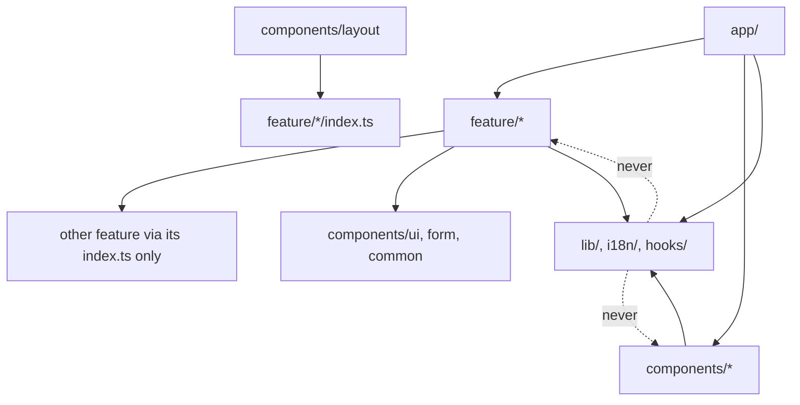

# ADR-008: Portal Structure

| Author   | Dewa Surya Ariesta                                                                                                                                                              |
| -------- | ------------------------------------------------------------------------------------------------------------------------------------------------------------------------------- |
| Date     | 28 September 2026                                                                                                                                                               |
| Status   | Proposed                                                                                                                                                                        |
| Deciders | Dewa Surya Ariesta                                                                                                                                                              |
| Related  | [PRD](../PRD.md), [ADR-001](./ADR-001-initial_technology.md), [ADR-002](./ADR-002-usecase.md), [ADR-003](./ADR-003-api-contract.md), [ADR-004](./ADR-004-initial_schema_model.md) |

## 1. Overview

[ADR-001 §5.1](./ADR-001-initial_technology.md) chose **one Next.js application** for three things: the public site (blog, about, products), the user portal (profile, subscriptions, payments), and the admin dashboard. That application is `apps/portal`.

`apps/portal` today is a copy of an earlier project, **Simple Bank** (accounts, deposits, transfers, a Go backend). It already has good patterns: feature folders, one Axios client, TanStack Query hooks, Zustand wizard stores, i18n (`id`/`en`), shadcn/ui, and a navigation guard. But its domain, its routes, and its way of reaching the backend do not match the hub.

This ADR says **how `apps/portal` is organised for the hub**:

| #   | Covered here                                                                                     |
| --- | ------------------------------------------------------------------------------------------------ |
| 1   | The route map: which URL belongs to which surface (site, portal, admin), and how each renders.   |
| 2   | The folder layout and what each folder may import.                                               |
| 3   | The shape of one feature folder.                                                                 |
| 4   | The two data paths: public reads on the server, signed-in calls from the browser.               |
| 5   | Where each kind of state lives.                                                                  |
| 6   | What to keep, change, and remove from the Simple Bank code, in PRD release order.               |

## 2. Decision Drivers

| #   | Driver                                                                                                                             | Source                                   |
| --- | ---------------------------------------------------------------------------------------------------------------------------------- | ---------------------------------------- |
| D1  | Public pages are static or ISR for SEO and LCP < 2.5 s. Portal and admin pages are not indexed.                                   | PRD FR-C1, NFR SEO; ADR-001 §5.1         |
| D2  | Stay inside the Cloudflare Workers limits (10 ms CPU per request on the free plan, 3 MiB Worker). Prefer static over per-request rendering. | ADR-001 §5.2                     |
| D3  | The browser signs in with the Firebase Web SDK and sends `Authorization: Bearer <ID token>` to the API. On `401` it refreshes the token and retries **once**. No cookies go to the API. | ADR-001 §5.7; ADR-002 §7; ADR-003 §3.2, §3.6 |
| D4  | Every response uses the ADR-003 envelope (`data`, `code`, `message`, `meta.total_page`, `error[]`).                                | ADR-003 §3.5                             |
| D5  | Ads appear only on public content pages, never in the portal, admin, or checkout.                                                 | ADR-001 §5.2 "Ads rules"                 |
| D6  | The API calls `POST /api/revalidate` on the site after content changes.                                                            | ADR-003 §11.1                            |
| D7  | One developer: the structure must be easy to follow, and a new feature must be a copy of an existing one.                         | ADR-001 §1                               |
| D8  | Frontend features line up with the API groups and backend modules, so one use case goes through the same names end to end.       | ADR-002 §5; ADR-003 §4                   |

## 3. Decision Summary

| #   | Decision                                                                                                                                                                                                   |
| --- | ---------------------------------------------------------------------------------------------------------------------------------------------------------------------------------------------------------- |
| S1  | Keep the `app/` → `feature/` → `lib/` layering and the `[locale]` segment. Split the app into **four route groups**: `(site)`, `(auth)`, `(portal)`, `(admin)`, plus `sso/authorize` and `app/api/revalidate` (§4). |
| S2  | **One feature folder per API sub-group** (`content`, `product`, `auth`, `sso`, `billing`, `admin/*`) (§5, §6).                                                                                             |
| S3  | **Two data paths** (§7): public reads run on the server with `fetch` and ISR, and signed-in calls run in the browser with Axios and TanStack Query, sending the Firebase ID token.                          |
| S4  | **Remove the Server Action + msgpack "masking" + httpOnly session cookie layer.** The API is not called through Next.js for signed-in requests (§7.3).                                                     |
| S5  | Portal and admin pages are **client-guarded static shells**: no server prefetch, `noindex`, no ads. The API is the real security boundary (`401`/`403`).                                                   |
| S6  | Import rules (§5.2) are enforced with ESLint `no-restricted-imports`, not by memory.                                                                                                                       |
| S7  | Move from the bank code to the hub in PRD release order (§10). Delete the bank features and do not adapt them.                                                                                             |

## 4. Route Map

### 4.1 Surfaces

| Route group | Who           | Rendering                               | Data path          | Guard                        | Ads | Indexed |
| ----------- | ------------- | --------------------------------------- | ------------------ | ---------------------------- | --- | ------- |
| `(site)`    | Visitor       | Static / ISR, revalidated by the API    | Server `fetch` §7.1 | None                         | Yes | Yes     |
| `(auth)`    | Visitor       | Static shell, client sign-in            | Browser §7.2       | Redirect away if signed in   | No  | Login only |
| `sso`       | Visitor, User | Static shell, client flow               | Browser §7.2       | Signs in first if needed     | No  | No      |
| `(portal)`  | SaaS User     | Static shell, client data               | Browser §7.2       | `<AuthGate>`                 | No  | No      |
| `(admin)`   | Administrator | Static shell, client data               | Browser §7.2       | `<AuthGate role="ADMIN">`    | No  | No      |
| `app/api`   | Hub API       | Route Handler                           | —                  | `X-Revalidate-Secret`        | —   | —       |

### 4.2 Routes

All pages sit under `app/[locale]/` (`id` is the default, `en` is second). The use case column points to [ADR-002](./ADR-002-usecase.md).

| Group      | Route                                 | Use case     | API (ADR-003)                                   | Phase |
| ---------- | ------------------------------------- | ------------ | ----------------------------------------------- | ----- |
| `(site)`   | `/`                                   | UC-01, UC-02 | `GET /public/articles`, `GET /public/products`  | 1     |
| `(site)`   | `/about`                              | UC-02        | —                                               | 1     |
| `(site)`   | `/blog`                               | UC-01        | `GET /public/articles`                          | 1     |
| `(site)`   | `/blog/[slug]`                        | UC-01        | `GET /public/articles/{slug}`                   | 1     |
| `(site)`   | `/blog/category/[slug]`               | UC-03        | `GET /public/categories/{slug}`, `/public/articles` | 4 |
| `(site)`   | `/blog/tag/[slug]`                    | UC-03        | `GET /public/tags/{slug}`, `/public/articles`   | 4     |
| `(site)`   | `/products`                           | UC-02        | `GET /public/products`                          | 1     |
| `(site)`   | `/products/[productCode]`             | UC-02, UC-08 | `GET /public/products/{productCode}`            | 1     |
| `(auth)`   | `/login`                              | UC-04        | `POST /me/session`                              | 2     |
| `(auth)`   | `/logout`                             | UC-04        | — (Firebase `signOut()`)                        | 2     |
| `sso`      | `/sso/authorize`                      | UC-06        | `POST /sso/codes` (ADR-001 §5.7; not yet in ADR-003) | 2 |
| `(portal)` | `/account`                            | UC-05        | `GET /me`                                       | 2     |
| `(portal)` | `/account/subscriptions`              | UC-10, UC-12 | `GET /me/subscriptions`                         | 3     |
| `(portal)` | `/account/transactions`               | UC-11        | `GET /me/transactions`                          | 3     |
| `(portal)` | `/account/transactions/[orderId]`     | UC-08, UC-11 | `GET /me/transactions/{orderId}`                | 3     |
| `(portal)` | `/checkout/[planCode]`                | UC-08, UC-12 | `POST /checkout`, poll `GET /me/transactions/{orderId}` | 3 |
| `(admin)`  | `/admin`                              | —            | —                                               | 1     |
| `(admin)`  | `/admin/articles`, `/new`, `/[id]`    | UC-16–UC-18  | `/admin/articles/**`                            | 1     |
| `(admin)`  | `/admin/media`                        | UC-19        | `/admin/media/**`                               | 1     |
| `(admin)`  | `/admin/categories`, `/admin/tags`    | UC-20        | `/admin/categories/**`, `/admin/tags/**`        | 1     |
| `(admin)`  | `/admin/users`, `/[id]`               | UC-14        | `/admin/users/**`                               | 2     |
| `(admin)`  | `/admin/transactions`, `/[orderId]`   | UC-15        | `/admin/transactions/**`                        | 3     |
| `(admin)`  | `/admin/products`, `/[id]`            | UC-21        | `/admin/products/**`, `/admin/plans/**`         | 3     |
| `(admin)`  | `/admin/comments`                     | UC-26        | `/admin/comments/**` (ADR-010)                  | 5     |

Outside `[locale]`: `app/api/revalidate/route.ts`, `app/sitemap.ts`, `app/robots.ts`, `app/manifest.ts`, and `public/ads.txt`.

**Rules.**

- There is **no `/register` page**. Sign-in is Google only, and the first sign-in creates the account (ADR-002 UC-04, OQ4).
- The checkout URL uses the plan `code` (`/checkout/dd-pro-monthly`), which never changes (ADR-004 §3). The page reads the plan from `GET /public/products/{productCode}` and sends its `planId` to `POST /checkout`.
- After sign-in, the user goes back to `?next=` if it is a same-site path, else to `/account` (UC-04 step 7).
- Only `(site)` layouts mount the ad script and `<AdSlot>` (D5). The `(site)` layout is the only one that imports `components/ads/`.

### 4.3 Revalidation and locales

The API sends paths **without** a locale (`/blog/my-post`, ADR-003 §11.1). The Route Handler adds each locale before it calls `revalidatePath()`:

```ts
// app/api/revalidate/route.ts (shape, not final code)
for (const path of body.paths) {
  if (path === "/sitemap.xml") revalidatePath(path);
  else for (const locale of locales) revalidatePath(`/${locale}${path}`);
}
```

The API contract stays locale-free, and a new locale needs no API change.

## 5. Folder Layout

### 5.1 Target tree

```
apps/portal/
├── app/
│   ├── [locale]/
│   │   ├── layout.tsx              # html/body, providers (theme, i18n, query, nuqs, auth)
│   │   ├── error.tsx, not-found.tsx
│   │   ├── (site)/                 # public, ISR, ads (§4)
│   │   │   ├── layout.tsx          # SiteNav, SiteFooter, AdScript
│   │   │   ├── page.tsx
│   │   │   ├── about/  blog/  products/
│   │   ├── (auth)/login/  (auth)/logout/
│   │   ├── sso/authorize/
│   │   ├── (portal)/               # <AuthGate>, PortalShell, noindex
│   │   │   ├── layout.tsx
│   │   │   ├── account/  checkout/
│   │   └── (admin)/admin/          # <AuthGate role="ADMIN">, AdminShell, noindex
│   │       ├── layout.tsx
│   │       ├── articles/  media/  categories/  tags/
│   │       ├── users/  transactions/  products/
│   ├── api/revalidate/route.ts
│   ├── sitemap.ts  robots.ts  manifest.ts  globals.css
├── feature/                        # domain logic, one folder per API sub-group (§6)
│   ├── common/                     # envelope types, params parsing, shared pure helpers
│   ├── content/                    # public articles, categories, tags     (server)
│   ├── product/                    # public products and plans              (server)
│   ├── auth/                       # Firebase session, /me/session, /me     (browser)
│   ├── sso/                        # /sso/authorize flow                    (browser)
│   ├── billing/                    # checkout, transactions, subscriptions (browser)
│   └── admin/
│       ├── articles/  media/  taxonomy/
│       ├── users/  transactions/  products/
├── components/
│   ├── ui/                         # shadcn primitives (owned source)
│   ├── form/                       # RHF fields (InputField, MoneyInputField, ...)
│   ├── common/                     # cross-feature UI: page-header, states, navigation-guard, toast, progress bar
│   ├── layout/                     # SiteNav, SiteFooter, PortalShell, AdminShell (was components/navigation)
│   ├── landing/                    # home/about sections (static, no data fetching)
│   └── ads/                        # AdScript, AdSlot — (site) only
├── lib/
│   ├── api/                        # transport: browser client, public fetch, envelope, errors (§7)
│   ├── firebase/                   # Firebase app init (client only)
│   ├── query/                      # QueryClient factory, toast meta
│   ├── seo/                        # metadata helpers, JSON-LD builders
│   ├── toast/  logger.ts  utils.ts  number.ts  form.ts
├── i18n/                           # settings, server loader, locale-aware Link/redirect
├── messages/{id,en}/<namespace>.json
├── providers/                      # theme, query, auth
├── hooks/                          # generic hooks only (use-debounce, use-mobile)
└── proxy.ts                        # locale redirect only
```

### 5.2 Import rules

Arrows show what a layer **may** import. Anything not listed is forbidden and is blocked by ESLint `no-restricted-imports` (S6).



| #   | Rule                                                                                                                                                                                                  |
| --- | ----------------------------------------------------------------------------------------------------------------------------------------------------------------------------------------------------- |
| I1  | `lib/` never imports `feature/` or `components/`. Today `lib/api/api-interceptor.ts` imports `feature/auth/constants`; the new token provider (§7.2) removes this.                                    |
| I2  | A feature imports another feature **only through its `index.ts`**, never a deep path.                                                                                                                  |
| I3  | `components/ui`, `form`, and `common` never import `feature/`. Only `components/layout` may, through feature barrels (it composes the shell: user menu, sign-out button).                             |
| I4  | `feature/admin/**` is imported only by `app/[locale]/(admin)/**`. `(site)` and `(portal)` never pull admin code into their bundles.                                                                   |
| I5  | Files that must run on the server only start with `import "server-only"` and are named `server.ts`. They are **never** re-exported from a barrel; pages import them by path. (This is the existing rule in `feature/auth/index.ts`.) |
| I6  | `components/ads` is imported only by `(site)` layouts and pages (D5).                                                                                                                                  |
| I7  | Components used by one feature live in `feature/<name>/components/`. They move to `components/common/` when a second feature needs them.                                                              |

## 6. Feature Folder Shape

### 6.1 Features and their API groups

| Feature                   | API group (ADR-003)     | Backend module (ADR-002) | Runs in | Namespace (i18n) |
| ------------------------- | ----------------------- | ------------------------ | ------- | ---------------- |
| `content`                 | 1 Public (articles, categories, tags, sitemap) | `content` | Server  | `content`        |
| `product`                 | 1 Public (products)     | `product`                | Server  | `product`        |
| `auth`                    | 2 Account               | `identity`               | Browser | `auth`           |
| `sso`                     | SSO (ADR-001 §5.7)      | `identity`               | Browser | `auth`           |
| `billing`                 | 3 Billing               | `payment`, `subscription`| Browser | `billing`        |
| `admin/articles`          | 6.3                     | `content`                | Browser | `admin`          |
| `admin/media`             | 6.4                     | `media`                  | Browser | `admin`          |
| `admin/taxonomy`          | 6.5, 6.6                | `content`                | Browser | `admin`          |
| `admin/users`             | 6.1                     | `admin`, `identity`      | Browser | `admin`          |
| `admin/transactions`      | 6.2                     | `admin`, `payment`       | Browser | `admin`          |
| `admin/products`          | 6.7                     | `product`                | Browser | `admin`          |
| `engagement`              | 1, 2 (ADR-010)          | `engagement`             | Browser | `engagement`     |
| `admin/comments`          | 6.8 (ADR-010)           | `engagement`             | Browser | `admin`          |

A new API sub-group gets a new feature folder. A new endpoint in an existing group becomes one more method in that feature's client.

### 6.2 Files in a browser feature

This is the current Simple Bank shape, with two fixes from `apps/portal/docs/IMPROVEMENT_OPPORTUNITIES.md` (§2.2 name collisions, §2.3 duplicated query functions):

```
feature/billing/
├── index.ts          # public barrel — client-safe exports only
├── type.ts           # DTOs, copied from the ADR-003 shapes (camelCase, money = { amount, currency })
├── client.ts         # class BillingClient extends BaseClient; export const billingClient
├── queries.ts        # billingKeys + queryOptions() factories (one per read)
├── hooks.ts          # useTransactions(), useCheckoutMutation() built on queries.ts
├── schema.ts         # static Zod schemas, messages are i18n keys
├── utils.ts          # pure helpers — the first unit-test targets
└── components/
    ├── checkout-summary.tsx
    ├── payment-status.tsx
    └── store.ts      # Zustand: wizard/UI state only, never server data
```

```ts
// feature/billing/queries.ts
export const billingKeys = {
  all: ["billing"] as const,
  transactions: (p: TransactionParams) => [...billingKeys.all, "transactions", p] as const,
  transaction: (orderId: string) => [...billingKeys.all, "transaction", orderId] as const,
};

export const transactionsQuery = (p: TransactionParams) =>
  queryOptions({
    queryKey: billingKeys.transactions(p),
    queryFn: () => billingClient.listTransactions(p).then((r) => r.data),
  });
```

**Rules.**

- Each feature exports a named key factory (`billingKeys`, `contentKeys`), never a plain `queryKeys`.
- Hooks and any prefetch use the same `queryOptions()` object, so the key and fetch function cannot drift.
- `client.ts` methods take one options object and return `AxiosResponse<ApiResponse<T>>` or `AxiosResponse<ApiPage<T>>` (§7.4).
- A feature with no forms has no `schema.ts`. A feature with no wizard has no `store.ts`. Missing files are fine; extra kinds of files are not.

### 6.3 Files in a server feature

`content` and `product` feed ISR pages, so they have no hooks and no Axios:

```
feature/content/
├── index.ts          # types + pure helpers only
├── type.ts
├── server.ts         # import "server-only"; getArticle(slug), listArticles(params), ...
├── utils.ts          # e.g. reading time, excerpt, JSON-LD builder
└── components/       # ArticleBody (Markdown renderer), ArticleCard, Pagination links
```

The home page, `/products/[productCode]`, and the checkout summary all read products. The client-side checkout reads the plan through a small `productClient` in `feature/product/client.ts`. Server pages still use `feature/product/server.ts`.

## 7. Data Paths

### 7.1 Public reads (server, ISR)

```
(site)/blog/[slug]/page.tsx
   │  getArticle(slug)                 feature/content/server.ts
   ▼
lib/api/public-fetch.ts                native fetch, no auth header
   │  next: { revalidate: 3600 }       time-based fallback (ADR-003 §11.1)
   │  redirect: "manual"
   │  404 → notFound(), 301 → permanentRedirect("/blog/<newSlug>") (ADR-003 §5.3)
   ▼
GET /v1/public/**
```

- Use **native `fetch`**, not Axios. Next.js caches and revalidates `fetch` calls. Axios skips that cache, and its Node adapter adds size to the Worker bundle (D2).
- Detail pages export `generateStaticParams()` returning `[]`, so pages render on first request and are then cached. **The build never calls the API.** This is the existing `BuildPhaseSkippedError` rule, kept.
- Metadata (`generateMetadata`) calls the same `server.ts` function. React `cache()` shares the result between metadata and page within one request.
- Verify the exact Next.js 16 caching API (`revalidate` segment config vs. `"use cache"` / `cacheLife`) in `node_modules/next/dist/docs/` before building, as `apps/portal/AGENTS.md` asks.

### 7.2 Signed-in calls (browser, Firebase token)

```
Client Component
   │  useTransactions(params)          feature/billing/hooks.ts
   ▼
TanStack Query  ── queryOptions ──►  billingClient.listTransactions()   feature/billing/client.ts
   ▼
lib/api/browser-client.ts              one axios instance
   │  request:  Authorization: Bearer await getIdToken()
   │            X-Timezone: Intl.DateTimeFormat().resolvedOptions().timeZone
   │            Idempotency-Key (only when the caller sets it, POST /checkout)
   │  response: 401 → getIdToken(forceRefresh) → retry once → still 401 → /logout
   │            error → ApiError with code, message, fieldErrors, traceId (X-Trace-Id)
   ▼
/v1/me/**, /v1/checkout, /v1/admin/**   (CORS allow-listed, ADR-003 §3.6)
```

**Token provider (keeps rule I1).** `lib/api/browser-client.ts` exposes `setTokenProvider(fn)`. `feature/auth` calls it once, with a function that returns `auth.currentUser?.getIdToken(force)`. `lib/` never imports `feature/`.

**Auth state.** `providers/auth-provider.tsx` listens to Firebase `onAuthStateChanged`. On sign-in it calls `POST /me/session` and stores `{ status, profile, role }` in a small Zustand store in `feature/auth`. Its `status` is `loading`, `signed-in`, or `signed-out`.

**Guard.** `<AuthGate>` in the `(portal)` and `(admin)` layouts:

| Status                         | What it renders                                        |
| ------------------------------ | ------------------------------------------------------ |
| `loading`                      | The shell with skeletons (no flash of the login page). |
| `signed-out`                   | Redirects to `/login?next=<current path>`.             |
| `signed-in`, role not allowed  | The 403 state; no admin data is requested.             |
| `signed-in`, role allowed      | Children.                                              |

The guard is for user experience only. The API checks every request (ADR-003 A1–A3).

**`proxy.ts`** keeps only the locale redirect. It drops the session-cookie check, because there is no session cookie any more.

### 7.3 Why the Server Action layer is removed

Simple Bank sent every call through a Server Action. It packed each result with msgpack + zlib ("masking") and kept the token in an httpOnly cookie. The hub removes this because:

| Reason                                                                                                                                                            | Driver |
| ----------------------------------------------------------------------------------------------------------------------------------------------------------------------------------------------------------- | ------ |
| ADR-001/002/003 already decided that the browser sends the Firebase ID token and the API allows CORS without cookies. A Server Action proxy would need the token on the Next.js server, which the Firebase Web SDK does not give it (tokens live in IndexedDB). | D3     |
| Every signed-in request would cost a Worker invocation plus pack/unpack CPU, on a plan with 10 ms CPU per request.                                                  | D2     |
| msgpack + zlib is encoding, not protection. Anyone can decode it in DevTools (`apps/portal/docs/SETUP_DATA_MASKING.md` says the same).                                | —      |
| One hop fewer: browser → Nginx → API, not browser → Worker → Nginx → API.                                                                                           | D2     |

**Trade-off.** Tokens are readable by JavaScript on the page, so XSS is the main risk. We reduce it with a strict Content Security Policy (script sources: self, Firebase, Midtrans Snap, and the ad network only on `(site)`), no `dangerouslySetInnerHTML` except JSON-LD, and a Markdown renderer that does not allow raw HTML (§8).

### 7.4 Envelope and errors

`lib/api/envelope.ts` replaces `lib/api/types.ts` and `feature/common/type.ts`, and matches ADR-003 §3.5 exactly:

```ts
export type ApiResponse<T> = { data: T; code: number; message: string };
export type ApiPage<T> = ApiResponse<T[]> & {
  meta: { total: number; page: number; limit: number; total_page: number };
};
export type ApiErrorBody = { code: number; message: string; error: { field: string; message: string }[] };
```

- `lib/api/error.ts` keeps its helpers (`getApiErrorMessage`, `getApiFieldErrors`) and reads `error[]` instead of `error.details`. It also returns the `X-Trace-Id` so error states can show it (ADR-003 §3.5).
- UI branches on the HTTP `code`, never on `message` text (ADR-003 §3.5).
- Field errors map to React Hook Form with `form.setError(field, …)`. The existing `zodResolverTranslate` and query-`meta` toast system stay as they are.

## 8. Cross-Cutting Concerns

| Concern             | Where                                               | Rule                                                                                                                     |
| ------------------- | --------------------------------------------------- | ------------------------------------------------------------------------------------------------------------------------ |
| Server state        | TanStack Query (feature `hooks.ts`)                 | The only home for API data in the browser.                                                                               |
| Wizard / modal state | Zustand `feature/*/components/store.ts`            | Step and in-progress form values only. `reset()` on close.                                                               |
| URL state           | `nuqs`                                              | Filters, `page`, `limit`, sort on list pages (`?page=n` matches the API, ADR-003 §3.4).                                  |
| Session             | `feature/auth` store + `providers/auth-provider.tsx` | Status, profile, role. No token is copied into state.                                                                   |
| Toasts              | `lib/query/query-client.ts` meta                    | Kept as is.                                                                                                              |
| Unsaved changes     | `components/common/navigation-guard`                | Kept. Required for the article editor (UC-16).                                                                           |
| i18n                | `i18n/`, `messages/{id,en}/`                        | One namespace per feature (§6.1). Register it in `i18n/settings.ts` and check that both loaders pick it up. Article bodies are not translated. |
| SEO                 | `lib/seo/`                                          | `generateMetadata` on every `(site)` page, `Article` JSON-LD on `/blog/[slug]`, `noindex` on `(auth)` (except `/login`), `sso`, `(portal)`, `(admin)`. |
| Markdown            | `feature/content/components/article-body.tsx`       | Render on the server. Do not allow raw HTML. Images point at CloudFront with a custom loader or `unoptimized` (ADR-001 §5.2). |
| Money and time      | `lib/number.ts`, `feature/common/utils.ts`          | Money is an integer of rupiah: format with `Intl.NumberFormat("id-ID", { currency: "IDR" })`. Times are UTC from the API: show in the user's zone (default `Asia/Jakarta`). |
| Logging             | `lib/logger.ts`                                     | Server only (route handler, public fetch). Keep the redaction list. Check that winston runs in the Workers runtime and fits the size budget; if it does not, keep `maskSensitiveData` and write JSON to `console`, which Workers Logs collects. |
| Midtrans Snap       | `feature/billing/components/snap-launcher.tsx`      | Load `snap.js` with `next/script` only on `/checkout`. Never grant access from the popup callback. Poll the transaction (UC-08 step 7). |
| Tests               | `*.test.ts` next to the file                        | Start with Vitest for `utils.ts`, `schema.ts`, and `lib/api/error.ts`. The CI job belongs to ADR-007.                   |

## 9. Keep, Change, Remove

What happens to each part of the current Simple Bank code.

| Part                                                                                                                | Action     | Note                                                                                              |
| ------------------------------------------------------------------------------------------------------------------- | ---------- | ------------------------------------------------------------------------------------------------- |
| `components/ui`, `components/form`, `components/common/*` (navigation guard, toast, progress bar, page header, states) | **Keep**   | Already domain-free.                                                                              |
| `i18n/`, `[locale]` routing, `messages/` structure                                                                  | **Keep**   | Replace the bank namespaces (`account`, `deposit`, `transfer`, `onboarding`) with §6.1.            |
| `lib/query/query-client.ts`, `providers/query-provider.tsx`, `lib/toast`                                            | **Keep**   |                                                                                                   |
| `BaseClient` (`lib/api/base-client.ts`)                                                                             | **Keep**   | Move the Axios instance to `browser-client.ts`, and set `baseURL` from `NEXT_PUBLIC_API_URL` (`https://api.<domain>/v1`). |
| `lib/seo/metadata.ts`, `app/sitemap.ts`, `app/robots.ts`, `app/manifest.ts`                                         | **Keep**   | The sitemap reads `GET /public/sitemap`.                                                          |
| `lib/logger.ts`                                                                                                     | **Keep, check** | See §8 Logging.                                                                              |
| `lib/api/api-interceptor.ts`                                                                                        | **Change** | Rewrite for the browser: token provider, retry-once on `401`, `X-Trace-Id`. Drop `next/headers` reads. |
| `lib/api/types.ts`, `feature/common/type.ts`, `lib/api/error.ts`                                                    | **Change** | Merge into `lib/api/envelope.ts` (§7.4). Removes the duplicate error type.                        |
| `proxy.ts`                                                                                                          | **Change** | Locale redirect only.                                                                             |
| `components/navigation/*`                                                                                           | **Change** | Move to `components/layout/`. Drop the bank quick actions and account list.                        |
| `components/landing/*`                                                                                              | **Change** | Rewrite the sections for Dewa, the blog, and products. Keep `scroll-reveal`, `social-icons`, `author.ts`. |
| `hooks/use-debaunch.ts`                                                                                             | **Change** | Rename to `use-debounce.ts` now, while few files import it.                                       |
| `feature/auth` (session cookie, `dal.ts`, `actions.ts`, register form)                                              | **Change** | Rebuild around Firebase (§7.2). Keep `logout-button`, `brand-banner`, and `auth-backdrop` visuals. |
| `feature/account`, `account-manage`, `account-transaction`, `transfer`, `onboarding`                                | **Remove** | Bank domain. Use their wizard/store code as the example for billing and admin dialogs, then delete. |
| `lib/api/action-result.ts`, `pack-server-action.ts`, `unpack-server-result.ts`, `lib/masking-data/`, `lib/mask-result.ts` | **Remove** | §7.3. `lib/mask-result.ts` is already an unused duplicate.                                     |
| `lib/timezone-sync.tsx`, `lib/api/constants.ts` (timezone cookie)                                                   | **Remove** | The browser sends `X-Timezone` itself.                                                            |
| `requestViaApiClient` in `base-client.ts`                                                                           | **Remove** | Not used anywhere.                                                                                |
| `(splash)/auth-success`, `(auth)/register`, `temp/api-docs.json`                                                    | **Remove** | Replaced by `sso/authorize` and Google-only sign-in; the API docs are the Go backend's.            |
| Root notes `GUARD_NAVIGATION.md`, `MASK_SERVER_RESPONSE.md`, `HANDLE_PAGINATE_DATA.md`, `TEM_MD.md`; `AGENTS.md`, `docs/*` | **Change** | Move the useful notes into `apps/portal/docs/`, delete the masking doc, and rewrite `AGENTS.md` for the hub. |

## 10. Migration Order

Follows the PRD release plan (§9), so each phase ships something usable.

| Step | PRD phase | Work                                                                                                                                                                     |
| ---- | --------- | ------------------------------------------------------------------------------------------------------------------------------------------------------------------------ |
| 0    | —         | Remove the bank features and the masking layer. Add `lib/api/envelope.ts`, `public-fetch.ts`, `browser-client.ts`, and ESLint import rules. Rewrite `AGENTS.md`. Add Vitest. |
| 1    | P1        | `(site)`: home, about, blog, article, products. `content` and `product` features. `api/revalidate`. Ads slots. `(admin)` content screens, temporarily protected by a Firebase sign-in + `ADMIN` role check (needs step 2's `auth` feature, so build the minimal `auth` first). |
| 2    | P2        | `feature/auth` complete, `/login`, `/logout`, `/account`, `/sso/authorize`, `/admin/users`.                                                                                |
| 3    | P3        | `feature/billing`: `/products/[productCode]` buy button, `/checkout/[planCode]`, `/account/subscriptions`, `/account/transactions`. `/admin/transactions`, `/admin/products`. |
| 4    | P4        | Renewal on `/account/subscriptions` (UC-12), `/blog/category/[slug]`, `/blog/tag/[slug]`.                                                                                 |

## 11. Alternatives Considered

| Option                                                                                  | Why not                                                                                                                                                                    |
| --------------------------------------------------------------------------------------- | -------------------------------------------------------------------------------------------------------------------------------------------------------------------------- |
| **Keep the Server Action BFF**, with Firebase **session cookies** (created by the Admin SDK) instead of ID tokens | Gives httpOnly cookies, but changes ADR-001 §5.7 and ADR-003 §3.2/§3.6: the API must verify session cookies, CORS must allow credentials, and every call costs Worker CPU. Consider it only if an XSS risk review asks for it. |
| **Separate Next.js apps** for site, portal, and admin                                   | Goes against ADR-001 §5.1 (one codebase, one deployment). Three deploys and three copies of the UI kit for one developer. Route groups plus import rule I4 give most of the separation. |
| **Organise by type** (`components/`, `hooks/`, `services/` at the top)                   | One use case would be spread across four folders. The current feature folders already work and match the API groups (D8).                                                    |
| **Server-side prefetch** for portal/admin pages (current `HydrationBoundary` pattern)   | The server has no Firebase token (§7.3). These pages are not indexed, so a skeleton on first load costs no SEO.                                                               |
| **Axios for public reads too**                                                          | Axios bypasses Next.js fetch caching, which ISR needs (§7.1).                                                                                                                |

## 12. Consequences

### 12.1 Positive

- Every use case has one clear path: route in §4.2 → feature in §6.1 → endpoint in ADR-003.
- Public pages are cached HTML with no per-request API call, which is good for LCP and Worker CPU.
- Portal and admin pages are static shells, so signed-in traffic never uses Worker CPU; it goes straight to Nginx.
- Admin code never ships to visitors (rule I4).
- Most of the existing, tested-by-use UI code (ui kit, forms, guards, toasts, i18n) carries over unchanged.

### 12.2 Negative and risks

| Risk                                                                                   | Mitigation                                                                                                   |
| -------------------------------------------------------------------------------------- | ------------------------------------------------------------------------------------------------------------ |
| The ID token can be read by JavaScript, so an XSS can steal it (valid for up to 1 hour). | Strict CSP, no raw HTML in Markdown, no third-party scripts outside `(site)`, short token life.              |
| A signed-in page shows a skeleton on first load.                                       | Shell and skeletons render immediately; data comes from one API call.                                       |
| The ESLint import rules take a little setup.                                           | Set them up in step 0, before any hub feature exists.                                                        |
| Next.js 16 and OpenNext may differ from the patterns here (caching API, `proxy.ts` runtime, winston on Workers). | Check `node_modules/next/dist/docs/` and run `opennextjs-cloudflare preview` before each release (ADR-001 §5.2). |

## 13. Follow-up

| Item                                                                                  | Where               |
| ------------------------------------------------------------------------------------- | ------------------- |
| Add ADR-008 to the follow-up table in ADR-001 §9.                                     | ADR-001             |
| Add the SSO endpoints (`POST /sso/codes`, `POST /sso/token`) to the endpoint list.    | ADR-003 §4.1        |
| Content Security Policy for site, portal, admin, and checkout (Firebase, Midtrans, ads). | ADR-005 (ads) or a new ADR |
| Portal CI job: lint, type-check, test, build, OpenNext preview.                       | ADR-007             |
| Rewrite `apps/portal/AGENTS.md` and `apps/portal/docs/README.md` to match this ADR.    | `apps/portal`       |
