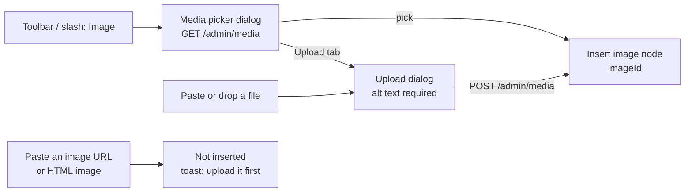
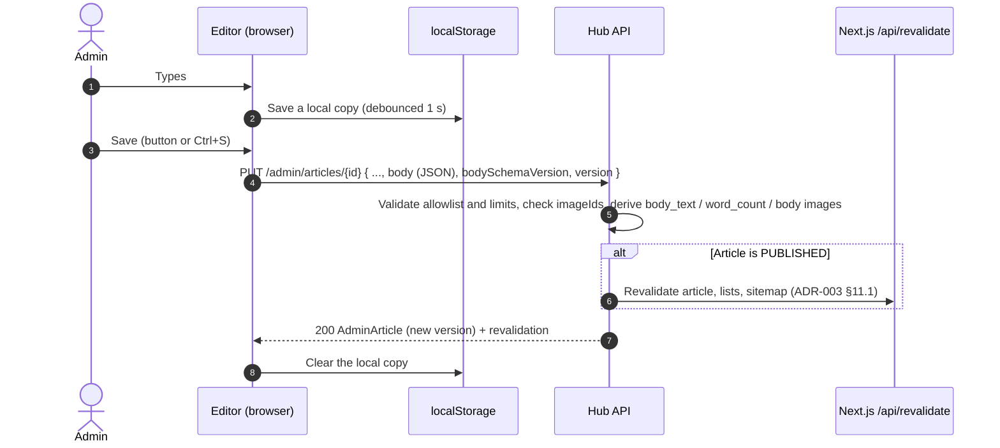
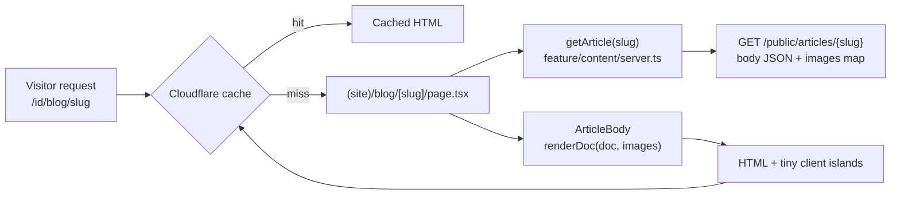

# ADR-009: Article Authoring and Display

| Author   | Dewa Surya Ariesta                                                                                                                                                                                                  |
| -------- | ------------------------------------------------------------------------------------------------------------------------------------------------------------------------------------------------------------------- |
| Date     | 28 September 2026                                                                                                                                                                                                   |
| Status   | Proposed                                                                                                                                                                                                            |
| Deciders | Dewa Surya Ariesta                                                                                                                                                                                                  |
| Related  | [PRD](../PRD.md), [ADR-001](./ADR-001-initial_technology.md), [ADR-002](./ADR-002-usecase.md), [ADR-003](./ADR-003-api-contract.md), [ADR-004](./ADR-004-initial_schema_model.md), [ADR-008](./ADR-008-portal_structure.md) |

## 1. Overview

The blog is the main way the hub gets visitors (PRD G1). ADR-002 UC-16 and ADR-003/004 describe articles written in **Markdown** and stored as `body` (Markdown) plus `body_html` (rendered on save).

The admin (Dewa) wants a **Notion-like writing experience** instead:

- a block editor built with **Tiptap**,
- a toolbar that covers every text style,
- images from the media library,
- embedded links (videos, demos, link cards),
- tables.

Markdown cannot hold all of this without loss (merged table cells, callouts, embeds, image width, text colour). This ADR changes the article body format and describes both halves:

| #   | Covered here                                                                                  |
| --- | --------------------------------------------------------------------------------------------- |
| 1   | The body format: what is stored, and the allowlist of blocks and marks (§4).                   |
| 2   | **Authoring:** the Tiptap editor, its toolbars, and how images, embeds, and tables are added (§5). |
| 3   | Saving: validation, draft safety, preview, and publish (§6).                                   |
| 4   | **Serving:** how the public page renders the body, and the display strategy (§7).              |
| 5   | The changes this needs in ADR-002, ADR-003, ADR-004, and ADR-008 (§9).                         |

## 2. Decision Drivers

| #   | Driver                                                                                                                                 | Source                            |
| --- | -------------------------------------------------------------------------------------------------------------------------------------- | --------------------------------- |
| D1  | Writing feels like Notion: `/` commands, a selection toolbar, drag to move blocks, Markdown shortcuts.                                | Admin request                     |
| D2  | The editor covers text styles, images, embeds, and tables. It keeps SEO fields, cover image, category, and tags from A-3.3.            | PRD A-3.3, A-3.7                  |
| D3  | Public pages are static/ISR, LCP < 2.5 s, no layout shift, Lighthouse SEO ≥ 90.                                                        | PRD NFR SEO/Performance; ADR-008 §7.1 |
| D4  | No raw HTML from the body ever reaches the public page. The body cannot run scripts, even if an admin token is stolen.                | ADR-008 §7.3                      |
| D5  | Images come only from the media library (resized WebP on CloudFront). The article must know which images it uses, so they cannot be deleted while in use. | ADR-001 §5.9; ADR-004 `article_body_images` |
| D6  | The editor must not add JavaScript to public pages. The Worker bundle stays small (3 MiB free, 10 MiB paid).                          | ADR-001 §5.2                      |
| D7  | Content works in light and dark mode.                                                                                                  | Existing theme (`next-themes`)    |
| D8  | Only free, open-source parts. No paid editor plan.                                                                                     | ADR-001 D1                        |

## 3. Decision Summary

| #   | Decision                                                                                                                                                                                   |
| --- | ------------------------------------------------------------------------------------------------------------------------------------------------------------------------------------------ |
| S1  | The article body is stored as **Tiptap (ProseMirror) JSON**, not Markdown or HTML. The column is `articles.body jsonb`, with `body_schema_version` (§4).                                    |
| S2  | Only the blocks and marks in the **allowlist** (§4.2) are valid. The API rejects anything else. The allowlist *is* the sanitizer.                                                         |
| S3  | The admin editor is **Tiptap v3** with open-source extensions and our own UI (shadcn), loaded only on `/admin/articles/**` (§5).                                                            |
| S4  | Images in the body store only an **`imageId`**. The API returns the image variants next to the body, so URLs are never copied into content (§4.3).                                        |
| S5  | Embeds use a **provider allowlist** (YouTube, Vimeo, CodeSandbox, Figma). They are stored as `provider` + `id`, never as a raw iframe or URL (§5.5).                                       |
| S6  | The public page renders the JSON on the server with **our own small renderer** (a `switch` over the allowlist → React components). No `dangerouslySetInnerHTML`, no editor code on public pages (§7). |
| S7  | `body_html` is replaced by **`body_text`** (plain text) for reading time, excerpt fallback, and search (§4.4).                                                                             |
| S8  | Saving is **explicit** (button / `Ctrl+S`). A local copy is kept in the browser for crash recovery. Autosave to the API is not used, because saving a published article updates the live site (§6). |

## 4. Body Format

### 4.1 Shape

```json
{
  "type": "doc",
  "content": [
    { "type": "heading", "attrs": { "level": 2 }, "content": [{ "type": "text", "text": "Why Graviton" }] },
    {
      "type": "paragraph",
      "content": [
        { "type": "text", "text": "It is " },
        { "type": "text", "text": "cheaper", "marks": [{ "type": "bold" }, { "type": "highlight", "attrs": { "color": "yellow" } }] },
        { "type": "text", "text": " than x86." }
      ]
    },
    { "type": "image", "attrs": { "imageId": "5b2e...", "caption": "Architecture", "width": "wide" } },
    { "type": "embed", "attrs": { "provider": "youtube", "id": "dQw4w9WgXcQ", "caption": null } }
  ]
}
```

- The title is **not** part of the body. It stays in `title` and renders as the page's only `<h1>`.
- `body_schema_version` (starts at `1`) goes up only when a node or attribute changes in a way old content cannot follow. A one-off migration job then updates old bodies (§8).

### 4.2 Allowlist

This table is the single source of truth. The editor's extensions, the API validator, and the public renderer must all match it. A shared fixture (§8) tests all three.

**Blocks (nodes)**

| Node                                   | Attributes (all others are dropped)                                          | Toolbar / slash command            | Phase |
| -------------------------------------- | ---------------------------------------------------------------------------- | ---------------------------------- | ----- |
| `doc`, `text`, `hardBreak`             | —                                                                            | —                                  | 1     |
| `paragraph`                            | `textAlign`: `left` \| `center` \| `right`                                   | Text                               | 1     |
| `heading`                              | `level`: `2` \| `3` \| `4`; `textAlign`                                      | Heading 2 / 3 / 4                  | 1     |
| `bulletList`, `orderedList` (`start`), `listItem` | `start`: int ≥ 1                                                  | Bullet list, Numbered list         | 1     |
| `taskList`, `taskItem`                 | `checked`: bool                                                              | To-do list                         | 1     |
| `blockquote`                           | —                                                                            | Quote                              | 1     |
| `codeBlock`                            | `language`: one of the supported list (§7.4) or `null`                       | Code                               | 1     |
| `horizontalRule`                       | —                                                                            | Divider                            | 1     |
| `callout`                              | `tone`: `info` \| `tip` \| `warning` \| `danger`                             | Callout                            | 1     |
| `details`, `detailsSummary`, `detailsContent` | `open`: bool                                                          | Toggle                             | 1     |
| `image`                                | `imageId`: uuid (required); `alt`: ≤ 250 chars or `null` (uses the library alt); `caption`: ≤ 300 chars; `width`: `content` \| `wide` \| `full` | Image | 1 |
| `embed`                                | `provider`: §5.5 list; `id`: provider-specific pattern; `caption`            | Embed                              | 1     |
| `bookmark`                             | `url`: https; `title`, `description`, `siteName`: text                       | Link card                          | 2     |
| `table`, `tableRow`, `tableHeader`, `tableCell` | `colspan`, `rowspan`: 1–20; `colwidth`: int[] or `null`             | Table                              | 1     |

**Inline styles (marks)**

| Mark                         | Attributes                                                                  | Shortcut          |
| ---------------------------- | --------------------------------------------------------------------------- | ----------------- |
| `bold`, `italic`, `underline`, `strike` | —                                                                | `Ctrl+B/I/U`, `Ctrl+Shift+S` |
| `code`                       | —                                                                           | `Ctrl+E`          |
| `link`                       | `href`: `https:`, `http:`, `mailto:`, or a site path starting with `/` or `#` | `Ctrl+K`          |
| `textColor`                  | `color`: palette key (§4.5)                                                 | —                 |
| `highlight`                  | `color`: palette key (§4.5)                                                 | `Ctrl+Shift+H`    |
| `subscript`, `superscript`   | —                                                                           | —                 |

**Limits** (checked by the API, `400 VALIDATION_FAILED` on `field: "body"`):

| Limit                    | Value      |
| ------------------------ | ---------- |
| JSON size                | 512 KB     |
| Nesting depth            | 20         |
| Images in one body       | 100        |
| Table size               | 20 columns × 200 rows |

### 4.3 Images are references

The `image` node stores `imageId` only. On save, the API checks that each ID exists and rebuilds `article_body_images` from the body (ADR-004 §5.5). On read, the API returns the used images in an `images` map:

```json
"images": {
  "5b2e...": { "id": "5b2e...", "alt": "Architecture diagram", "width": 1600, "height": 900, "variants": [ /* ADR-003 §5.1 */ ] }
}
```

- The page gets `width`/`height` for every image, so no layout shift (D3).
- CloudFront URLs never end up inside article content, so a CDN change needs no content migration.
- A body image cannot be deleted while it is used (`409 IMAGE_IN_USE`, UC-19). This already works.

### 4.4 Derived fields

The API computes these on every save. They are never sent by the client.

| Field              | How                                                                                  | Used for                                                  |
| ------------------ | ------------------------------------------------------------------------------------ | --------------------------------------------------------- |
| `body_text`        | All text nodes joined, blocks separated by newlines. No marks, no image or embed data. | Admin search, excerpt fallback, future full-text search. |
| `word_count`       | Words in `body_text`.                                                                | Reading time: `ceil(word_count / 200)` minutes.           |
| `article_body_images` | All `image.imageId` values.                                                       | "Image in use" (UC-19).                                   |

### 4.5 Colour palette, not hex

Text colour and highlight store a **palette key**, not a hex value, so each colour has a light and a dark version (D7):

| Key      | Text (light / dark tokens)    | Highlight (light / dark tokens)       |
| -------- | ----------------------------- | ------------------------------------- |
| `gray`   | `--content-gray` / dark value  | `--content-gray-bg`                   |
| `red`, `orange`, `yellow`, `green`, `blue`, `purple`, `pink` | same pattern | same pattern       |

The tokens live in `app/globals.css`, next to the shadcn tokens. Tiptap's built-in `Color` extension writes hex to inline styles, so the editor uses a small custom `textColor` mark instead (§5.2).

## 5. Authoring (Admin Editor)

### 5.1 Screen layout

```
/admin/articles/[id]
┌─────────────────────────────────────────────────────────────────────┐
│ ← Articles     Draft · Saved 10:42        [Preview] [Settings] [Save] [Publish] │
├─────────────────────────────────────────────────────────────────────┤
│  Fixed toolbar: ↶ ↷ | Text ▾ | B I U S <> | 🔗 | A▾ 🖍▾ | ≡▾ | • 1. ☐ | ❝ ⎯ | 🖼 ▶ ▦ | ⋯ │
├─────────────────────────────────────────────────────────────────────┤
│                                                                     │
│   [ Title, large input — becomes <h1> ]                             │
│                                                                     │
│ ⋮⋮  Type '/' for commands…                                          │
│ ⋮⋮  ## Why Graviton                                                  │
│ ⋮⋮  Paragraph with [bubble menu on selection: B I U S <> 🔗 A 🖍]     │
│ ⋮⋮  [image block, caption, width: content | wide | full]            │
│                                                                     │
├─────────────────────────────────────────────────────────────────────┤
│ 1,245 words · 7 min read                                            │
└─────────────────────────────────────────────────────────────────────┘
Settings (side sheet): slug · excerpt · cover image · category · tags ·
                       meta title · meta description · Google preview
```

- **Title** is a plain large input above the editor, like Notion. It is not a heading block.
- **Settings** is a side sheet (`components/ui/sheet.tsx`) with a React Hook Form + Zod form for the metadata in ADR-003 `ArticleInput`. It shows a live Google-result preview (title ≤ 60 chars, description ≤ 160 chars) and warns when the fields are too long.
- The editor is desktop-first. On a phone the fixed toolbar scrolls sideways and the bubble menu still works on touch.

### 5.2 Editor stack

| Part                                        | Package (Tiptap v3, confirm names and licence at install)                        |
| ------------------------------------------- | --------------------------------------------------------------------------------- |
| Core and React binding                       | `@tiptap/react`, `@tiptap/pm`                                                    |
| Basic blocks and marks                       | `@tiptap/starter-kit` (turn off `heading` levels 1, 5, 6)                        |
| Tables                                       | `@tiptap/extension-table` (table, row, header, cell)                              |
| Task list, text align, highlight, sub/superscript | `@tiptap/extension-list` (tasks), `-text-align`, `-highlight`, `-subscript`, `-superscript` |
| Code with highlighting                       | `@tiptap/extension-code-block-lowlight` + `lowlight` (same highlighter as the public page, §7.4) |
| Toggle blocks                                | `@tiptap/extension-details`                                                      |
| Drag handle                                  | `@tiptap/extension-drag-handle-react`                                           |
| Placeholder, character count, undo/redo, focus | `@tiptap/extensions`                                                           |
| Slash menu                                   | `@tiptap/suggestion` + our own popup (`components/ui/dropdown-menu` look)         |
| Paste / drop files                           | `@tiptap/extension-file-handler`                                                |
| Custom nodes and marks                       | Ours: `image`, `embed`, `bookmark`, `callout`, `textColor`                        |
| UI (toolbar, menus, dialogs)                 | Our shadcn components. Tiptap's free UI components / "simple editor" template can be a starting point. |

**Rules.**

- Do **not** depend on Tiptap's paid Notion-like template, paid cloud features (collaboration, AI, comments), or Tiptap Cloud (D8). The admin is one person, so real-time collaboration is not needed.
- All extensions are configured in **one file**, `feature/admin/articles/editor/extensions.ts`. The node and attribute names must match §4.2.
- The editor is loaded with `next/dynamic(..., { ssr: false })` and uses `immediatelyRender: false`. It is imported only under `app/[locale]/(admin)/admin/articles/**` (ADR-008 rule I4), so no visitor ever downloads it (D6).

### 5.3 Toolbars and commands

The same actions are available in three places, so the admin can work with the mouse or the keyboard:

| Action group        | Fixed toolbar | Bubble menu (on selection) | `/` slash menu | Markdown shortcut           |
| ------------------- | :-----------: | :------------------------: | :------------: | --------------------------- |
| Undo / redo         | ✓             |                            |                | `Ctrl+Z` / `Ctrl+Shift+Z`   |
| Block type (text, H2–H4) | ✓ (dropdown) | ✓ (dropdown)            | ✓              | `## `, `### `, `#### `      |
| Bold, italic, underline, strike, inline code | ✓ | ✓               |                | `**x**`, `*x*`, `~~x~~`, `` `x` `` |
| Link                | ✓             | ✓                          |                | `Ctrl+K`, paste a URL on selected text |
| Text colour, highlight | ✓ (palette) | ✓ (palette)               |                |                             |
| Align               | ✓             |                            |                |                             |
| Lists, to-do        | ✓             |                            | ✓              | `- `, `1. `, `[ ] `         |
| Quote, divider, callout, toggle | ✓ |                            | ✓              | `> `, `---`                 |
| Code block          | ✓             |                            | ✓              | ```` ``` ````               |
| Image, embed, link card, table | ✓ |                             | ✓              |                             |
| Sub/superscript, clear formatting | ✓ (more ⋯) |                  |                |                             |

- A **drag handle** (⋮⋮) on the left of each block moves blocks and opens a block menu: turn into, duplicate, delete.
- Context menus appear on a selected image (caption, width, alt text, replace), embed (caption, replace), and table (§5.6).
- Every button has an `aria-label` and a tooltip showing its shortcut.

### 5.4 Inserting images



- **Media picker** reuses the `/admin/media` list (search, paging, thumbnails) as a dialog (`feature/admin/media` barrel).
- **Paste or drop** a file opens a small dialog with the alt text pre-filled from the file name, because the API requires alt text (ADR-003 §10.4). While uploading, the editor shows a placeholder block. If the upload fails, the placeholder is removed and an error toast is shown.
- **External image URLs are not hotlinked.** Content pasted from other sites drops its images and shows a toast, so every image goes through resize, metadata removal, and CloudFront (D5).
- A selected image can set `caption`, `width` (`content`, `wide`, `full`), and an `alt` override for this article.

### 5.5 Embedded links

A link can appear three ways:

| Kind          | Stored as                                  | How the admin adds it                                                  | Public page shows                                   |
| ------------- | ------------------------------------------ | ---------------------------------------------------------------------- | --------------------------------------------------- |
| Inline link   | `link` mark on text                        | `Ctrl+K`, the toolbar, or paste a URL over selected text                | Normal link                                          |
| Embed         | `embed` node: `provider` + `id`            | Slash "Embed" → paste URL, or paste a supported URL on an empty line → "Embed / Keep as link" choice | Click-to-load frame (§7.3)       |
| Link card     | `bookmark` node: `url`, `title`, `description`, `siteName` | Slash "Link card" → paste URL → metadata filled by `POST /admin/link-preview`, editable | Card with title, description, domain (no remote image) |

**Embed providers** (the editor parses the URL, the API checks `id` against the pattern):

| Provider      | Accepted URL                                      | `id` pattern             | Frame source                                         |
| ------------- | ------------------------------------------------- | ------------------------ | ---------------------------------------------------- |
| `youtube`     | `youtube.com/watch?v=`, `youtu.be/`, `/shorts/`   | `^[A-Za-z0-9_-]{11}$`    | `https://www.youtube-nocookie.com/embed/{id}`        |
| `vimeo`       | `vimeo.com/{id}`                                  | `^\d{1,12}$`             | `https://player.vimeo.com/video/{id}?dnt=1`          |
| `codesandbox` | `codesandbox.io/s/{id}`, `/p/sandbox/{id}`        | `^[a-z0-9-]{1,64}$`      | `https://codesandbox.io/embed/{id}`                  |
| `figma`       | `figma.com/file|design|proto/{key}/...`           | `^[A-Za-z0-9]{10,64}$`   | `https://www.figma.com/embed?embed_host=dewasuryahub&url=…` |

- The frame URL is **built by the renderer** from `provider` + `id`. It is never stored, so a changed or hostile URL cannot get into content.
- Adding a provider means updating this table, the editor parser, the API pattern, the renderer, and the CSP `frame-src`.
- Anything not in the list stays an inline link or a link card.

**`POST /admin/link-preview`** (new, phase 2, `Admin` auth): body `{ "url": "https://…" }`, returns `{ url, title, description, siteName }`. The API fetches the page, so it must guard against SSRF: HTTPS only; resolve DNS and reject private, loopback, and link-local addresses (again after each redirect); at most 3 redirects, 3 s timeout, and 1 MB read. It reads only `<title>` and `og:` / `twitter:` meta tags. The card never shows a remote image, so no third-party image host is needed in the CSP.

### 5.6 Tables

- Insert from the toolbar or slash menu with a size picker (default 3 × 3, header row on).
- A table menu appears when the cursor is in a table: add/delete row above/below, add/delete column left/right, toggle header row / header column, merge / split cells, delete table.
- Columns can be resized by dragging (`colwidth`). `Tab` / `Shift+Tab` move between cells, and `Tab` in the last cell adds a row.
- Cells hold paragraphs, lists, marks, and hard breaks. Images, embeds, tables, and code blocks are **not allowed inside cells**, so tables stay readable on a phone.

### 5.7 Frontend files

Following the feature shape in ADR-008 §6:

```
feature/content/                     # shared by admin and public site
├── article-schema/
│   ├── types.ts                     # ArticleDoc, node and mark types from §4.2
│   ├── allowlist.ts                 # node/mark names, attr rules, limits
│   ├── embed-providers.ts           # §5.5 table: parse(url), pattern, frameSrc(id)
│   └── palette.ts                   # §4.5 keys
├── components/article-body/         # public renderer (§7), no Tiptap import
│   ├── article-body.tsx             # renderDoc(doc, images) → React
│   ├── nodes/                       # figure, embed-facade, code-block, table, callout, toggle, bookmark
│   └── marks.tsx
└── utils/                           # toc.ts, heading-id.ts, reading-time.ts

feature/admin/articles/
├── client.ts  queries.ts  hooks.ts  type.ts  schema.ts
├── components/
│   ├── article-editor-page.tsx      # title, save state, actions, settings sheet
│   ├── article-settings-sheet.tsx   # RHF + Zod metadata form, Google preview
│   └── publish-checklist-dialog.tsx
└── editor/                          # dynamic import only
    ├── article-editor.tsx
    ├── extensions.ts                # the one extension list, matches §4.2
    ├── nodes/                       # image, embed, bookmark, callout node views
    ├── marks/text-color.ts
    ├── menus/                       # fixed-toolbar, bubble-menu, slash-menu, table-menu, image-menu, drag-handle
    └── dialogs/                     # media-picker, upload, link, embed
```

The public renderer does not import `feature/admin/**` (ADR-008 rule I4), and the admin editor imports `feature/content` only through its barrel (rule I2).

## 6. Saving and Publishing



| Topic              | Rule                                                                                                                                                                                  |
| ------------------ | ------------------------------------------------------------------------------------------------------------------------------------------------------------------------------------- |
| Save               | Explicit only (S8). The header shows `Saved`, `Unsaved changes`, or `Saving…`. The navigation guard (ADR-008 §8) blocks leaving with unsaved changes.                                 |
| Crash recovery     | The editor keeps `{ body, title, savedVersion, at }` in `localStorage` under `article-draft:<id>`. On open, if the local copy is newer than the server version, it offers "Restore unsaved changes". |
| Version conflict   | `409 VERSION_CONFLICT` opens a dialog: **Reload** (lose local changes) or **Copy my content** (JSON to clipboard, then reload). Nothing is merged automatically.                     |
| Validation errors  | A `400` on `body` shows the message and, if the API sends a path (`body.content[12]`), scrolls to that block.                                                                          |
| Preview            | `/admin/articles/[id]/preview` renders the **current editor content** with the public renderer (§7) in the public page layout, so what the admin sees is what visitors will get. Ads are shown as grey placeholders. |
| Publish            | Opens a checklist: title, slug, excerpt, category, cover image, meta description, and every body image has alt text. The first four are required by the API (`422 ARTICLE_INCOMPLETE`); the others are warnings. |
| Unpublish / delete | As UC-17 / UC-18.                                                                                                                                                                     |

## 7. Serving (Display Strategy)

### 7.1 Rendering pipeline



- The page is ISR (ADR-008 §7.1). The renderer runs **only on a cache miss** and after revalidation, not per visitor.
- `renderDoc` is a plain recursive function: `switch (node.type)` over the allowlist, returning React elements. Unknown node or mark types are **skipped** and logged. They never crash the page and never render as raw content (D4).
- No `dangerouslySetInnerHTML`, and no Tiptap or ProseMirror code in the public bundle or the Worker (D6). The only exception is JSON-LD (ADR-008 §7.3).
- The same `ArticleBody` component renders the admin preview (§6), in the browser.

### 7.2 Page layout

```
┌──────────────────────────────── (site) layout ────────────────────────────────┐
│ Breadcrumb: Blog › DevOps                                                       │
│ <h1> Title                                                                      │
│ Excerpt (lead paragraph)                                                        │
│ Dewa Surya Ariesta · 28 Oct 2026 · 7 min read · Updated 29 Oct                  │
│ [Cover image — LCP, eager, fetchpriority=high]                                  │
├────────────────────────────────────────────┬──────────────────────────────────┤
│ <article> body, max ~70ch                   │ On this page (TOC, sticky)        │
│   blocks…                                   │  · Why Graviton                   │
│   [Ad slot: in-article-1]                   │  · Setup                          │
│   blocks…                                   │    · Terraform                    │
│   [image: wide / full breaks out of 70ch]   │ [Ad slot: sidebar]                │
│   blocks…                                   │                                   │
├────────────────────────────────────────────┴──────────────────────────────────┤
│ Tags · [Ad slot: end-of-article]                                               │
│ Related articles (same category, 3 cards, 480 px covers)                        │
└────────────────────────────────────────────────────────────────────────────────┘
Mobile: one column; the TOC becomes a collapsed "On this page" block under the cover.
```

| Part              | Rule                                                                                                                                                             |
| ----------------- | ---------------------------------------------------------------------------------------------------------------------------------------------------------------- |
| Typography        | Tailwind `@tailwindcss/typography` (`prose`), mapped to the theme tokens so it follows light/dark. Body width about 70 characters.                              |
| Headings          | The title is the only `<h1>`. Body headings are `<h2>`–`<h4>` with an `id` made from the text (slugified, `-2`, `-3` for duplicates) and a hover `#` link to copy. |
| Table of contents | Built from the body's H2 and H3 at render time. Shown only when there are at least 3 of them. The current section is highlighted with a small client island (IntersectionObserver). |
| Reading time      | From `readingMinutes` in the API response.                                                                                                                     |
| Related articles  | `GET /public/articles?category=<slug>&limit=4`, the current article removed, 3 shown.                                                                           |

### 7.3 How each block is shown

| Block        | Output                                                                                                                                                                                         |
| ------------ | ---------------------------------------------------------------------------------------------------------------------------------------------------------------------------------------------- |
| Image        | `<figure><figcaption>`. `srcset` from the `images` map variants (480/960/1600). `sizes` depends on `width` (`content` ≈ 70ch, `wide` ≈ 960 px, `full` = 100vw). Missing image ID → skipped. |
| Cover        | Same, but `loading="eager"` and `fetchpriority="high"`; it is the LCP element.                                                                                                                  |
| Embed        | **Click-to-load facade**: a box with a fixed 16:9 aspect ratio, the provider name, and a play button (YouTube uses its thumbnail from `i.ytimg.com`). The `<iframe>` (with `loading="lazy"`, `allowfullscreen`, a `sandbox` suited to the provider, and `referrerpolicy="strict-origin-when-cross-origin"`) is added only on click. No third-party script or cookie loads until the visitor asks. |
| Link card    | `<a>` card with title, description, and domain. No remote image.                                                                                                                                |
| Table        | Wrapped in a horizontally scrollable box with edge shadows. First row in `<thead>` with `<th scope="col">` when it is a header row. `colspan` and `rowspan` kept.                               |
| Code block   | Highlighted on the server with `lowlight` (same grammar list as the editor), a language label, and a small **Copy** button island. Long lines scroll sideways, they do not wrap.                 |
| Callout      | `<aside role="note">` with an icon and colour per `tone`.                                                                                                                                      |
| Toggle       | Native `<details><summary>`, so it works with no JavaScript.                                                                                                                                  |
| To-do list   | Read-only checkboxes (`disabled`), for display.                                                                                                                                               |
| Link         | External links get `target="_blank" rel="noopener noreferrer"`. Site paths use the locale-aware `Link` (ADR-008).                                                                             |
| Colour marks | `<span data-color="blue">` / `<mark data-color="yellow">` styled by the palette tokens (§4.5).                                                                                               |

Client JavaScript on the article page is limited to: TOC highlighting, Copy buttons, embed facades, and the ad script. Each is a small `"use client"` component.

### 7.4 Code languages

The editor and the renderer register the same `lowlight` languages only, to keep bundles small: `bash`, `css`, `diff`, `dockerfile`, `go`, `html` (xml), `java`, `javascript`, `json`, `kotlin`, `markdown`, `nginx`, `python`, `sql`, `typescript`, `yaml`, `hcl` (Terraform), plus `plaintext`. Any other language renders as plain text.

### 7.5 Ads inside articles

ADR-005 chooses the ad network. This ADR only fixes **where** slots go, so they do not hurt reading or CLS:

| Slot               | Position                                                                                                                                      |
| ------------------ | --------------------------------------------------------------------------------------------------------------------------------------------- |
| `in-article-1`     | After the 3rd top-level block, only if the body has at least 8 top-level blocks.                                                             |
| `in-article-n`     | Then after every 10 more top-level blocks, at most 2 more.                                                                                    |
| `sidebar`          | Under the TOC, desktop only.                                                                                                                  |
| `end-of-article`   | After the tags.                                                                                                                               |

- Slots go only **between top-level blocks**: never inside lists, tables, callouts, or toggles, and never between a heading and the block right after it. If the chosen position falls there, the slot moves down one block.
- Every slot reserves a fixed `min-height`, so a late or empty ad does not move the page.
- Admin preview shows grey placeholders in the same positions.

### 7.6 SEO

| Item            | Source                                                                                                                                  |
| --------------- | --------------------------------------------------------------------------------------------------------------------------------------- |
| `<title>`, meta description | `metaTitle` → `title`; `metaDescription` → `excerpt` → first 160 chars of `body_text`.                                     |
| Canonical, hreflang | ADR-008 `lib/seo/metadata.ts`.                                                                                                     |
| Open Graph / Twitter | Cover 1600 px variant, with width, height, and alt.                                                                              |
| JSON-LD          | `Article` (`headline`, `image`, `datePublished`, `dateModified`, `author`, `articleSection` = category, `keywords` = tags, `wordCount`) and `BreadcrumbList`. |
| Semantics        | One `<h1>`, ordered headings, `<article>`, `<figure>`/`<figcaption>`, `<time datetime>`, alt text on every image (the library requires it). |

## 8. Keeping the Three Parts in Sync

The editor, the API validator, and the public renderer each read §4.2. To stop them from drifting:

| Check                                                                                                                                                                  | Where                   |
| ---------------------------------------------------------------------------------------------------------------------------------------------------------------------- | ----------------------- |
| A **kitchen-sink fixture** (`contracts/article/kitchen-sink.v1.json`, at the repo root) uses every node, mark, and attribute once, plus a set of **invalid** fixtures (script-like attrs, `javascript:` links, unknown nodes, oversized tables). | Repo root, shared       |
| Portal test: the editor schema's node and mark names equal `allowlist.ts`, and `renderDoc` renders the kitchen sink without skipping anything.                        | `apps/portal` (Vitest)  |
| API test: the validator accepts the kitchen sink and rejects every invalid fixture with `400`.                                                                        | `apps/coreservices`     |
| A change to §4.2 bumps `body_schema_version` only when old content no longer fits. A one-off job migrates old bodies, and the renderer keeps reading the older version until the job has run. | This ADR + API job      |

## 9. Changes to Other ADRs

These documents still describe Markdown. Update them when this ADR is accepted:

| ADR     | Section                         | Change                                                                                                                                                                                        |
| ------- | ------------------------------- | --------------------------------------------------------------------------------------------------------------------------------------------------------------------------------------------- |
| ADR-002 | UC-16 step 1, step 3             | "Markdown editor" → "block editor (ADR-009)". Images are inserted from the media library or by paste/drop upload.                                                                            |
| ADR-003 | §5.2 `GET /public/articles/{slug}` | Return `body` (article JSON), `bodySchemaVersion`, `images` (map of `Image`), `readingMinutes`. Remove `bodyHtml`.                                                                          |
| ADR-003 | §10.3 `ArticleInput` / `AdminArticle` | `body` is the article JSON object (not a string) + `bodySchemaVersion`. `AdminArticle` also returns `images` and `wordCount`.                                                            |
| ADR-003 | §10 (new)                        | `POST /admin/link-preview` (§5.5), with its SSRF rules and a rate limit (for example 30 / minute).                                                                                           |
| ADR-003 | §12                              | Body validation errors use `field: "body"` or a path like `body.content[12]`.                                                                                                                 |
| ADR-004 | `articles`                       | `body text` (Markdown) → `body jsonb NOT NULL DEFAULT '{"type":"doc","content":[]}'`; add `body_schema_version smallint NOT NULL DEFAULT 1`; `body_html` → `body_text text NOT NULL DEFAULT ''`; add `word_count int NOT NULL DEFAULT 0`. |
| ADR-004 | `article_body_images`            | "Rebuilt from the Markdown" → "rebuilt from the `image` nodes in `body`".                                                                                                                    |
| ADR-004 | §10.2 risk row about `body_html`  | Replace with "renderer and validator drift", mitigated by §8.                                                                                                                                 |
| ADR-008 | §7.3, §8 Markdown row             | Point to this ADR: the body is JSON rendered by `ArticleBody`, not Markdown.                                                                                                                 |

## 10. Alternatives Considered

| Option                                                                                          | Why not                                                                                                                                                                        |
| ----------------------------------------------------------------------------------------------- | ------------------------------------------------------------------------------------------------------------------------------------------------------------------------------ |
| **Keep Markdown** as the stored format, with Tiptap reading and writing Markdown                | Loses callouts, toggles, merged cells, image width, colours, and embeds, or needs custom Markdown syntax that no tool understands. Round-trips change the text.               |
| **Store HTML** from `editor.getHTML()`, sanitized on the server (jsoup allowlist)               | Works, but the public page then needs `dangerouslySetInnerHTML`, images must carry URLs, and ads/TOC/facades need HTML parsing at render. JSON gives all of this for free.      |
| **Render with `@tiptap/static-renderer`** instead of our own `renderDoc`                          | Less code to write, but it pulls Tiptap and ProseMirror into the Worker bundle (D6), and our custom needs (image map, facades, ad slots, heading IDs) still need custom mappings. Revisit if `renderDoc` grows hard to keep. |
| **Render HTML in the API on save** (as ADR-004 planned with `body_html`)                          | The renderer would be written twice (Java for the page, React for preview), and every UI change to a block would need a re-render job.                                         |
| **Tiptap's paid Notion-like template or Tiptap Cloud**                                           | Monthly cost for one author (D8). Collaboration and AI are not needed.                                                                                                        |
| **Other editors** (Lexical, BlockNote, Plate, Editor.js)                                          | BlockNote is the closest to Notion out of the box but is less flexible for custom nodes and styling. Lexical and Plate are strong but have fewer ready extensions for tables and drag handles. Editor.js has weak inline formatting and tables. Tiptap has the widest open-source extension set and fits shadcn styling. |
| **Autosave to the API**                                                                          | Saving a published article updates the live site and triggers revalidation. Half-written edits would go public. Revisit with a separate draft revision table if needed.       |
| **Load embeds directly as iframes**                                                              | Each YouTube iframe loads about 1 MB of script and sets cookies before the visitor asks, which hurts LCP and privacy.                                                         |

## 11. Consequences

### 11.1 Positive

- A Notion-like editor with images, embeds, tables, and full text styling, at no licence cost.
- The public page is safe by design: only allowlisted blocks render, and there is no HTML injection path.
- Visitors download no editor code. Embeds and ads cannot shift the layout.
- Image URLs and embed frame URLs are built at render time, so a CDN or provider URL change needs no content migration.
- Admin preview and the public page use the same renderer.

### 11.2 Negative and risks

| Risk                                                                                  | Mitigation                                                                                                       |
| ------------------------------------------------------------------------------------- | ---------------------------------------------------------------------------------------------------------------- |
| Three implementations of one allowlist (editor, Java validator, renderer) can drift.  | Shared fixtures and tests (§8).                                                                                  |
| The content is tied to the Tiptap/ProseMirror JSON shape.                             | It is plain, documented JSON. A converter to Markdown or HTML can be written later from `renderDoc`.             |
| `renderDoc` plus `lowlight` on a cache miss may exceed the free plan's 10 ms CPU for long articles. | Register only the §7.4 languages, measure with `opennextjs-cloudflare preview`, and move to Workers Paid before phase 3 as ADR-001 already plans. |
| Tiptap v3 package names and which extensions are free may change.                    | Confirm names and licences at install time, and pin versions.                                                    |
| `link-preview` makes the API fetch arbitrary URLs.                                   | SSRF rules in §5.5, admin-only, rate-limited. It is phase 2, so phase 1 ships without link cards.                |
| No automatic save to the server.                                                      | The local copy (§6) covers browser crashes. `Ctrl+S` and the unsaved-changes guard cover the rest.              |

## 12. Follow-up

| Item                                                                                           | Where               |
| ---------------------------------------------------------------------------------------------- | ------------------- |
| Apply the changes in §9.                                                                       | ADR-002, 003, 004, 008 |
| Ad network, consent, and the CSP `frame-src` / `img-src` for embeds (`youtube-nocookie.com`, `player.vimeo.com`, `codesandbox.io`, `figma.com`, `i.ytimg.com`). | ADR-005             |
| Create `contracts/article/` fixtures and the two contract tests.                                | ADR-007 (CI)        |
| Later (PRD "cover later"): share buttons, reactions, comments. They go around `ArticleBody`, not inside the body format. | Future ADR          |
