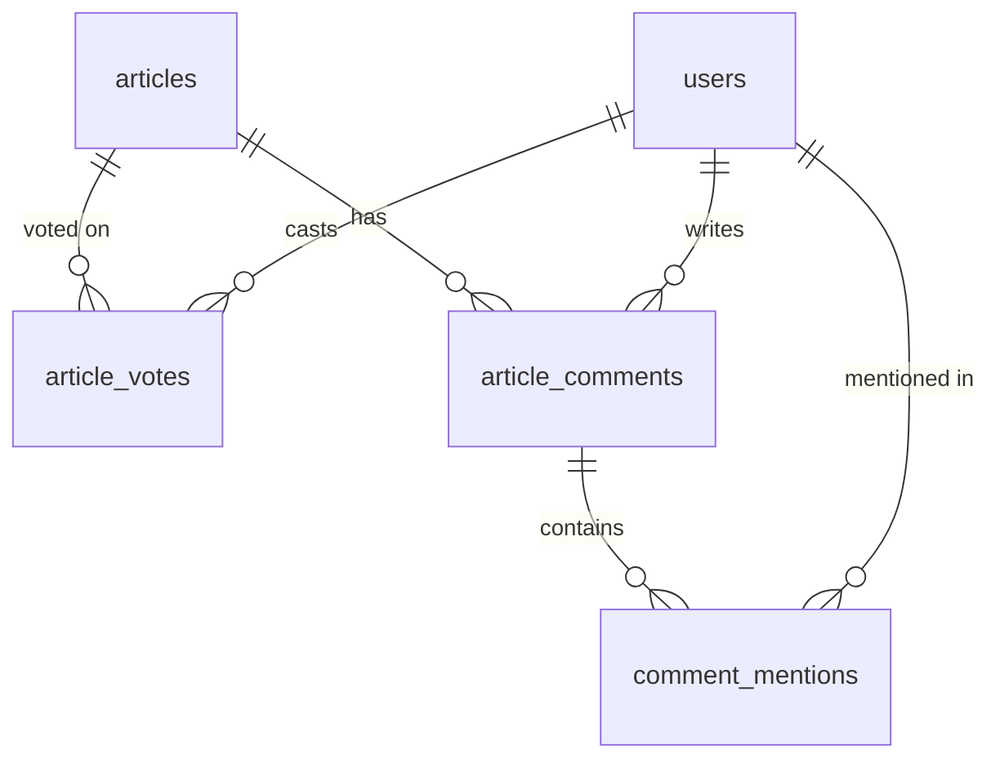

# ADR-010: Article Interactions (Vote, Comment, Mention)

| Author   | Dewa Surya Ariesta                                                                                                                                                                                                                                              |
| -------- | --------------------------------------------------------------------------------------------------------------------------------------------------------------------------------------------------------------------------------------------------------------- |
| Date     | 29 September 2026                                                                                                                                                                                                                                               |
| Status   | Proposed                                                                                                                                                                                                                                                        |
| Deciders | Dewa Surya Ariesta                                                                                                                                                                                                                                              |
| Related  | [PRD](../PRD.md), [ADR-001](./ADR-001-initial_technology.md), [ADR-002](./ADR-002-usecase.md), [ADR-003](./ADR-003-api-contract.md), [ADR-004](./ADR-004-initial_schema_model.md), [ADR-008](./ADR-008-portal_structure.md), [ADR-009](./ADR-009-article_authoring_and_display.md) |

## 1. Overview

The PRD lists "User interaction with post: Up, Down, Comment, Tag other user" under "need to cover later" (PRD §11). ADR-002 §10 and ADR-004 §11 left it out of the first release because it needs signed-in readers. Hub accounts (UC-04, phase 2) now exist, so this feature can be built.

In this ADR, **"tag another user" is called a _mention_** (`@name` inside a comment). The word _tag_ already means article tags (`tags`, `article_tags`, `/blog/tag/[slug]`), and one word for two things would confuse the code and the API.

| #   | Covered here                                                                                       |
| --- | -------------------------------------------------------------------------------------------------- |
| 1   | The rules for Visitors and SaaS Users (§4).                                                        |
| 2   | New use cases UC-22 to UC-26 (§5).                                                                 |
| 3   | The tables (§6) and the API endpoints (§7).                                                        |
| 4   | The frontend: where the interaction section lives on the ISR page, the sign-in prompt, and the navigation guard (§8). |
| 5   | **The implementation steps, in order** (§10).                                                      |

## 2. Requirements (from the request)

| #   | Actor     | Requirement                                                                                                                                      |
| --- | --------- | ------------------------------------------------------------------------------------------------------------------------------------------------ |
| R1  | Visitor   | When a Visitor tries to vote up, vote down, comment, or mention, a dialog asks them to sign in with Google.                                       |
| R2  | SaaS User | A SaaS User can vote up, vote down, comment, and mention other SaaS Users. The result is saved and shown on the page for everyone.              |
| R3  | SaaS User | A SaaS User has **one** vote and **one** comment per article. Doing it again **edits** their existing vote or comment; it does not add a second one. |
| R4  | SaaS User | If a SaaS User has typed a comment but not submitted it, leaving the page shows a warning that the text will be lost (navigation guard).         |

Actors are the ones in ADR-002 §3.1: **Visitor** = not signed in, **SaaS User** = signed in (role `USER` or `ADMIN`).

## 3. Decision Drivers

| #   | Driver                                                                                                                                 | Source                         |
| --- | -------------------------------------------------------------------------------------------------------------------------------------- | ------------------------------ |
| D1  | The article page stays static/ISR. A vote or comment must **not** trigger a revalidation, or one busy article would rebuild constantly. | ADR-008 §7.1, ADR-009 §7.1     |
| D2  | The article body and the interaction section are separate. Interactions go **around** `ArticleBody`, not inside the body format.       | ADR-009 §12                    |
| D3  | No raw HTML from users ever reaches the page. Comments are plain text.                                                                 | ADR-009 D4, ADR-008 §7.3 (XSS) |
| D4  | One vote and one comment per user per article is enforced by the **database**, not only by the UI.                                     | R3; ADR-004 style (M4)         |
| D5  | A user's email is never shown to other users. Mentions show only name and avatar.                                                      | PRD NFR Security               |
| D6  | The interaction section cannot shift the layout (CLS) or delay LCP.                                                                    | PRD NFR Performance            |
| D7  | Sign-in stays Google-only through Firebase, and uses the existing popup flow so the reader does not leave the article.                 | ADR-001 §5.7, `feature/auth/session.ts` |

## 4. Decision Summary

| #   | Decision                                                                                                                                                                                                                                 |
| --- | ---------------------------------------------------------------------------------------------------------------------------------------------------------------------------------------------------------------------------------------- |
| I1  | Votes are **`+1` (up) or `-1` (down)**, one row per `(article, user)`. Clicking the same button again removes the vote; clicking the other one switches it.                                                                               |
| I2  | Comments are **one per `(article, user)`**, flat (no replies). Submitting again **edits** the comment. The author can delete it and then write a new one.                                                                                 |
| I3  | Mentions live **inside a comment** as tokens `<@userId>`. The API validates them and stores them in `comment_mentions`. At most 5 mentions per comment, no self-mention.                                                                  |
| I4  | Interactions are **loaded in the browser**, not in the ISR HTML. Public counts and comments come from new `/public/**` endpoints with a short cache; "my vote / my comment" comes from a `User` endpoint.                                   |
| I5  | A Visitor who clicks any interaction control sees a **sign-in dialog** (Google popup). After sign-in, the action they clicked is done for them (vote) or the comment box is focused (comment).                                             |
| I6  | The comment box uses the existing **navigation guard** (`components/common/navigation-guard`) while it holds unsent text.                                                                                                                 |
| I7  | The admin can **hide** a comment (moderation). A hidden comment is not shown publicly and does not count.                                                                                                                                 |
| I8  | Interactions belong to the **article**, not to a translation. The `id` and `en` pages show the same votes and comments.                                                                                                                  |

## 5. Use Cases (add to ADR-002)

| ID    | Use case                     | Actor              | PRD             | Module     | Phase |
| ----- | ---------------------------- | ------------------ | --------------- | ---------- | ----- |
| UC-22 | View article interactions    | Visitor, SaaS User | PRD §11         | `engagement` | 5   |
| UC-23 | Vote on an article           | SaaS User          | PRD §11, R2, R3 | `engagement` | 5   |
| UC-24 | Write / edit / delete my comment | SaaS User      | PRD §11, R2–R4  | `engagement` | 5   |
| UC-25 | Mention a user in a comment  | SaaS User          | PRD §11, R2     | `engagement` | 5   |
| UC-26 | Moderate comments            | Administrator      | NFR Security    | `engagement`, `admin` | 5 |

Phase 5 is new: it comes after the PRD release plan P1–P4. It needs only phase 2 (accounts) to be live, so it can be moved earlier if wanted.

### UC-22 View article interactions

| Who  | Visitor or SaaS User                           |
| ---- | ---------------------------------------------- |
| When | The article page `/blog/<slug>` finishes loading. |

1. The page renders the article from ISR (unchanged).
2. The interaction section (below the article, above Related articles) shows skeletons of a fixed height.
3. The browser calls `GET /public/articles/{slug}/interactions` (counts) and `GET /public/articles/{slug}/comments?page=1`.
4. If the reader is signed in, the browser also calls `GET /me/articles/{articleId}/interaction` to show their own vote as active and to load their comment into the box.

| Error case                 | What happens                                                          |
| -------------------------- | --------------------------------------------------------------------- |
| API down                   | The article still shows. The section shows "Comments could not be loaded" with a retry button. |
| Article unpublished since cache | `404` → the section is hidden.                                   |

### UC-23 Vote on an article

| Who  | SaaS User (Visitor → sign-in dialog, §8.3) |
| ---- | ------------------------------------------ |

1. The user clicks **Up** or **Down**.
2. The UI updates the button and count at once (optimistic update).
3. The browser calls `PUT /me/articles/{articleId}/vote { "value": 1 | -1 }`, or `DELETE` if the user clicked the button that was already active.
4. The API upserts the row in `article_votes` (one per user, D4) and returns the new counts.
5. The UI replaces the optimistic counts with the returned ones.

| Error case          | What happens                                                        |
| ------------------- | ------------------------------------------------------------------- |
| `401`               | Token refresh and retry once (ADR-003 A1); still `401` → sign-in dialog. |
| Any other error     | Roll back the optimistic state, show a toast.                        |
| Double click        | Idempotent: `PUT` with the same value changes nothing.              |

### UC-24 Write / edit / delete my comment

| Who  | SaaS User (Visitor → sign-in dialog) |
| ---- | ------------------------------------ |

1. If the user has no comment, the box is empty with the button **Post**. If they already have one, their comment is shown with **Edit** and **Delete**.
2. While the box has text that differs from the saved comment, the navigation guard is on (§8.4).
3. The user submits. The browser calls `PUT /me/articles/{articleId}/comment { "body": "..." }`.
4. The API validates the body (1–2 000 characters after trim, mention tokens, §7.3), upserts the one row in `article_comments`, rebuilds `comment_mentions`, and sets `edited_at` if it was an edit.
5. The UI turns the guard off, shows the saved comment at the top of the list with an "edited" label when `editedAt` is set.
6. **Delete:** confirm dialog → `DELETE /me/articles/{articleId}/comment` → `204`. The box is empty again.

| Error case                       | What happens                                                    |
| -------------------------------- | --------------------------------------------------------------- |
| Empty or too long                | Client Zod check; server `400` with `field: "body"`.            |
| Comment hidden by admin          | `409 COMMENT_HIDDEN`. The user cannot edit it; they see "This comment was hidden by the moderator". |
| Too many requests                | `429` (Nginx, §7.5). Toast "Please wait a moment".              |

### UC-25 Mention a user in a comment

1. In the comment box, the user types `@` and at least 2 characters.
2. The browser calls `GET /me/mentionable-users?q=<text>` (debounced 250 ms) and shows up to 8 users (name + avatar).
3. Choosing one inserts a chip that is stored as `<@userId>` in the body.
4. On submit, the API checks every mentioned user exists, is not the author, and that there are at most 5 distinct mentions.
5. On display, each token becomes `@Name` (bold, not a link, since users have no public profile page).

| Error case                  | What happens                                                         |
| --------------------------- | -------------------------------------------------------------------- |
| Unknown or self user ID     | `400 MENTION_INVALID`.                                               |
| More than 5 mentions        | `400 MENTION_LIMIT`.                                                 |
| Mentioned user later changes name | The new name shows, because names are resolved at read time.  |

### UC-26 Moderate comments

1. Admin opens `/admin/comments` (filter by article, status, newest first).
2. Admin clicks **Hide** or **Show** on a comment → `POST /admin/comments/{id}/hide` or `/show`.
3. Hidden comments disappear from the public list and from `commentCount`.

## 6. Schema (add to ADR-004)

New migration: **`V11__article_interactions.sql`** (the repo already has `V1`–`V10`). It follows ADR-004 §3 conventions and enables RLS like `V9`.



#### `article_votes`

| Column       | Type          | Null | Default | Notes                                        |
| ------------ | ------------- | ---- | ------- | -------------------------------------------- |
| `article_id` | `uuid`        | no   |         | FK → `articles.id` `ON DELETE CASCADE`.      |
| `user_id`    | `uuid`        | no   |         | FK → `users.id` (`RESTRICT`).                |
| `value`      | `smallint`    | no   |         | `CHECK (value IN (1, -1))`.                  |
| `created_at` | `timestamptz` | no   | `now()` |                                              |
| `updated_at` | `timestamptz` | no   | `now()` |                                              |

Keys: `PRIMARY KEY (article_id, user_id)` — **this is the "one vote per user" rule (R3)**. Index `(user_id)`.

#### `article_comments`

| Column       | Type          | Null | Default     | Notes                                                  |
| ------------ | ------------- | ---- | ----------- | ------------------------------------------------------ |
| `id`         | `uuid`        | no   |             | PK.                                                    |
| `article_id` | `uuid`        | no   |             | FK → `articles.id` `ON DELETE CASCADE`.                |
| `user_id`    | `uuid`        | no   |             | FK → `users.id` (`RESTRICT`).                          |
| `body`       | `text`        | no   |             | Plain text with `<@uuid>` tokens. `CHECK (char_length(body) BETWEEN 1 AND 2000)`. |
| `status`     | `varchar(16)` | no   | `'VISIBLE'` | `CHECK IN ('VISIBLE','HIDDEN')`.                       |
| `edited_at`  | `timestamptz` | yes  |             | Set when the body changes after creation.              |
| `version`    | `int`         | no   | `0`         | `@Version`, protects against two tabs editing at once. |
| `created_at` | `timestamptz` | no   | `now()`     |                                                        |
| `updated_at` | `timestamptz` | no   | `now()`     |                                                        |

Keys and indexes: `UNIQUE (article_id, user_id)` — **the "one comment per user" rule (R3)**; `(article_id, created_at DESC) WHERE status = 'VISIBLE'` for the public list; `(user_id)`; `(status, created_at DESC)` for the admin list.

#### `comment_mentions`

| Column              | Type   | Null | Notes                                            |
| ------------------- | ------ | ---- | ------------------------------------------------ |
| `comment_id`        | `uuid` | no   | FK → `article_comments.id` `ON DELETE CASCADE`.  |
| `mentioned_user_id` | `uuid` | no   | FK → `users.id` (`RESTRICT`).                    |

Keys: `PRIMARY KEY (comment_id, mentioned_user_id)`, index `(mentioned_user_id)` (for future notifications). Rebuilt from the body on every save, like `article_body_images`.

**Counts.** At launch, counts are one aggregate query:

```sql
SELECT count(*) FILTER (WHERE value = 1)  AS up,
       count(*) FILTER (WHERE value = -1) AS down
FROM article_votes WHERE article_id = :id;
```

plus `count(*)` on visible comments. Both use the primary key / partial index. If an article passes ~10 000 votes, add counter columns updated in the same transaction.

**Deletes.** Deleting an article cascades to its votes and comments (content is hard-deleted, ADR-004 §3). Users are never deleted, so `RESTRICT` on `user_id` is safe.

## 7. API (add to ADR-003)

### 7.1 Endpoints

| Group | Method | Path                                         | Auth    | Use case     |
| ----- | ------ | -------------------------------------------- | ------- | ------------ |
| 1     | GET    | `/public/articles/{slug}/interactions`       | `None`  | UC-22        |
| 1     | GET    | `/public/articles/{slug}/comments`           | `None`  | UC-22        |
| 2     | GET    | `/me/articles/{articleId}/interaction`       | `User`  | UC-22        |
| 2     | PUT    | `/me/articles/{articleId}/vote`              | `User`  | UC-23        |
| 2     | DELETE | `/me/articles/{articleId}/vote`              | `User`  | UC-23        |
| 2     | PUT    | `/me/articles/{articleId}/comment`           | `User`  | UC-24, UC-25 |
| 2     | DELETE | `/me/articles/{articleId}/comment`           | `User`  | UC-24        |
| 2     | GET    | `/me/mentionable-users?q=`                   | `User`  | UC-25        |
| 6.8   | GET    | `/admin/comments`                            | `Admin` | UC-26        |
| 6.8   | POST   | `/admin/comments/{id}/hide`                  | `Admin` | UC-26        |
| 6.8   | POST   | `/admin/comments/{id}/show`                  | `Admin` | UC-26        |

Writes are under `/me/**` so the existing prefix security rule (`User`) covers them, and the user always comes from the token (ADR-003 A3). Only published articles accept interactions; a draft → `404`.

### 7.2 Shapes

```jsonc
// GET /public/articles/{slug}/interactions → ApiResponse<InteractionSummary>
{ "articleId": "0192…", "upCount": 42, "downCount": 3, "commentCount": 17 }

// GET /public/articles/{slug}/comments?page=1&limit=20&sort=createdAt,desc → Page<Comment>
{
  "id": "0192…",
  "author": { "id": "0191…", "name": "Rina", "avatarUrl": "https://lh3…" },
  "body": "Great post <@0191…abc>!",
  "mentions": { "0191…abc": { "id": "0191…abc", "name": "Budi", "avatarUrl": null } },
  "createdAt": "2026-10-28T03:15:00Z",
  "editedAt": null
}

// GET /me/articles/{articleId}/interaction → ApiResponse<MyInteraction>
{ "vote": 1, "comment": { /* Comment */ } | null }

// PUT /me/articles/{articleId}/vote  { "value": 1 }  → ApiResponse<InteractionSummary & { myVote }>
// PUT /me/articles/{articleId}/comment { "body": "…", "version": 3 }  → ApiResponse<Comment>
//    version is omitted on first create; a stale version → 409 VERSION_CONFLICT

// GET /me/mentionable-users?q=bu → ApiResponse<UserMini[]>  (max 8, never includes email)
{ "id": "0191…", "name": "Budi", "avatarUrl": null }
```

`author` and `mentions` never contain email (D5).

### 7.3 Body validation (server)

| Rule                                               | Error                      |
| -------------------------------------------------- | -------------------------- |
| Trimmed length 1–2 000 characters                  | `400`, `field: "body"`     |
| Tokens match `<@[0-9a-f-]{36}>`; other `<`/`>` stay as text (rendered as text, never HTML) | — |
| Every mentioned ID exists in `users` and is not the author | `400 MENTION_INVALID` |
| At most 5 distinct mentions                        | `400 MENTION_LIMIT`        |
| Comment is `HIDDEN`                                | `409 COMMENT_HIDDEN`       |

### 7.4 Caching

- `/public/articles/{slug}/interactions` and `/comments`: `Cache-Control: public, max-age=10, stale-while-revalidate=60`. Short, because they are read in the browser and change often. **No Next.js revalidation is sent** (D1).
- After a write, the browser uses the response to update its own view, so the author sees their change at once even if the public cache is 10 s old.
- `/me/**`: `no-store` (ADR-003 §3.6).

### 7.5 Rate limits (Nginx, add to ADR-003 §3.7)

| Endpoint                          | Limit per IP           |
| --------------------------------- | ---------------------- |
| `PUT/DELETE /me/articles/*/vote`  | 30 / minute, burst 10  |
| `PUT/DELETE /me/articles/*/comment` | 10 / minute, burst 5 |
| `/me/mentionable-users`           | 60 / minute, burst 20  |

### 7.6 Error codes (add to ADR-003 §12)

| HTTP | Reason             | Endpoint(s)                          |
| ---- | ------------------ | ------------------------------------ |
| 400  | `MENTION_INVALID`  | `PUT /me/articles/{id}/comment`      |
| 400  | `MENTION_LIMIT`    | `PUT /me/articles/{id}/comment`      |
| 409  | `COMMENT_HIDDEN`   | `PUT /me/articles/{id}/comment`      |
| 409  | `VERSION_CONFLICT` | `PUT /me/articles/{id}/comment`      |

## 8. Frontend (add to ADR-008)

### 8.1 Page placement

```
│ <article> body (ISR, unchanged)                                     │
├─────────────────────────────────────────────────────────────────────┤
│ Tags · [Ad slot: end-of-article]                                    │
│ ┌── <ArticleInteractions articleId slug>  ("use client") ─────────┐ │
│ │ [▲ 42]  [▼ 3]            17 comments                            │ │
│ │ ┌ comment box (mine) ───────────────────────── [Post] ┐         │ │
│ │ └─────────────────────────────────────────────────────┘         │ │
│ │ comment · comment · comment …   [Load more]                     │ │
│ └─────────────────────────────────────────────────────────────────┘ │
│ Related articles                                                     │
```

- One client island, `dynamic()`-imported and mounted when it scrolls near the viewport (IntersectionObserver), so it adds no JavaScript to LCP (D6).
- Its skeleton has a fixed min-height, so loading it causes no layout shift.
- The ISR page passes only `articleId` and `slug`; no interaction data is in the static HTML.

### 8.2 Feature folder

A new browser feature, following ADR-008 §6.2:

```
feature/engagement/
├── index.ts
├── type.ts            # InteractionSummary, Comment, MyInteraction, UserMini
├── client.ts          # EngagementClient: getSummary, listComments, getMine, vote, clearVote, saveComment, deleteComment, searchUsers
├── queries.ts         # engagementKeys + queryOptions()
├── hooks.ts           # useInteractionSummary, useComments (infinite), useMyInteraction, useVoteMutation (optimistic), useSaveCommentMutation, useDeleteCommentMutation, useMentionSearch
├── schema.ts          # commentSchema (Zod, 1–2000 chars, i18n messages)
├── utils.ts           # parseMentions(body) → segments; serializeMentions(chips) → body
└── components/
    ├── article-interactions.tsx   # the island
    ├── vote-buttons.tsx
    ├── comment-box.tsx            # RHF + mention picker + navigation guard
    ├── mention-picker.tsx
    ├── comment-list.tsx
    ├── comment-item.tsx           # renders segments as text + <strong>@Name</strong>, never HTML
    └── sign-in-prompt-dialog.tsx
feature/admin/comments/            # UC-26, same shape
```

- i18n namespace `engagement` in `messages/{id,en}/`, registered in `i18n/settings.ts`.
- Public reads (`/public/.../interactions`, `/comments`) go through the same browser Axios client without a token (they are called from the browser, not the ISR server).
- Add a `(admin)` route `/admin/comments`.

### 8.3 Visitor sign-in prompt (R1)

```mermaid
sequenceDiagram
    actor V as Visitor
    participant UI as ArticleInteractions
    participant D as SignInPromptDialog
    participant FB as Firebase (Google popup)
    participant API as Hub API

    V->>UI: Clicks ▲ (or focuses the comment box)
    UI->>UI: auth status = signed-out → save pendingAction {type: "vote", value: 1}
    UI->>D: Open dialog "Sign in with Google to vote and comment"
    V->>D: Clicks "Continue with Google"
    D->>FB: signInWithPopup (feature/auth/session.ts)
    FB-->>D: Signed in
    D->>API: POST /me/session (existing auth provider)
    D-->>UI: Close; status = signed-in
    UI->>API: Replay pendingAction → PUT /me/articles/{id}/vote
```

| Rule | Detail |
| ---- | ------ |
| Trigger | Every interaction control checks `useSession().status`. `signed-out` → open the dialog instead of acting. `loading` → controls are disabled. |
| Popup, not redirect | The popup keeps the reader on the article, so nothing is lost. If the popup is blocked, the dialog shows a link to `/login?next=/blog/<slug>`. |
| Pending action | Kept in component state only. Vote → replayed once after sign-in. Comment → the box is focused; nothing is sent automatically. Cancelled dialog → pending action dropped. |
| First sign-in | Creates the account as in UC-04; no extra step. |

### 8.4 Navigation guard for an unsent comment (R4)

`comment-box.tsx` arms the existing guard (`components/common/navigation-guard/store.ts`) while the text is dirty:

```tsx
const isDirty = form.formState.isDirty && body.trim() !== (saved?.body ?? "");

useEffect(() => {
  setGuard(isDirty, {
    title: t("guard.title"),             // "Discard your comment?"
    description: t("guard.description"), // "Your comment has not been posted and will be lost."
    confirmLabel: t("guard.discard"),
    cancelLabel: t("guard.keepEditing"),
    onAbort: () => form.reset(),
  });
  return () => setGuard(false);
}, [isDirty]);
```

| Way to leave              | Covered by                                                    |
| ------------------------- | ------------------------------------------------------------- |
| In-app link               | `NavigationGuardProvider` intercepts every same-site `<a>` click (capture phase) while the guard is armed, so plain `Link`s in the nav, footer, breadcrumbs, and Related articles are covered. In-page `#anchor` links, new-tab links, and downloads are let through. `GuardedLink` still works. |
| Browser back / forward    | `NavigationGuardProvider` `popstate` handling (already built). |
| Refresh / close tab       | `useUnsavedChangesWarning` → `beforeunload` (already built).  |
| Locale switcher           | Calls `requestNavigation()` before changing locale.           |
| Successful submit / cancel / delete | `setGuard(false)` right after the action.           |

Because the provider intercepts link clicks globally, no `(site)` link needs to be changed to `GuardedLink`.

## 9. Security and Privacy

| Risk                                  | Mitigation                                                                                              |
| ------------------------------------- | ------------------------------------------------------------------------------------------------------- |
| XSS through comments                  | Plain text only. Rendered as React text nodes; no `dangerouslySetInnerHTML`; no link auto-detection at launch. |
| Spam / vote flooding                  | Google sign-in required, one vote and one comment per account (DB unique keys), Nginx rate limits, admin hide. |
| Email leaks via mention search        | `UserMini` has only `id`, `name`, `avatarUrl`. Search needs `q` ≥ 2 chars, returns max 8.               |
| User enumeration via mention search   | Signed-in only and rate-limited. Acceptable for a small community; revisit if abused.                   |
| Personal data in comments (PDP law)   | Comments are tied to a user; a future account-deletion ADR must delete or anonymise them (ADR-004 §10.2). |

## 10. Implementation Steps

Do the steps in this order. Each step can be merged on its own.

### Step 1 — Documents

- [ ] Accept this ADR.
- [ ] ADR-002: add UC-22 to UC-26 (§5); remove "Post interactions" from §10.
- [ ] ADR-003: add §7 endpoints to §4.1, a new sub-group 6.8, rate limits, and error codes.
- [ ] ADR-004: add the three tables and `V11` to §7; remove the row from §11.
- [ ] ADR-008: add `feature/engagement`, `feature/admin/comments`, `/admin/comments`, and the `engagement` namespace.
- [ ] PRD: move "User interaction with post" from §11 into the stories (V-1.4 Visitor prompt, US-2.5 to US-2.7).

### Step 2 — Database (`apps/coreservices`)

- [ ] `V11__article_interactions.sql`: `article_votes`, `article_comments`, `comment_mentions`, indexes, `ENABLE ROW LEVEL SECURITY` on all three.
- [ ] JPA entities + repositories; Testcontainers test runs all migrations and Hibernate `validate`.
- [ ] Test that a second vote / comment row for the same `(article, user)` fails at the DB level.

### Step 3 — Backend module `engagement`

- [ ] `VoteService`: upsert (`INSERT … ON CONFLICT (article_id, user_id) DO UPDATE`), delete, `summary(articleId)`.
- [ ] `CommentService`: upsert with `@Version`, `edited_at`, mention parsing/validation, rebuild `comment_mentions`, delete, `COMMENT_HIDDEN` rule.
- [ ] `MentionService`: user search by name (`ILIKE`, limit 8, exclude the caller).
- [ ] Controllers for `/public/articles/{slug}/interactions`, `/public/articles/{slug}/comments`, `/me/articles/**`, `/me/mentionable-users`, `/admin/comments/**`. Only published articles.
- [ ] Batch-load authors and mentioned users per comment page (no N+1).
- [ ] Cache headers (§7.4); OpenAPI matches §7.
- [ ] Tests: vote switch/remove, comment create/edit/delete, mention rules, hidden comment, `401`/`403`, draft article → `404`.

### Step 4 — Infrastructure

- [ ] Nginx rate-limit zones (§7.5).
- [ ] Confirm CORS still allows `PUT`/`DELETE` from the site domain.

### Step 5 — Frontend feature `feature/engagement` (`apps/portal`)

- [ ] `type.ts`, `client.ts`, `queries.ts`, `hooks.ts` (optimistic vote with rollback; invalidate summary + comments after comment writes).
- [ ] `utils.ts` `parseMentions` / `serializeMentions` + Vitest tests.
- [ ] `schema.ts` + `messages/{id,en}/engagement.json`.

### Step 6 — Frontend UI

- [ ] `vote-buttons.tsx`, `comment-list.tsx` (load more), `comment-item.tsx` (text + mention segments, "edited" label).
- [ ] `comment-box.tsx` with `mention-picker.tsx` (type `@`, debounced search, keyboard navigation, chips).
- [ ] `sign-in-prompt-dialog.tsx` and the pending-action replay (§8.3).
- [ ] Navigation guard wiring (§8.4) and `GuardedLink` / `requestNavigation` on the `(site)` header, footer, locale switcher, and article links.
- [ ] `article-interactions.tsx` island: lazy mount, fixed-height skeleton, error state with retry. Mount it in `(site)/blog/[slug]/page.tsx` after the end-of-article ad.

### Step 7 — Admin moderation

- [ ] `feature/admin/comments` + `/admin/comments` page (table, filters, Hide/Show).

### Step 8 — Verify

- [ ] Visitor: every control opens the dialog; after Google sign-in the vote is applied and the comment box is focused.
- [ ] SaaS User: vote up → up again removes → down switches; one comment, edit keeps one row, delete then post works.
- [ ] Mention: picker works, chips render as `@Name`, 6th mention and self-mention are rejected.
- [ ] Guard: typed-but-unsent comment warns on link click, back button, refresh, and locale switch; no warning after submit.
- [ ] Both `id` and `en` pages show the same interactions.
- [ ] Lighthouse on an article page: LCP and CLS unchanged from before; SEO ≥ 90.
- [ ] Publishing a vote or comment sends **no** revalidation request.

## 11. Alternatives Considered

| Option                                            | Why not                                                                                                   |
| ------------------------------------------------- | --------------------------------------------------------------------------------------------------------- |
| Render comments in the ISR HTML (SEO for comments) | Every comment would need a revalidation (D1), and user text would go into the cached page. Comments add little SEO value. |
| Many comments per user, with replies              | R3 asks for one action per user that is edited. Replies can be added later with a `parent_id` column and dropping the unique key. |
| Third-party comments (Disqus, Giscus)             | Separate accounts (not the hub identity), tracking scripts and ads, and no control over mentions.        |
| Store mentions as HTML or a rich-text JSON         | Needs a sanitizer or a second renderer. Plain text + tokens is enough for `@Name`.                        |
| Allow anonymous (Visitor) votes by IP/cookie       | Easy to abuse, and R1 asks Visitors to sign in.                                                           |
| Name the feature "tag"                            | Clashes with article tags (`tags`, `/blog/tag/[slug]`).                                                  |

## 12. Consequences

### 12.1 Positive

- Readers can react and discuss using the one hub account, which also moves Visitors toward registered users (PRD G3 conversion metric).
- The "one per user" rule is enforced by unique keys, so bugs or double clicks cannot create duplicates.
- The article page keeps its ISR speed and cache; interactions never rebuild it.
- The navigation guard and Google sign-in are reused, not rebuilt.

### 12.2 Negative and risks

| Risk                                                        | Mitigation                                                                           |
| ----------------------------------------------------------- | ------------------------------------------------------------------------------------ |
| Counts on the page can be up to ~10 s old for other readers. | Acceptable for a blog; the author sees their own change at once.                    |
| One comment per user limits discussion.                     | Deliberate (R3). Revisit with replies if readers ask for it.                        |
| Moderation is manual.                                       | Hide button + rate limits. Add a word filter or report button if spam appears.     |
| Mentioned users are not notified.                           | `comment_mentions` is indexed by user, ready for a notification ADR.               |
| `(site)` links must all use the guard to honour R4.         | Step 6 checklist; add an ESLint rule to forbid plain `Link` in `feature/engagement` and the `(site)` article page. |

## 13. Open Questions

| No  | Question                                                                                           | Proposed answer                         |
| --- | -------------------------------------------------------------------------------------------------- | --------------------------------------- |
| 1   | R3 read as "one comment per user per article". Is that right, or should users write many comments and only votes be unique? | One comment (as written). Confirm. |
| 2   | Should a mentioned user be notified (email or in-hub)?                                             | Later ADR; data is ready.               |
| 3   | Should Visitors see comments without signing in?                                                   | Yes — only acting needs sign-in (R1).   |
| 4   | Should the admin be able to delete (not only hide) a comment?                                      | Hide only at launch; keeps a record.    |

## 14. Follow-up

| Item                                                          | Where                 |
| ------------------------------------------------------------- | --------------------- |
| Apply Step 1 document changes.                                | ADR-002, 003, 004, 008, PRD |
| Mention notifications.                                        | Future ADR            |
| Replies / threads, report button, word filter.                | Future ADR            |
| Account deletion must remove or anonymise votes and comments. | Future ADR (ADR-004 §10.2) |
