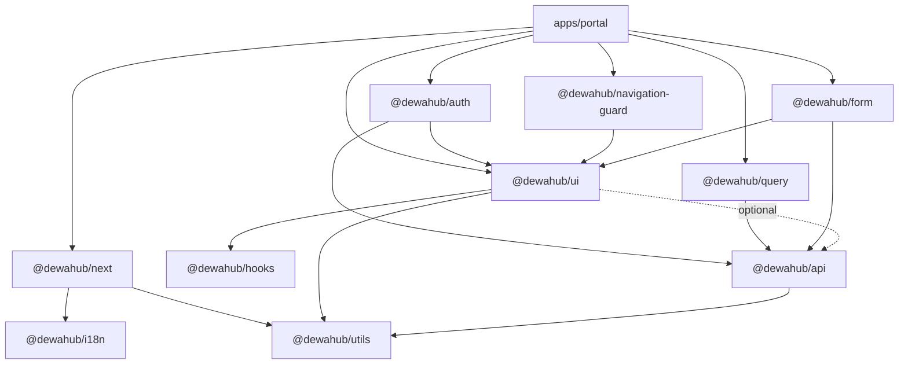

# PRD-001: Dewa Hub React Library

| Author  | Dewa Surya Ariesta                                                                                                                                                                          |
| ------- | ------------------------------------------------------------------------------------------------------------------------------------------------------------------------------------------- |
| Date    | 30 September 2026                                                                                                                                                                           |
| Status  | Draft                                                                                                                                                                                       |
| Related | [PRD](./PRD.md), [ADR-001](./ADR/ADR-001-initial_technology.md), [ADR-003](./ADR/ADR-003-api-contract.md), [ADR-008](./ADR/ADR-008-portal_structure.md), [ADR-010](./ADR/ADR-010-article_interactions.md) |

## 1. Overview

`apps/portal` is the only frontend in the hub today. It is one Next.js 16 / React 19 application that serves the public site, the user portal, and the admin dashboard (ADR-008). Over the Phase 1–5 work it has grown a solid base of shared code:

- **~25 UI primitives** in `components/ui/` (shadcn on Base UI + Tailwind v4): Button, Dialog, Sheet, Table, Tabs, Sidebar, Pagination, EmptyState, ErrorState, and more.
- **~15 cross-feature components** in `components/common/` and `components/form/`: PageHeader, QueryErrorState, ApiErrorAlert, ConfirmDialog, SearchInput, CopyButton, ToastViewport, TopProgressBar, NavigationGuard, InputField, TextareaField.
- **Infrastructure** in `lib/`, `hooks/`, `providers/`, and `i18n/`: the ADR-003 envelope types, `ApiError`, `BaseClient`, the Axios browser client with token refresh, `publicFetch` for ISR, the QueryClient factory with toast `meta`, date/money formatters, the Zod → i18n form resolver, the logger with redaction, the theme provider, and locale-aware routing.

This PRD proposes pulling that code out of `apps/portal` into a set of **versioned, generic React packages** under `packages/`. `apps/portal` becomes the first consumer. The next consumers are the connected SaaS products, starting with **Doctor Document** (PRD §1), and any future admin or internal tools.

## 2. Problem Statement

The PRD asks for a platform where "additional products can be added later without re-architecting" (PRD §1, G3). Every connected product will need the same frontend foundation as the hub: Google sign-in through the hub (SSO, FR-U1/U2), the ADR-003 envelope and error handling, the same look and feel, `id`/`en` i18n, and the same list/form/dialog patterns. Today that foundation cannot be reused:

| #   | Problem                                                                                                                                                                                                                                         | Evidence in the codebase                                                                                                                                                                                                    |
| --- | ----------------------------------------------------------------------------------------------------------------------------------------------------------------------------------------------------------------------------------------------- | --------------------------------------------------------------------------------------------------------------------------------------------------------------------------------------------------------------------------- |
| P1  | **Shared code is locked inside one app.** A new product would copy `components/ui`, `lib/api`, and `lib/query` by hand, and the copies would drift. ADR-008 notes the portal itself started as a copy of Simple Bank and had to be cleaned up.    | `apps/portal/docs/IMPROVEMENT_OPPORTUNITIES.md` §2 "Duplication that will drift".                                                                                                                                             |
| P2  | **The same list-screen pattern is re-written per feature.** Search box + 300 ms debounce + `nuqs` URL state + "reset to page 1" + skeleton / error / empty / data branches + mobile card list + desktop table + Pagination.                     | `users-screen.tsx`, `transactions-screen.tsx`, `articles-screen.tsx`, `comments-screen.tsx`, `media-library-screen.tsx`, `billing/transactions-list.tsx` (6 copies; skeleton/error/empty branch in 13+ files).               |
| P3  | **The same form-dialog pattern is re-written per feature.** `useForm` + `zodResolverTranslate` + reset-on-open + `applyApiFieldErrors` + `ApiErrorAlert` + Cancel/Submit footer.                                                               | `taxonomy-form-dialog.tsx`, `product-form-dialog.tsx`, `plan-form-dialog.tsx`, `redirect-uris-card.tsx`.                                                                                                                    |
| P4  | **Generic pieces live in feature folders**, so nothing else can use them without breaking import rule I2/I7.                                                                                                                                    | `SwitchField`/`SelectField` in `feature/admin/products/components/form-fields.tsx`; status-to-badge "tone" maps in `billing/utils.ts` and `admin/transactions`; `pageWindow()` in `content/pagination-links.tsx`; zone-aware date range in `admin/transactions/utils.ts`; picker dialogs in `admin/users` and `admin/media`. |
| P5  | **Two implementations of the same thing.** Page-number windowing exists in `components/ui/pagination.tsx` (`getPageNumbers`) and in `feature/content/components/pagination-links.tsx` (`pageWindow`).                                          | Both files.                                                                                                                                                                                                                  |
| P6  | **Shared components are hard-wired to the portal.** They call `useTranslation("common")` with portal keys, import `@/i18n/navigation` (Next.js + `[locale]`), and assume `Asia/Jakarta`, `id-ID`, and `IDR`.                                    | `confirm-dialog.tsx`, `search-input.tsx`, `pagination.tsx`, `locale-switcher.tsx`, `lib/datetime.ts`, `lib/number.ts`.                                                                                                       |
| P7  | **Small inconsistencies nobody owns.** `empty-state.tsx` imports `cn` from the `cn` npm package instead of `@/lib/utils`; `Pagination` defaults to 25 rows while the API default is 20 (`DEFAULT_PAGE_LIMIT`).                                   | `components/ui/empty-state.tsx`, `components/ui/pagination.tsx`, `lib/api/envelope.ts`.                                                                                                                                      |
| P8  | **Shared code has little test coverage and no docs of its own.** Tests exist for feature `utils.ts` files, but not for `lib/api/*`, `lib/form.ts`, `lib/datetime.ts`, or any component in `components/`.                                        | `find apps/portal -name "*.test.*"`.                                                                                                                                                                                         |

## 3. Goals

### 3.1 Goals

| #   | Goal                                                                                                                                                                                              | Measure                                                                                              |
| --- | ------------------------------------------------------------------------------------------------------------------------------------------------------------------------------------------------- | ---------------------------------------------------------------------------------------------------- |
| G1  | A new Dewa product can get sign-in, API access, theming, i18n, and the standard screens by **installing packages**, not copying files.                                                            | Doctor Document's frontend is scaffolded with zero files copied from `apps/portal`.                  |
| G2  | **One implementation** of each shared concern (envelope, errors, pagination, formatting, form fields, list screen, form dialog).                                                                   | P2–P5 duplicates removed; each list screen shrinks by ~50 % in lines.                                |
| G3  | **Generic by default.** No package imports Next.js, Firebase, i18next, or a portal path unless it is an explicitly named adapter entry point.                                                      | ESLint `no-restricted-imports` in each package; `@dewahub/ui` runs in a plain Vite app.               |
| G4  | **Keep portal behaviour and budgets.** No visual regression, no extra client JavaScript on `(site)` pages, still inside the 3 MiB Worker limit (ADR-001 §5.2).                                     | Bundle size of `/[locale]/blog/[slug]` is unchanged or smaller; Worker size is unchanged or smaller.  |
| G5  | **Accessible and tested.** Every component keeps its current ARIA behaviour and ships with unit tests and a usage story.                                                                          | Tests for every exported helper; a story per component; axe checks pass in CI.                       |
| G6  | **Tree-shakeable and versioned.** Packages ship ESM with `sideEffects: false`, one entry per component group, and follow semver with a changelog.                                                 | Importing `Button` does not pull in `Sidebar` or `Table`.                                            |

### 3.2 Non-goals

| #   | Non-goal                                                                                                                                                                                            |
| --- | --------------------------------------------------------------------------------------------------------------------------------------------------------------------------------------------------- |
| N1  | Publishing to the public npm registry. Packages are consumed inside this monorepo (Yarn workspaces) first; a private registry (GitHub Packages) is only needed once a product lives in another repo. |
| N2  | Redesigning the UI. The library extracts today's design; visual changes are separate work.                                                                                                        |
| N3  | Moving domain code. `feature/*` clients, DTOs, and screens stay in `apps/portal`. Only code that is not about articles, billing, users, etc. moves.                                               |
| N4  | Replacing the stack (shadcn/Base UI, Tailwind v4, TanStack Query, RHF + Zod, Zustand, Axios). The library standardises it.                                                                         |
| N5  | Extracting the TipTap editor and the article renderer in the first release. They are listed in §5.10 as a later phase.                                                                            |

### 3.3 Design principles

1. **Labels in, not keys in.** Components take their text as props (`labels`, `title`, `confirmLabel`) with English defaults. A small `LibraryProvider` can supply translated defaults once; the library never calls `useTranslation()` itself.
2. **Adapters at the edge.** Routing (`Link`, `useRouter`), auth tokens, toasts, and i18n are injected through providers or options, so the core works in Next.js, Vite, or Storybook.
3. **Headless logic + styled component.** Behaviour lives in a hook (`useListQueryState`, `useNavigationGuard`, `usePageWindow`); the component is a thin styled wrapper. Products that need a different look reuse the hook.
4. **Composition over configuration.** Follow the shadcn slot style already in the codebase (`Card`, `CardHeader`, `CardContent`), not a prop per option.
5. **Server-safe entry points.** Anything that can render on the server is importable without `"use client"`; server-only code (`publicFetch`, logger) lives under a `/server` entry point with `import "server-only"`.

## 4. Components and Their Functionality

The components below go into **`@dewahub/ui`** (primitives and composites) and **`@dewahub/form`** (form fields). "Source" names today's file in `apps/portal`. "Change" lists what must be made generic.

### 4.1 Primitives (`@dewahub/ui`)

These are owned shadcn sources. They move as-is, with their variants kept.

| Component                                                                                              | Source                     | Functionality                                                                                                                                                                                         | Change for the library                                                                                     |
| ------------------------------------------------------------------------------------------------------ | -------------------------- | ----------------------------------------------------------------------------------------------------------------------------------------------------------------------------------------------------- | ---------------------------------------------------------------------------------------------------------- |
| `Button`                                                                                               | `ui/button.tsx`            | Variants (`default`, `outline`, `ghost`, `destructive`, `destructive-solid`, …) and sizes (`xs`–`lg`, `icon-*`). `loading` shows a spinner, sets `aria-busy`, and disables the button. Exports `buttonVariants` for links styled as buttons. | None.                                                                                                      |
| `Badge`                                                                                                | `ui/badge.tsx`             | Small status label with tone variants (`success`, `warning`, `destructive`, `secondary`, `outline`).                                                                                                 | Add a `StatusBadge` wrapper (§4.3).                                                                         |
| `Card` (+ `Header`, `Title`, `Description`, `Action`, `Content`, `Footer`)                             | `ui/card.tsx`              | Surface container with slots.                                                                                                                                                                         | None.                                                                                                      |
| `Dialog` (+ `Trigger`, `Content`, `Header`, `Footer`, `Title`, `Description`, `Close`)                 | `ui/dialog.tsx`            | Modal with focus trap, `showCloseButton`, `disablePointerDismissal` for must-acknowledge dialogs.                                                                                                     | Close-button label becomes a prop.                                                                        |
| `Sheet`                                                                                                | `ui/sheet.tsx`             | Side panel (settings sheet, mobile nav).                                                                                                                                                              | None.                                                                                                      |
| `DropdownMenu` (+ items, checkbox/radio items, sub-menus, shortcut)                                    | `ui/dropdown-menu.tsx`     | Menus for user menu, theme and locale switchers, row actions.                                                                                                                                         | None.                                                                                                      |
| `Tabs`                                                                                                 | `ui/tabs.tsx`              | Accessible tab list and panels.                                                                                                                                                                       | None.                                                                                                      |
| `Table` (+ `Header`, `Body`, `Footer`, `Row`, `Head`, `Cell`, `Caption`, `TableDataState`)             | `ui/table.tsx`             | Styled table, `isHoverActive` rows, a built-in loading/empty row state.                                                                                                                               | Used by `DataTable` (§4.2).                                                                                 |
| `Input`, `Textarea`, `Label`, `NativeSelect`, `Checkbox`, `Switch`                                     | `ui/*.tsx`                 | Base form controls with `aria-invalid` styling.                                                                                                                                                       | None.                                                                                                      |
| `InputGroup` (+ `Addon`, `Button`, `Text`, `Input`, `Textarea`)                                        | `ui/input-group.tsx`       | Input with leading/trailing icons, buttons, or text.                                                                                                                                                  | None.                                                                                                      |
| `Field` (+ `Label`, `Description`, `Error`)                                                            | `ui/field.tsx`             | Base UI field wrapper: label association, `invalid`/`touched`/`dirty` state, error text.                                                                                                              | None.                                                                                                      |
| `Avatar` (+ `Image`, `Fallback`, `Badge`, `Group`, `GroupCount`)                                       | `ui/avatar.tsx`            | User picture with initials fallback and stacked groups.                                                                                                                                               | Add `getInitials(name)` helper (§5.7).                                                                      |
| `Tooltip`, `Separator`, `Skeleton`, `Progress`, `LoadingDot`                                           | `ui/*.tsx`                 | Hints, dividers, loading placeholders, upload progress.                                                                                                                                               | None.                                                                                                      |
| `Sidebar` (+ ~20 slots, `SidebarProvider`, `useSidebar`)                                               | `ui/sidebar.tsx`           | Collapsible app sidebar with mobile sheet, rail, groups, and menu items.                                                                                                                              | Separate entry point (`@dewahub/ui/sidebar`) because of its size (727 lines).                             |

### 4.2 Data display and states (`@dewahub/ui`)

| Component            | Source                                                                  | Functionality                                                                                                                                                                                                                                                                                                                  | Change for the library                                                                                                                                                              |
| -------------------- | ----------------------------------------------------------------------- | ------------------------------------------------------------------------------------------------------------------------------------------------------------------------------------------------------------------------------------------------------------------------------------------------------------------------------ | ----------------------------------------------------------------------------------------------------------------------------------------------------------------------------------- |
| `EmptyState`         | `ui/empty-state.tsx`                                                    | Icon tile, title, description, primary/secondary actions or custom children. `size="sm"` for dialogs and sidebars.                                                                                                                                                                                                             | Fix the `cn` import (P7). Make it a named export.                                                                                                                                   |
| `ErrorState`         | `ui/error-state.tsx`                                                    | Icon, title, description, and a Retry button with a `retrying` state.                                                                                                                                                                                                                                                          | Labels as props.                                                                                                                                                                    |
| `QueryErrorState`    | `common/query-error-state.tsx`                                          | Picks icon and message from the HTTP status (`0` network, `403`, `404`, `409`, `5xx`), hides Retry for `403`/`404`, and shows the `X-Trace-Id`.                                                                                                                                                                                  | Take a `messages` map by status. Depend on `ApiError` from `@dewahub/api` only.                                                                                                     |
| `Pagination`         | `ui/pagination.tsx`                                                     | Page buttons with ellipsis, previous/next, and a rows-per-page select.                                                                                                                                                                                                                                                         | Use the shared `usePageWindow()` (§5.4) and remove its own `getPageNumbers` (P5). Default `rowsPerPage` = 20 (P7). Labels as props.                                                  |
| `PaginationLinks`    | `feature/content/components/pagination-links.tsx`                       | Server-rendered `?page=n` links for crawlable lists (no JavaScript), with `rel="prev"`/`"next"`.                                                                                                                                                                                                                               | Move out of `feature/content`. Take a `renderLink` prop (or the router adapter) instead of importing `@/i18n/navigation`.                                                             |
| **`AsyncBoundary`** (new) | Pattern in 13+ files                                                 | Renders one of four states from a TanStack Query result: `pending` → skeleton, `error` → `QueryErrorState` with retry, `empty` → `EmptyState`, `success` → children. Dims the content (`opacity-70`) while `isFetching`.                                                                                                        | New. Props: `query`, `isEmpty(data)`, `skeleton`, `empty`, `children(data)`.                                                                                                        |
| **`DataTable`** (new) | `users-screen`, `transactions-screen`, `articles-screen`, `comments-screen`, `billing/transactions-list` | Column definitions drive both the **desktop table** and the **mobile card list** (each column says `hideBelow: "lg"` or how it renders in a card). Row click navigates or opens; an inner link stops propagation. Optional row selection and row actions menu. Built on `@tanstack/react-table` (already a dependency, unused). | New. Removes the hand-written mobile/desktop duplication in every list screen.                                                                                                     |
| **`ListScreen`** (new) | Same six screens                                                       | Composition: `PageHeader` + toolbar (search + filters) + `AsyncBoundary` + `DataTable` + `Pagination` + footnote. Wired to `useListQueryState()` (§5.4).                                                                                                                                                                       | New. A new admin list becomes ~40 lines of column config.                                                                                                                           |
| `StatusBadge` (new)  | `billing/components/status-badge.tsx`, tone maps in feature `utils.ts`  | `Badge` whose variant comes from a `tones` map: `<StatusBadge value="PAID" tones={{ PAID: "success", PENDING: "warning" }} label={t(...)} />`.                                                                                                                                                                                 | New generic; features keep only their map.                                                                                                                                          |
| `TableOfContents`    | `feature/content/components/table-of-contents.tsx`                      | Heading list with the active heading tracked by `IntersectionObserver`; H3 indented.                                                                                                                                                                                                                                           | Extract `useActiveHeading(ids)` into `@dewahub/hooks`; component takes `items` and a `label`.                                                                                        |

### 4.3 Feedback and overlays (`@dewahub/ui`)

| Component            | Source                                             | Functionality                                                                                                                                                                                               | Change for the library                                                                                                  |
| -------------------- | -------------------------------------------------- | ----------------------------------------------------------------------------------------------------------------------------------------------------------------------------------------------------------- | ----------------------------------------------------------------------------------------------------------------------- |
| `InlineAlert`        | `common/inline-alert.tsx`                          | In-flow message with `destructive`, `warning`, `info`, `success` variants. `role="alert"` for errors, `role="status"` otherwise.                                                                           | None.                                                                                                                   |
| `ApiErrorAlert`      | `common/api-error-alert.tsx`                       | Shows the API `message`, the `error[]` items that did not map to a form field, and the trace id.                                                                                                            | Labels as props.                                                                                                        |
| `ConfirmDialog`      | `common/confirm-dialog.tsx`                        | Confirm / cancel for destructive or important actions; `destructive` styles the confirm button; `loading` disables cancel.                                                                                   | Labels as props with defaults.                                                                                          |
| **`AcknowledgeDialog`** (new) | `version-conflict-dialog.tsx`, `credential-secret-dialog.tsx` | Dialog that cannot be dismissed by clicking outside or by Esc (`disablePointerDismissal`, no close button) until the user picks an action. For "show secret once", "version conflict", "session expired". | New generic; the two feature dialogs become thin wrappers.                                                              |
| `ToastViewport` + `pushToast()` | `common/toast-viewport.tsx`, `lib/toast/store.ts` | Stacked, animated toasts (max 4, 4 s), success/error, `aria-live`. `pushToast()` works outside React (QueryClient caches) and is a no-op on the server.                                                     | Add `info`/`warning` variants and per-toast `duration`. Resolve `ToastText` keys through the injected translator.          |
| `TopProgressBar`     | `common/top-progress-bar.tsx`                      | Thin top bar that trickles while a same-origin navigation, a query, or a mutation is in flight.                                                                                                             | Make the "is busy" sources pluggable (`useIsFetching`/`useIsMutating` optional) so it works without TanStack Query.      |
| `CopyButton`         | `common/copy-button.tsx`                           | Copies a value, swaps to a check icon for 2 s, and toasts success or failure.                                                                                                                               | Built on `useCopyToClipboard()` (§5.3). Toast optional.                                                                 |

### 4.4 Inputs and pickers (`@dewahub/ui`)

| Component            | Source                                                                 | Functionality                                                                                                                                                                                                                  | Change for the library                                                                                                                          |
| -------------------- | ---------------------------------------------------------------------- | ------------------------------------------------------------------------------------------------------------------------------------------------------------------------------------------------------------------------------ | ----------------------------------------------------------------------------------------------------------------------------------------------- |
| `SearchInput`        | `common/search-input.tsx`                                              | Search field with icon, a clear button, and Esc to clear. Optional trailing addon.                                                                                                                                             | Add built-in `debounceMs` so callers stop pairing it with `useDebounce`. Labels as props.                                                       |
| **`EntityPickerDialog<T>`** (new) | `admin/users/user-picker-dialog.tsx`, `admin/media/media-picker-dialog.tsx` | Dialog with debounced search, a paged result list (list or grid), keyboard selection, a selected state, and optional extra tabs (e.g. "Upload"). Only fetches while open.                                                        | New generic: `useSearch(q, page)`, `renderItem`, `getId`, `layout: "list" \| "grid"`. User and media pickers become ~20-line wrappers.            |
| **`FileDropzone`** (new) | `admin/media/upload-media-dialog.tsx`                               | Drag-and-drop or click to choose a file, `accept` and `maxSize` checks, image preview (object URL revoked on unmount), upload progress bar.                                                                                     | New; the media upload keeps only the alt-text field and the mutation.                                                                           |
| **`MentionTextarea`** (new) | `engagement/comment-box.tsx`, `mention-picker.tsx`                 | Textarea that opens a suggestion listbox on `@`, with ArrowUp/Down, Enter/Tab to pick, Esc to close, `aria-activedescendant`, and mousedown selection that keeps the caret. Suggestions come from an async `search(q)`.         | New; extracted from the 380-line `comment-box.tsx`.                                                                                             |
| **`ToggleVoteButton`** (new) | `engagement/vote-buttons.tsx`                                    | Pill button with icon + count, `aria-pressed`, active styling. Pairs with the optimistic mutation helper (§5.5).                                                                                                               | New generic.                                                                                                                                    |
| **`LocaleTabs`** (new) | `admin/articles/components/language-tabs.tsx`                        | One tab per content locale with a "written" dot, an amber "needs attention" dot, and a plus for missing locales.                                                                                                               | New generic: `locales`, `written`, `attention`, `labels`.                                                                                       |

### 4.5 Layout and app chrome (`@dewahub/ui/layout`)

| Component                     | Source                                              | Functionality                                                                                                                                              | Change for the library                                                                                                        |
| ----------------------------- | --------------------------------------------------- | ---------------------------------------------------------------------------------------------------------------------------------------------------------- | ----------------------------------------------------------------------------------------------------------------------------- |
| `PageContainer`, `PageHeader` | `common/page-header.tsx`                            | Page gutter and max width; title, description, breadcrumbs, title addon, right-aligned actions that wrap below on mobile.                                   | None.                                                                                                                         |
| **`AppShell`** (new)          | `layout/admin-shell.tsx`, `layout/portal-shell.tsx` | Sidebar + header + content shell driven by a `nav` config (`groups → items { href, label, icon, exact }`) with active-route matching and a user-menu slot. | New generic; admin and portal shells become config.                                                                           |
| `ThemeToggle`                 | `common/theme-toggle.tsx`                           | Light / dark / system menu with animated sun/moon icon.                                                                                                     | Labels as props.                                                                                                              |
| `LocaleSwitcher`              | `common/locale-switcher.tsx`                        | Locale menu that respects the navigation guard before switching.                                                                                            | Take `locales`, `labels`, and `onChange` instead of importing `@/i18n/*`.                                                      |
| `JsonLd`, `InlineScript`      | `common/json-ld.tsx`, `common/inline-script.tsx`    | Safe structured-data script and a hydration-safe inline script (used for the no-flash theme script).                                                       | Move to `@dewahub/next` (§5.9).                                                                                                |

### 4.6 Form fields (`@dewahub/form`)

All fields take `control` and `name` from React Hook Form, render `Field` + label + description + error, and forward the rest of the control's props. The shared prop type is today's `FormInputProps<T>`.

| Component                   | Source                                        | Functionality                                                                                                                                       | Change for the library                                         |
| --------------------------- | --------------------------------------------- | --------------------------------------------------------------------------------------------------------------------------------------------------- | -------------------------------------------------------------- |
| `InputField`                | `form/input-field.tsx`                        | Text/number/email input bound to RHF.                                                                                                               | None.                                                          |
| `TextareaField`             | `form/textarea-field.tsx`                     | Textarea with an optional character counter (`inside`, `top`, `bottom`).                                                                            | None.                                                          |
| `SwitchField`               | `feature/admin/products/components/form-fields.tsx` | Boolean as a labelled switch row.                                                                                                            | Move out of the feature (P4).                                  |
| `SelectField`               | same                                          | Native `<select>` bound to a string field.                                                                                                          | Move out of the feature (P4).                                  |
| **`CheckboxField`** (new)   | —                                             | Boolean checkbox with label.                                                                                                                        | New.                                                           |
| **`MoneyInputField`** (new) | Named in ADR-008 §5.1 but not built; the price in `plan-form-dialog.tsx` is a plain text box | Integer money input with thousand grouping for display and a raw integer value in the form (ADR-003 §3.3).                           | New; currency and locale are props.                            |
| **`SlugField`** (new)       | `taxonomy-form-dialog.tsx`, `article-settings-sheet.tsx` | Slug input that suggests `slugify(source)` until the user edits it, and shows the suggestion as hint text.                                  | New.                                                           |
| **`FormDialog`** (new)      | `taxonomy-form-dialog`, `product-form-dialog`, `plan-form-dialog` | Dialog + `<form noValidate>` + title/description + fields + `ApiErrorAlert` + Cancel/Submit footer. Resets to `defaultValues` each time it opens; on a failed mutation maps `error[]` onto fields with `applyApiFieldErrors` and shows the rest. | New. Removes the repeated open/reset/submit/error boilerplate (P3). |
| **`FormNavigationGuard`** (new) | `article-editor-page.tsx`, `comment-box.tsx` | Arms the navigation guard while `formState.isDirty` (or a custom `when`) and disarms on submit/unmount.                                          | New; thin wrapper over `useNavigationGuard` (§5.6).           |

## 5. Other Reusable Code as Generic Libraries

Code that is not a component is split by concern, so a product installs only what it needs. Package names are proposals.

```
packages/
├── ui/            @dewahub/ui          §4.1–4.5  components, theme tokens, Tailwind preset
├── form/          @dewahub/form        §4.6, §5.2 RHF fields + Zod helpers
├── api/           @dewahub/api         §5.1  envelope, ApiError, BaseClient, transports
├── query/         @dewahub/query       §5.5  QueryClient factory, key factories, optimistic helpers
├── hooks/         @dewahub/hooks       §5.3–5.4 generic React hooks
├── navigation-guard/ @dewahub/navigation-guard §5.6
├── auth/          @dewahub/auth        §5.8  Firebase session, AuthGate, hub SSO client
├── i18n/          @dewahub/i18n        §5.7  locale settings, translator adapter, providers
├── utils/         @dewahub/utils       §5.7  formatting, strings, dates, params, logger
├── next/          @dewahub/next        §5.9  Next.js adapters: Link, SEO, JSON-LD, revalidate
└── config/        @dewahub/config      §5.11 tsconfig, eslint, tailwind, vitest presets
```



Packages never import each other in a cycle, and only `@dewahub/next` imports `next`.

### 5.1 `@dewahub/api` — API contract and transport

| Export                                                                                             | Source                    | Functionality                                                                                                                                                                                               | Make generic                                                                                                                                             |
| -------------------------------------------------------------------------------------------------- | ------------------------- | ----------------------------------------------------------------------------------------------------------------------------------------------------------------------------------------------------------- | -------------------------------------------------------------------------------------------------------------------------------------------------------- |
| `ApiResponse<T>`, `ApiPage<T, Extra>`, `PageMeta`, `ApiErrorBody`, `ApiFieldError`, `Money`, `PageParams` | `lib/api/envelope.ts` | The ADR-003 §3.5 envelope types, the single source for every product.                                                                                                                                     | Also generate them from `contracts/openapi` so the types cannot drift from the backend.                                                                  |
| `isApiPage`, `isApiErrorBody`, `emptyPage`, `normalizePageParams`, `DEFAULT_PAGE_LIMIT`, `MAX_PAGE_LIMIT` | same                  | Type guards, an empty-page fallback, and page/limit clamping.                                                                                                                                              | None.                                                                                                                                                    |
| `ApiError`, `toApiError`, `apiErrorFromResponse`, `readTraceId`, `getApiStatus`, `getTraceId`, `getApiErrorMessage`, `getApiFieldErrors`, `isRetryableError` | `lib/api/error.ts` | One error type for every failed call: status (`0` = network), message, field errors, trace id. Normalises Axios and fetch failures.                                                                         | Trace header name as an option.                                                                                                                          |
| `applyApiFieldErrors(error, setError, fields)`                                                     | same                      | Maps a `400` `error[]` onto React Hook Form fields, focuses the first, returns the rest.                                                                                                                   | Re-exported from `@dewahub/form`.                                                                                                                        |
| `BaseClient`, `cleanParams`, `serializeParams`                                                     | `lib/api/base-client.ts`  | Base class for feature clients (`get/post/put/patch/delete` with one options object); drops empty params; repeats array params for Spring.                                                                  | Accept any Axios instance (already does).                                                                                                                |
| `createBrowserClient({ baseURL, getToken, onUnauthorized, headers })`                              | `lib/api/browser-client.ts` | Axios instance with `Authorization: Bearer`, `X-Timezone`, 15 s timeout, no cookies, and **refresh-and-retry once on `401`**, then the unauthorized handler.                                             | Today it is a module singleton with `setTokenProvider()`. Change to a **factory** so each product (and each test) builds its own client.                |
| `withIdempotencyKey(config, key?)`                                                                 | `billing/client.ts`       | Adds an `Idempotency-Key` header, generating a UUID when none is given.                                                                                                                                     | New helper.                                                                                                                                              |
| `@dewahub/api/server`: `createPublicFetch({ baseURL, revalidate })`, `unwrapData`, `unwrapPage`, `readOrFallback`, `isUnavailableError`, `BuildPhaseSkippedError` | `lib/api/public-fetch.ts` | Server `fetch` for public reads with ISR `revalidate`/`tags`, `redirect: "manual"` so `301`s reach the caller, a build-phase skip, and a fallback that degrades list sections when the API is down.        | Factory instead of env-bound constants. Separate `/server` entry with `import "server-only"`.                                                            |

### 5.2 `@dewahub/form` — validation helpers

| Export                                                   | Source        | Functionality                                                                                                                                                      | Make generic                                                                                             |
| -------------------------------------------------------- | ------------- | ------------------------------------------------------------------------------------------------------------------------------------------------------------------ | -------------------------------------------------------------------------------------------------------- |
| `zodResolverTranslate(schema, t)`                        | `lib/form.ts` | Zod resolver whose error messages are i18n keys with params (`"validation.max::max:80"`), translated after validation (see `docs/FORM_ERROR_TRANSLATION.md`).      | Export `formatKey(key, params)` so schemas stop hand-writing the `::`/`;`/`:` format.                    |
| `translateErrors`, `getFirstErrorFieldPath`, `scrollToFirstError`, `scrollToViewById` | same | Recursive error translation, first-error lookup, smooth scroll to the first invalid field.                                                                    | None.                                                                                                    |
| `useApiForm({ schema, defaultValues, mutation, fields })` (new) | `taxonomy-form-dialog.tsx` et al. | Hook behind `FormDialog`: builds the form, resets on open, submits with `mutateAsync`, applies server field errors, exposes `unmatchedErrors`.       | New.                                                                                                     |
| Common Zod pieces (new): `slugSchema`, `httpsUrlSchema`, `moneyAmountSchema`, `nonEmptyTrimmed` | `admin/products/schema.ts`, `admin/taxonomy/schema.ts` | Reusable field schemas with i18n-key messages.                                                                         | New.                                                                                                     |

### 5.3 `@dewahub/hooks` — generic React hooks

| Hook                                  | Source                                     | Functionality                                                                                                   |
| ------------------------------------- | ------------------------------------------ | --------------------------------------------------------------------------------------------------------------- |
| `useDebounce(value, ms)`              | `hooks/use-debounce.ts`                    | Debounced value (used in 7 files).                                                                              |
| `useMediaQuery(query)`, `useIsMobile()` | `hooks/use-mobile.ts`                    | `useSyncExternalStore` media query; `false` on the server. Generalise the breakpoint.                           |
| `useCopyToClipboard(resetMs)`         | `common/copy-button.tsx`                   | `copy(value)` returning success, plus a `copied` flag that resets.                                              |
| `useActiveHeading(ids, options)`      | `content/components/table-of-contents.tsx` | The heading currently in view, via `IntersectionObserver`.                                                      |
| `useObjectUrl(file)`                  | `admin/media/upload-media-dialog.tsx`      | `URL.createObjectURL` with revoke on change/unmount.                                                            |
| `useBeforeUnload(when)`               | `navigation-guard/use-unsaved-changes-warning.ts` | Native "Leave site?" prompt while `when` is true.                                                        |
| `useInterval(fn, ms \| null)`, `useTimeout` | Timers in `copy-button`, `top-progress-bar`, polling | Declarative timers that clean up.                                                                     |
| `useScriptStatus(src)`                | `billing/components/snap-launcher.tsx`     | Loads a third-party script once and reports `idle \| ready \| error` (today Snap-specific; reuse for ads, analytics). |

### 5.4 List state and pagination (`@dewahub/hooks`, `@dewahub/utils`)

| Export                                             | Source                                                              | Functionality                                                                                                                                                                                                                                    |
| -------------------------------------------------- | ------------------------------------------------------------------- | ------------------------------------------------------------------------------------------------------------------------------------------------------------------------------------------------------------------------------------------------- |
| `useListQueryState({ filters, sorts, pageSizes })` (new) | `useQueryStates` blocks in six screens                         | URL-backed list state (`q`, `page`, `limit`, `sort`, typed filters) with `nuqs`, a debounced search value, and **"any filter change resets `page` to 1"**. Returns `params` ready for the feature client and an `isFiltered` flag for the empty state. |
| `pageWindow(current, total)` / `usePageWindow`     | `content/pagination-links.tsx` and `ui/pagination.tsx`              | One page-number windowing algorithm (first, last, current ±1, gaps as `null`). Replaces the two copies (P5).                                                                                                                                     |
| `pageHref(basePath, page)`                         | `content/pagination-links.tsx`                                      | `?page=n` link builder; page 1 has no query.                                                                                                                                                                                                     |
| `parseIntParam`, `parseStringParam`, `parseArrayParam`, `parsePageParam`, `firstParam` | `feature/common/params.ts`                | Safe parsing of `searchParams` in server pages.                                                                                                                                                                                                  |

### 5.5 `@dewahub/query` — TanStack Query conventions

| Export                                                | Source                                   | Functionality                                                                                                                                                                                                                         | Make generic                                                                                                               |
| ----------------------------------------------------- | ---------------------------------------- | ------------------------------------------------------------------------------------------------------------------------------------------------------------------------------------------------------------------------------------- | -------------------------------------------------------------------------------------------------------------------------- |
| `createQueryClient({ onToast, defaults })`            | `lib/query/query-client.ts`              | QueryClient with retry only on network/`5xx` (max 2), 30 s stale time, and **toast feedback through `meta`** (`successMessage`, `errorMessage`, `false` to opt out); ignores Next.js redirect errors.                                   | Inject the toast function and default messages instead of importing `lib/toast`.                                          |
| `RequestFeedbackMeta` + module augmentation           | same                                     | Typed `meta` on every `useQuery`/`useMutation`.                                                                                                                                                                                       | None.                                                                                                                      |
| `QueryProvider`                                       | `providers/query-provider.tsx`           | One client per browser, a new one per server request, devtools in development.                                                                                                                                                        | Devtools behind an option.                                                                                                 |
| `createQueryKeys(scope)` (new)                        | `queries.ts` in every feature            | Builds namespaced key factories (`all`, `list(params)`, `detail(id)`) so no feature exports a bare `queryKeys` again (IMPROVEMENT_OPPORTUNITIES §2.2).                                                                                  | New.                                                                                                                       |
| `useOptimisticMutation({ keys, apply, rollback })` (new) | `engagement/hooks.ts` (`useVoteMutation`) | Cancel queries → snapshot → apply local change → roll back on error → invalidate on settle.                                                                                                                                         | New; generalises the vote/comment optimistic flow.                                                                         |
| `pollUntil({ interval, timeout, isDone })` (new)      | `billing/utils.ts` (`pollDecision`, `pollInterval`) | Returns a `refetchInterval` function that polls until a terminal state or a timeout, and exposes `timedOut`.                                                                                                            | New; checkout keeps only `status !== "PENDING"`.                                                                           |
| `invalidateLists(queryClient, scope)` / `setDetailAndInvalidateLists` (new) | `useArticleCacheUpdate` and similar | After a write: set the detail cache, invalidate the lists.                                                                                                                                                                      | New.                                                                                                                       |

### 5.6 `@dewahub/navigation-guard`

| Export                                       | Source                                    | Functionality                                                                                                                                                                                                                                                                                                  | Make generic                                                                                                                                         |
| -------------------------------------------- | ----------------------------------------- | -------------------------------------------------------------------------------------------------------------------------------------------------------------------------------------------------------------------------------------------------------------------------------------------------------------- | ---------------------------------------------------------------------------------------------------------------------------------------------------- |
| `NavigationGuardProvider`                    | `navigation-guard/provider.tsx`           | One shared "unsaved changes" dialog; arms `beforeunload`; intercepts **every** same-origin link click in the capture phase (not only `GuardedLink`), skips in-page anchors, and handles browser Back with a sentinel history entry (the Next.js App Router workaround documented in the file). | Router adapter (`push(href)`) instead of `next/navigation`; dialog rendered through an overridable `renderDialog`.                                   |
| `useNavigationGuardStore`, `useNavigationGuard(when, options)` (new) | `navigation-guard/store.ts` | `setGuard`, `requestNavigation`, `confirmLeave` (runs `onAbort`), `cancelLeave`; a hook that arms/disarms with a component's lifetime.                                                                                                                                              | Add the hook so callers stop calling `setGuard(false)` in cleanup by hand.                                                                           |
| `GuardedLink`                                | `navigation-guard/guarded-link.tsx`       | Link that asks before leaving; modifier-clicks behave normally.                                                                                                                                                                                                                                                | Takes the `Link` component from the router adapter.                                                                                                 |

### 5.7 `@dewahub/utils` and `@dewahub/i18n`

| Export                                                                            | Source                                  | Functionality                                                                                                                         | Make generic                                                                                                    |
| --------------------------------------------------------------------------------- | --------------------------------------- | ------------------------------------------------------------------------------------------------------------------------------------- | --------------------------------------------------------------------------------------------------------------- |
| `cn`                                                                              | `lib/utils.ts`                          | `clsx` + `tailwind-merge`.                                                                                                            | None.                                                                                                           |
| `slugify`, `truncate`, `randomId`                                                 | `lib/utils.ts`                          | Slug rule (ADR-003 §10.3), ellipsis truncation, UUID v4 with a fallback.                                                              | None.                                                                                                           |
| `formatDate`, `formatDateTime`, `formatTime`, `toIsoDate`, `browserTimeZone`, `intlLocale` | `lib/datetime.ts`               | Intl formatting of API UTC timestamps in the viewer's zone; `—` for empty.                                                            | Default zone and locale map come from config, not the hard-coded `Asia/Jakarta` / `id-ID` (P6). Needed for the SEA/EU expansion. |
| `isIsoDate`, `zonedDayStart`, `dateRangeToInstants` (new home)                    | `feature/admin/transactions/utils.ts`   | Validate `YYYY-MM-DD`; turn a picked local day range into UTC instants (`to` exclusive), DST-safe.                                    | Move out of the feature (P4).                                                                                   |
| `formatMoney`, `formatNumber`, `formatBytes`                                      | `lib/number.ts`                         | Integer money with currency, numbers, human file sizes.                                                                               | Locale and default currency as options.                                                                         |
| `getInitials(name)` (new)                                                         | Avatar fallbacks                        | Initials for avatars.                                                                                                                 | New.                                                                                                            |
| `@dewahub/utils/server`: `createLogger({ level, sensitiveKeys })`, `maskSensitiveData` | `lib/logger.ts`                    | JSON-line logger for Workers with key- and pattern-based redaction of tokens, secrets, and cookies.                                  | Factory with extra keys.                                                                                        |
| `@dewahub/i18n`: `defineLocales({ locales, defaultLocale, namespaces })`, `isLocale`, `getI18nOptions`, `TranslationsProvider`, `ExtraTranslations`, `createServerTranslator` | `i18n/settings.ts`, `i18n/server.ts`, `providers/translations-provider.tsx` | Locale list and type guard, i18next options, client provider, per-route-group extra namespaces, server `getTranslation`, split namespace files. | Locales and namespaces become input, not constants. |
| `LibraryProvider` (new)                                                           | —                                       | Supplies the library's translator (`t`), router adapter (`Link`, `push`, `replace`), toast function, and date/money defaults once, at the app root. | New. This is how §3.3 principles 1 and 2 are met. |
| `ThemeProvider`, `useTheme`, `themeInitScript`                                     | `providers/theme-provider.tsx`          | Light/dark/system theme, synced across tabs through `storage` events, applied before paint.                                           | Storage key as an option; export the no-flash init script.                                                      |

### 5.8 `@dewahub/auth` — sign-in for every Dewa product

This is the package that most directly serves PRD G2/G3: Doctor Document and later products sign in the same way as the hub.

| Export                                                            | Source                                                     | Functionality                                                                                                                                                                                                              | Make generic                                                                                                                     |
| ----------------------------------------------------------------- | ---------------------------------------------------------- | -------------------------------------------------------------------------------------------------------------------------------------------------------------------------------------------------------------------------- | -------------------------------------------------------------------------------------------------------------------------------- |
| `createSession({ firebaseConfig, api, onSignedIn })`              | `feature/auth/session.ts`, `lib/firebase/client.ts`        | Starts the Firebase listener once per page, calls the session endpoint once per user, installs the token provider on the API client, and signs out on a second `401`.                                                       | The session endpoint and profile type are inputs, so a product can use its own `/me`.                                            |
| `useSessionStore`, `useSession()`                                 | `feature/auth/session-store.ts`                            | `{ status, me, role, firebaseUser, sessionError, isAdmin }`. The ID token is never stored.                                                                                                                                  | Generic `Me`/`Role` types.                                                                                                       |
| `AuthGate({ role, fallback })`                                    | `feature/auth/components/auth-gate.tsx`                    | Loading → fallback; signed out → redirect to login with `?next=`; wrong role → 403 state; allowed → children.                                                                                                               | Login path and router from the adapter.                                                                                          |
| `SignInPrompt({ onSignedIn })`                                    | `engagement/components/sign-in-prompt-dialog.tsx`          | Asks a visitor to sign in with the Google popup without leaving the page, then replays the pending action. Popup-closed is not an error.                                                                                    | New generic (today engagement-only).                                                                                             |
| `safeNextPath(next)`, `loginHref(path, search)`                   | `feature/auth/utils.ts`                                    | Same-site `?next=` validation (UC-04 step 7).                                                                                                                                                                               | None.                                                                                                                            |
| `@dewahub/auth/sso-client` (new): `startHubSignIn()`, `handleHubCallback()`, `createPkcePair()` | Counterpart of `feature/sso/utils.ts` | For **connected products**: build the hub `/sso/authorize` URL with `client_id`, `redirect_uri`, `state`, and a PKCE S256 challenge; on callback check `state` and hand the `code` to the product's backend.     | New. The hub side (`validateAuthorizeParams`, `isAllowedRedirectUri`, `buildRedirect`) stays in `apps/portal`.                    |

### 5.9 `@dewahub/next` — Next.js adapters

| Export                                                                                   | Source                                   | Functionality                                                                                                                              |
| ---------------------------------------------------------------------------------------- | ---------------------------------------- | ------------------------------------------------------------------------------------------------------------------------------------------ |
| `createLocaleNavigation(settings)` → `Link`, `usePathname`, `useRouter`, `redirect`, `getPathname` | `i18n/navigation.tsx`, `i18n/redirect.ts` | Locale-prefixed links and routing for an `app/[locale]` tree; external links pass through. Also serves as the library's router adapter.  |
| `buildPageMetadata`, `buildLanguageAlternates`, `canonicalFor`, `absoluteUrl`, `NOINDEX` | `lib/seo/metadata.ts`                    | Canonical, hreflang (limited to the languages a page really has), Open Graph, and Twitter metadata.                                        |
| `serializeJsonLd`, `websiteJsonLd`, `breadcrumbJsonLd`, `articleJsonLd`, `personJsonLd`, `<JsonLd>` | `lib/seo/json-ld.ts`, `common/json-ld.tsx` | Escaped structured data. The site name, URL, and author become config.                                                                 |
| `createRevalidateHandler({ secret, locales })`                                           | `app/api/revalidate/route.ts`            | Route Handler that checks `X-Revalidate-Secret` and revalidates each locale-free path for every locale (ADR-008 §4.3).                    |
| `<InlineScript>`, `<AdSlot>`, `<AdScript>`                                               | `common/inline-script.tsx`, `components/ads/*` | Hydration-safe inline script; ad slot with reserved height (no CLS) and placeholder mode.                                          |

### 5.10 Later phase: content packages

These are large and specific, so they follow once the base packages are stable.

| Package                    | Source                                                          | Why it is worth a package                                                                                                                                                                  |
| -------------------------- | --------------------------------------------------------------- | ------------------------------------------------------------------------------------------------------------------------------------------------------------------------------------------ |
| `@dewahub/article-schema`  | `feature/content/article-schema/*`                              | The node/mark allowlist, embed-provider rules, and code languages are the contract between the editor, the API, and the renderer (`contracts/article`). Shared by the backend tests too. |
| `@dewahub/article-renderer`| `feature/content/components/article-body/*`                     | Server-renders article JSON to HTML (headings with anchors, code with highlight + copy, figures, callouts, tables, embeds as click-to-load facades). Doctor Document could reuse it for help pages. |
| `@dewahub/editor`          | `feature/admin/articles/editor/*`                               | The TipTap editor with slash menu, bubble/table/image menus, drag handle, and custom nodes. Only worth extracting if a second product needs rich-text authoring.                          |

### 5.11 `@dewahub/config` and tooling

| Item                                  | Functionality                                                                                                                                            |
| ------------------------------------- | -------------------------------------------------------------------------------------------------------------------------------------------------------- |
| Tailwind v4 preset + `theme.css`      | The design tokens (`--primary`, `--success`, `--warning`, `--destructive`, radius, fonts) now in `app/globals.css`, so every product looks the same.     |
| `tsconfig` base, ESLint config        | Shared strict TS settings; the ADR-008 §5.2 import rules as a reusable ESLint config, plus per-package `no-restricted-imports` (G3).                      |
| Vitest preset                         | jsdom + Testing Library setup; used by every package.                                                                                                    |
| Storybook (or Ladle)                  | One story per component, with light/dark and `id`/`en` toggles; axe checks in CI (G5).                                                                   |
| Build                                 | `tsup` to ESM + `.d.ts`, `"use client"` banners kept per file, `sideEffects: false`, one `exports` entry per component group (G6).                      |
| Release                               | Yarn workspaces + Changesets for versions and changelogs; a `packages.yml` workflow reusing `.github/actions/changed` so packages build and test only when they change. |

## 6. Rollout (proposed)

| Step | Scope                                                                                                                                  | Exit check                                                                                   |
| ---- | -------------------------------------------------------------------------------------------------------------------------------------- | -------------------------------------------------------------------------------------------- |
| 1    | Root `package.json` with Yarn workspaces, `packages/config`, CI job.                                                                   | `apps/portal` builds and deploys unchanged.                                                  |
| 2    | `@dewahub/utils`, `@dewahub/api`, `@dewahub/hooks` (pure code, most tested).                                                            | Portal imports switched; existing tests pass; new tests for `lib/api/*`, `lib/form.ts`, `lib/datetime.ts`. |
| 3    | `@dewahub/ui` primitives + `LibraryProvider`; `@dewahub/form`; `@dewahub/query`; `@dewahub/navigation-guard`.                           | No visual diff on key pages; `(site)` bundle not larger (G4).                                |
| 4    | New composites: `AsyncBoundary`, `DataTable`, `ListScreen`, `FormDialog`, `EntityPickerDialog`, `StatusBadge`; migrate the six list screens and four form dialogs. | Duplicates in P2–P5 gone.                                                             |
| 5    | `@dewahub/auth` (+ `sso-client`), `@dewahub/next`, `@dewahub/i18n`.                                                                     | Doctor Document frontend signs in through the hub using only packages (G1).                  |
| 6    | Content packages (§5.10), if a second consumer exists.                                                                                  | —                                                                                            |

## 7. Open Questions

| #   | Question                                                                                                              | Default if not decided                                    |
| --- | --------------------------------------------------------------------------------------------------------------------- | --------------------------------------------------------- |
| 1   | Package scope name (`@dewahub/*`, `@dewa/*`, `@sdewa/*` to match the Java package `com.sdewa`)?                       | `@dewahub/*`                                               |
| 2   | Will Doctor Document live in this monorepo or in its own repo? (Decides whether a private registry is needed, N1.)    | This monorepo under `apps/`.                               |
| 3   | Ship components as a built package, or as a shadcn-style registry that copies source into each app?                   | Built package for logic; registry for primitives later if products need to restyle heavily. |
| 4   | Storybook or Ladle for the component catalogue?                                                                       | Storybook.                                                 |
| 5   | Should the library add `info`/`warning` toasts and per-toast duration now, or keep today's two variants?               | Add them in step 3.                                        |
